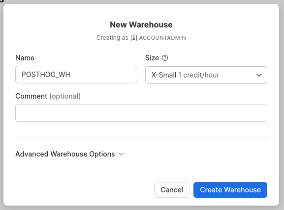

> **Important:** This app has been depreciated in favor of the [Snowflake batch exports destination](/docs/cdp/batch-exports/snowflake). 

This app allows you to export both live and historical events from PostHog into Snowflake.
This is useful when you want to run custom SQL queries on your data in PostHog using Snowflake's high-performance infrastructure.

This app utilizes a Snowflake [external stage](https://docs.snowflake.com/en/sql-reference/sql/create-stage.html) to stage events in object storage - Amazon S3 or Google Cloud Storage.
Staged events (stored in object storage as files containing event batches) are then copied into the final destination – your Snowflake table – once every 10 minutes by default.

## Installation

### PostHog Cloud

PostHog Cloud users can find the app [here on the apps page](https://app.posthog.com/project/apps?name=Snowflake).

Before you can enable the app, you will need to [configure it](#configure) by clicking on the settings icon.
Once the app has been configured, you can enable it by flipping the toggle and it will start exporting newly ingested events to Snowflake.

### PostHog Self-hosted

> This requires a PostHog instance running [version 1.24.0](https://posthog.com/blog/the-posthog-array-1-24-0) or later.
> Not running 1.24.0? Find out [how to update](/docs/runbook/upgrading-posthog)!

1. Log in to your PostHog instance
2. Click 'Apps' on the left-hand navigation
3. Search for 'Snowflake'
4. Select the 'Snowflake Export' app and press 'Install'
5. [Configure the app](#configure) by entering both your AWS & Snowflake credentials
6. Enable the app and watch events roll into Snowflake!

## Configureation

### Set-up Snowflake

To get started, you'll need to create a [Snowflake account](https://signup.snowflake.com/). Once you've set up your account, login to your Snowflake instance.

### Creating a virtual warehouse

First, we'll need to set up a [Snowflake Virtual Warehouse](https://docs.snowflake.com/en/user-guide/warehouses-overview.html).
If you already have a Snowflake Warehouse that you would like to use you can skip this step.

To create a new warehouse, login to Snowflake and navigate to "Admin" > "Warehouses" on the left panel and click on the "+ Warehouse" button.
Give your new warehouse a name and choose a size for it.

For more information on choosing a size for your warehouse, checkout the [Snowflake docs](https://docs.snowflake.com/en/user-guide/warehouses-considerations.html).



### Creating a new database

Now that we have a warehouse set up, we'll create a new database to store our exported data. To do this we'll use a [Worksheet](https://docs.snowflake.com/en/user-guide/ui-worksheet.html) to execute SQL statements with our new Warehouse.

We can create a new Worksheet by navigating to the Worksheets tab and clicking the "+ Worksheet" button. Then in the code editor, paste the following SQL:

```sql
CREATE DATABASE IF NOT EXISTS POSTHOG_DB;
```

This will create a new database called `POSTHOG_DB` where we can store our exports.

### Set-up roles and permissions

Now that we have our warehouse and database set up, we're going to start to get our permissions configured so PostHog can access these resources.

We'll do this by creating a new role `POSTHOG_EXPORT` which we'll grant only the necessary permissions that PostHog needs with the following SQL:

```sql
CREATE ROLE IF NOT EXISTS POSTHOG_EXPORT;

GRANT USAGE ON WAREHOUSE POSTHOG_WH TO ROLE POSTHOG_EXPORT;
GRANT USAGE ON DATABASE POSTHOG_DB TO ROLE POSTHOG_EXPORT;
GRANT USAGE,CREATE TABLE,CREATE STAGE ON SCHEMA POSTHOG_DB.PUBLIC TO ROLE POSTHOG_EXPORT;
GRANT INSERT,UPDATE ON ALL TABLES IN SCHEMA POSTHOG_DB.PUBLIC TO ROLE POSTHOG_EXPORT;

-- This will ensure that our admin user still has access to the table PostHog creates for our export data
GRANT ALL ON FUTURE TABLES IN SCHEMA POSTHOG_DB.PUBLIC TO ROLE ACCOUNTADMIN;
```

> **Note: ** For all the SQL snippets, _make sure to execute every line_! This can be done by selecting the entire block of commands within the editor and pressing the blue play button in the top right.

This will create a new role called `POSTHOG_EXPORT` with permission to use our newly created Warehouse, as well as permission to `INSERT` and `UPDATE` on tables in our database `POSTHOG_DB`.

Finally, we'll create a new user and grant the `POSTHOG_EXPORT` role to it. Make sure to keep track of the password you use for this user as we'll need it later!

```sql
CREATE USER IF NOT EXISTS POSTHOG
    PASSWORD = '<your_password>'
    DEFAULT_ROLE = POSTHOG_EXPORT
    MUST_CHANGE_PASSWORD = false;

GRANT ROLE POSTHOG_EXPORT TO USER POSTHOG;
```

### Set-up external staging

This app uses an [External stage](https://docs.snowflake.com/en/sql-reference/sql/create-stage.html) to store exported data, which can then be copied into Snowflake for processing.
Currently, we support both Amazon S3 and Google Cloud Storage for staging files.

### Connect Amazon S3 to Snowflake

1. Create a new S3 bucket, preferably in the same AWS region as your Snowflake instance.
2. Follow [this Snowflake guide on S3](https://docs.snowflake.com/en/user-guide/data-load-s3-config-aws-iam-user.html) to configure AWS IAM User Credentials to access Amazon S3. However, instead of doing step 3 yourself, input the AWS Key ID and Secret Key in the appropriate app configuration options. We'll take care of creating the stage for you.

### Connect Google Cloud Storage to Snowflake

1. Create a new GCS bucket.
2. Follow [this Snowflake guide on GCS](https://docs.snowflake.com/en/user-guide/data-load-gcs-config.html) to create a storage integration and generate a user for Snowflake to use when accessing your bucket. Make sure not to skip over any part of the guide!
3. There should now be a service account created by Snowflake in Google Cloud. Download the JSON file with credentials for that account by referring to [this Google Cloud guide](https://developers.google.com/workspace/guides/create-credentials#create_credentials_for_a_service_account). We'll upload this file into PostHog in the app configuration step.

Make sure the user available to the plugin has permissions on the storage integration you just created. You can do this like so:

```sql
GRANT USAGE ON INTEGRATION <your_gcs_integration_name> TO ROLE POSTHOG_EXPORT;
```

### Configure the app within PostHog

Now that Snowflake is set up, the last step is to configure the app. Below are the required options that you'll need to fill-in to get the app running.
There are also additional options available for advanced users who need to customize their integration further.

**`Snowflake account`**<br />
This can be found in your Snowflake URL. For example, if your URL when viewing Snowflake begins with: `https://app.snowflake.com/us-east-2.aws/xxx1111/...`, then your account ID would be `xxx1111.us-east-2.aws`.

**`Snowflake username`**<br />
The name of the user in Snowflake that has access to our database. If you followed the tutorial above, this will be `POSTHOG`

**`Snowflake password`**<br />
The password for the user we created.

**`Snowflake database name`**<br />
The name of the database where we would like PostHog to store our info. If you followed the tutorial above, set this as `POSTHOG_DB`

**`Snowflake database schema`**<br />
The schema within our database that we would like to use. If you followed the tutorial above, set this as `PUBLIC`

**`Snowflake table name`**<br />
The table within our database that we would like to copy our exported data into. If a table with the provided name does not exist yet, it will be created

**`Virtual warehouse to use for copying files`**<br />
The Warehouse we would like to use for executing our operations. If you followed, the tutorial above, set this as `POSTHOG_WH`

**`Stage type`**<br />
Whether you set up external staging with `S3` or `GCS`. Depending on what you set up, you will need to provide different config information.

**`Name to use for external stage`**<br />
The name of the stage within Snowflake for sourcing data from.

### Amazon S3

**`Bucket name`**<br />
The name of the S3 bucket to use for exporting data. This should be without the path or region.

**`AWS access key ID`**<br />
The access key ID for the IAM user with access to your bucket.

**`AWS secret access key`**<br />
The secret access key for the IAM user with access to your bucket.

**`S3 Bucket region`**<br />
The region where your bucket is located. We recommend using the same region as your Snowflake instance.

### Google Cloud Storage

**`Bucket name`**<br />
The name of the GCS bucket to use for exporting data. This should be without the path or region.

**`GCS storage integration name`**<br />
The name of the integration within Snowflake you created in [this step](#connect-google-cloud-storage-to-snowflake)

**`GCS credentials file`**<br />
A JSON file with your credentials for accessing GCS. Instructions on how to get this file can be found in [this Google Cloud tutorial](https://developers.google.com/workspace/guides/create-credentials#create_credentials_for_a_service_account)

### Your export is now set up!

Now that the app is configured, all you'll need to do is "Enable" it and PostHog will start exporting events to Snowflake!

## Troubleshooting

### Why am I seeing connection issues?

If you're running into connection issues please verify your login credentials, make sure **all** the permissions listed above have been granted to your user.

If you're exporting from PostHog Cloud, do **NOT set any IP whitelist/blacklist** or other network policies. PostHog Cloud operates on a decentralized network of computing resources and therefore the IPs could change at any time.

## FAQ

### Who created this app?

A lot of people worked on this app! We'd like to thank the following contributors for creating this. Thank you, all!

-   [Yakko Majuri](https://github.com/yakkomajuri)
-   [Marius Andra](https://github.com/mariusandra)
-   [Michael Matloka](https://github.com/Twixes)
-   [Paolo D'Amico](https://github.com/paolodamico) (We miss you Paolo!)

### Who maintains this app?

This app is maintained by PostHog. If you have issues with the app not functioning as intended, please [let us know](http://app.posthog.com/home#supportModal)!

### What if I have feedback on this app?

We love feature requests and feedback! Please [tell us what you think](http://app.posthog.com/home#supportModal)! to tell us what you think.

### What if my question isn't answered above?

We love answering questions. Ask us anything via [our community forum](/questions), or [drop us a message](http://app.posthog.com/home#supportModal). 

