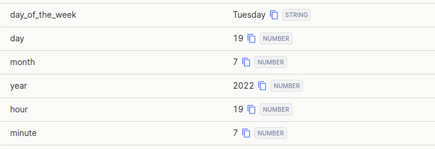
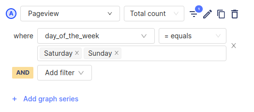
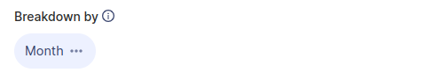

This app parses the timestamp of each event that comes in to PostHog and adds the following time-based properties:

| Property          | Description                                       | Example    |
| ----------------- | ------------------------------------------------- | ---------- |
| `day_of_the_week` | Plain text value for the day of the week          | Monday     |
| `day`             | Numeric value for the day within a month          | 7          |
| `month`           | Numeric value corresponding to the current month  | 6 _(June)_ |
| `year`            | Numeric value of the year                         | 2022       |
| `hour`            | Numeric value for the hour in UTC (24-hour clock) | 21         |
| `minute`          | Numeric value for the minute                      | 37         |

## Example event

Here is an example of what these properties look like after they have been added to an event.

## Installation

### PostHog Cloud

PostHog Cloud users can find the app [here](https://app.posthog.com/project/apps?name=Timestamp+Parser) and click on the toggle to enable the app.
Once the app has been enabled, it will automatically start parsing all new events which come in to PostHog.

### PostHog Self-hosted

> The Timestamp Parser requires a PostHog instance running [version 1.30.0](https://posthog.com/blog/the-posthog-array-1-30-0) or later.
> Not running 1.30.0? Find out [how to update](https://posthog.com/docs/runbook/upgrading-posthog).

1. In PostHog, click the "[Data pipeline](https://us.posthog.com/apps)" tab in the left sidebar.
2. Search for 'Timestamp Parser'.
3. Click on the toggle to enable the app.

Any new events that come in to PostHog will now be automatically parsed!

## Using the Timestamp Parser

The timestamp parser is a great tool for answering time-based questions that are sometimes very challenging to tackle with PostHog alone.

By filtering and breaking down events, we can now easily answer questions such as:

- Do we get more purchases on weekdays or weekends?
- Why does our traffic spike on Tuesdays?
- How do users use our platform differently during the holiday season?
- How does retention compare for users who join on a weekend versus a weekday?

> **Note: ** This app only works on _new_ events sent to PostHog, and as a result you won't be able to filter events that were sent before it was enabled.

## Examples

Here's an example of creating a filter in a [trends](/docs/user-guides/trends) insight to only show events that were send on a Saturday or Sunday.

We can also break down an insight by `month` to get an idea of how it varies over the course of a year.

Overall, the timestamp parser is a simple yet incredibly powerful app that these examples only scratch the surface on.

### Have a question?

We love answering questions. Ask us anything [in the company forums](/questions) or using the Q&A widget at the bottom of this page.

## FAQ

### Who created this app?

We'd like to thank PostHog team member [Yakko Majuri](https://github.com/yakkomajuri) and community member [Victor Campuzano](https://github.com/vicampuzano) for creating the Timestamp Parser. Thank you, both!

### Who maintains this app?

This app is maintained by the community. If you have issues with the app not functioning as intended, please [let us know](http://app.posthog.com/home#supportModal)!

### What if I have feedback on this app?

We love feature requests and feedback! Please [tell us what you think](http://app.posthog.com/home#supportModal)! to tell us what you think.

### What if my question isn't answered above?

We love answering questions. Ask us anything via [our community forum](/questions), or [drop us a message](http://app.posthog.com/home#supportModal). 

