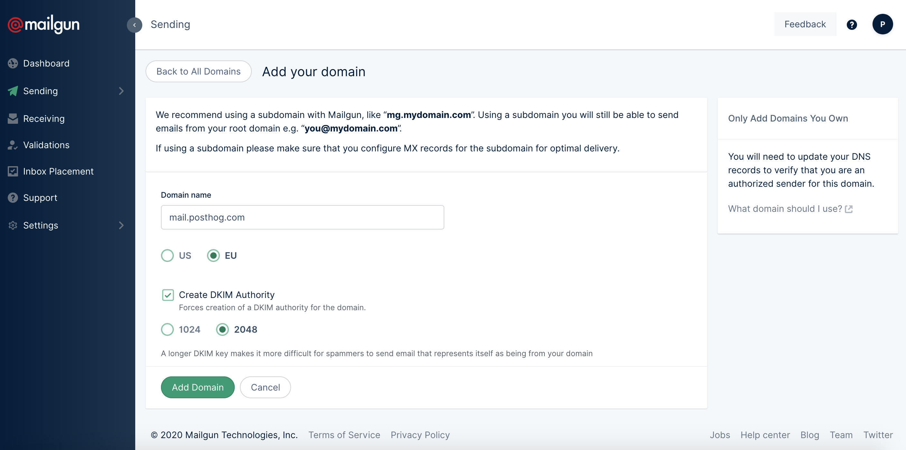

PostHog's core relies on email messaging for certain functionality. For example:
- Sending a reset link to a user that has forgotten their password.
- Sending a weekly report on the number of active users.
- Sending an invite link for new team members to join PostHog.

> By default, PostHog will send email messages using your current server (`localhost`) via `Sendmail`, however it is <b>highly recommended to set up a proper email server</b> as detailed below. Failure to do this can <b>severly affect email deliverability</b> and even send some messages to spam.


We very strongly recommend using an email service to act as email server (see examples below for most common providers). These providers are optimized to maximize email deliverability. To prevent spam, most email providers have very complex systems in place that validate a myriad of factors before allowing an email through. Optimizing your local server for this is a bit like reinventing the wheel, avoid this unless you have a very strong reason to use your local server.


To configure a remote email server, you will need to set up the following environment variables:
- `EMAIL_HOST`: Defaults to `localhost`. Hostname to connect to for establishing SMTP connections.
- `EMAIL_PORT`: Defaults to `25`. Port that should be used to connect to the host.
- `EMAIL_HOST_USER`: Defaults to `null`. Credentials to connect to the host.
- `EMAIL_HOST_PASSWORD`: Defaults to `null`. Credentials to connect to the host.
- `EMAIL_USE_TLS`: Defaults to `false`. Whether to use TLS protocol when connecting to the host.
- `EMAIL_USE_SSL`: Defaults to `false`. Whether to use SSL protocol when connecting to the host.
- `DEFAULT_FROM_EMAIL`: Defaults to `root@localhost`. Email address that will appear as the sender in emails (`From` header).

Sample configuration:
```yaml
EMAIL_HOST: smtp.example.com
EMAIL_PORT: 587
EMAIL_HOST_USER: postmaster@example.com
EMAIL_HOST_PASSWORD: password
EMAIL_USE_TLS: false
EMAIL_USE_SSL: true
DEFAULT_FROM_EMAIL: no-reply@example.com
```

Below you will find details on how to configure the most common email providers (not in any particular order). 


## Twilio's Sendgrid
1. After creating select the option to create a new sender profile, you can also go directly to [https://app.sendgrid.com/settings/sender_auth/senders/new](https://app.sendgrid.com/settings/sender_auth/senders/new).

## Mailgun
1. After you have created an account, go to Sending > [Domains](https://app.mailgun.com/app/sending/domains), and click on "Add New Domain".
1. Enter a domain name that you own. Using a subdomain is recommended (e.g. `m.posthog.com` instead of `posthog.com`). We strongly recommend selecting "Create DKIM Authority" (and using 2048 bits) to prevent spoofing with your domains (read more about [DKIM][dkim]). See sample configuration below:

    

1. You will now be given instructions to set up certain DNS records in your domain. Please be sure to add **all requested records** to ensure proper email deliverability.

1. Once you have added all records and verify them you can go to the domain settings > "SMTP credentials" section. You then need to create a set of SMTP credentials.

1. With the SMTP credentials, you can now set the required environment variables for email to work properly. You will also need to obtain the hostname from the credentials page. Your configuration should now look something like this.
Sample configuration:
```yaml
EMAIL_HOST: smtp.eu.mailgun.org # obtained from credentials page
EMAIL_PORT: 587
EMAIL_HOST_USER: postmaster@m.example.com # obtained from credentials page
EMAIL_HOST_PASSWORD: password # obtained from credentials page
EMAIL_USE_TLS: true
EMAIL_USE_SSL: false
DEFAULT_FROM_EMAIL: hey@example.com # you can define this, just use your domain
```

1. Once you have set these environment variables, restart your server and test sending an email (e.g. request a password reset).
    > Please note that you will need to restart both your web server and background worker for this to work properly.

## Amazon SES
Generally the least expensive option, but it's a bit more complicated to set up.


[dkim]: https://en.wikipedia.org/wiki/DomainKeys_Identified_Mail