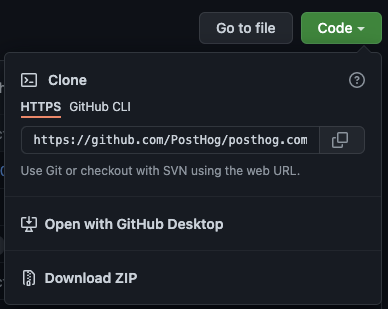
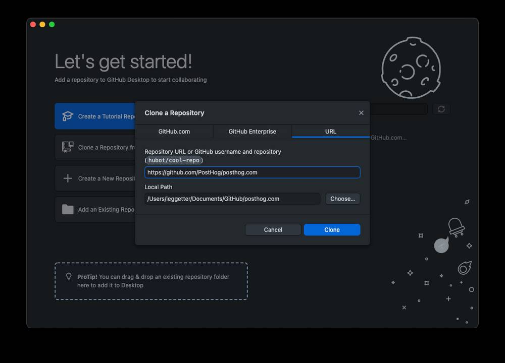
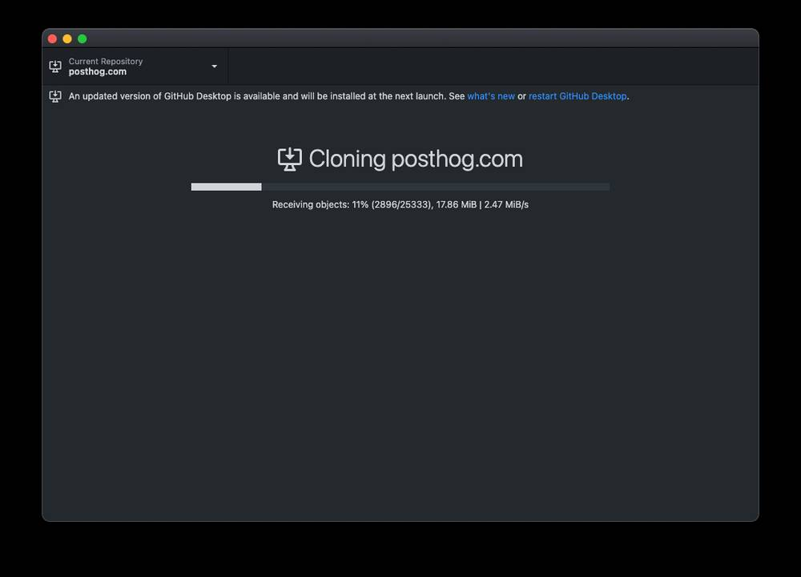
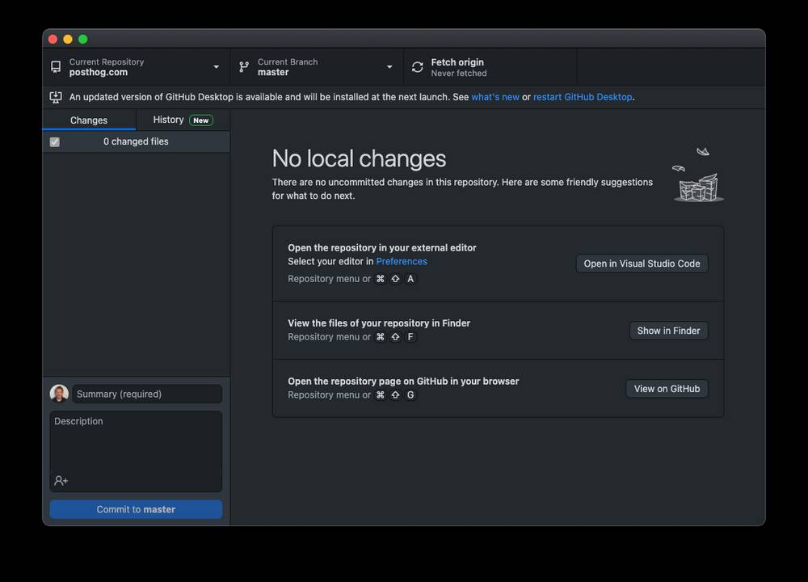
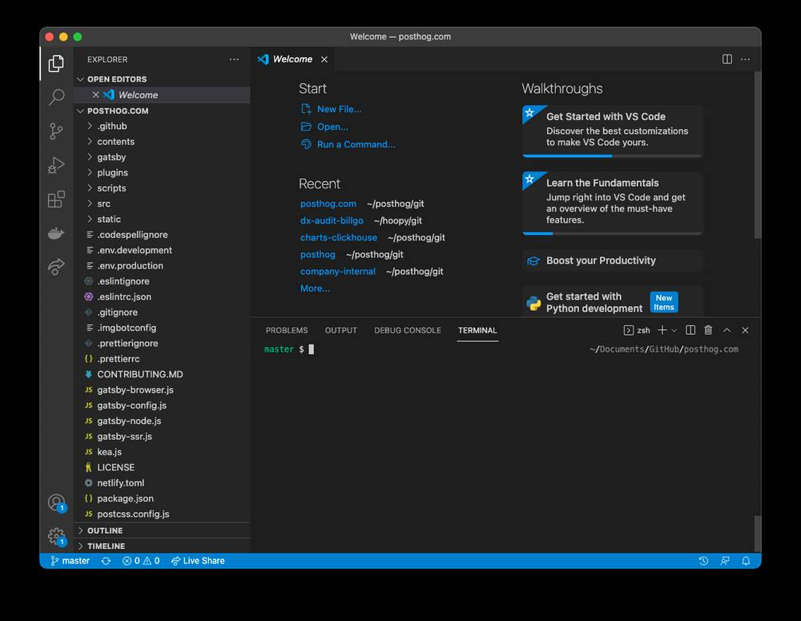
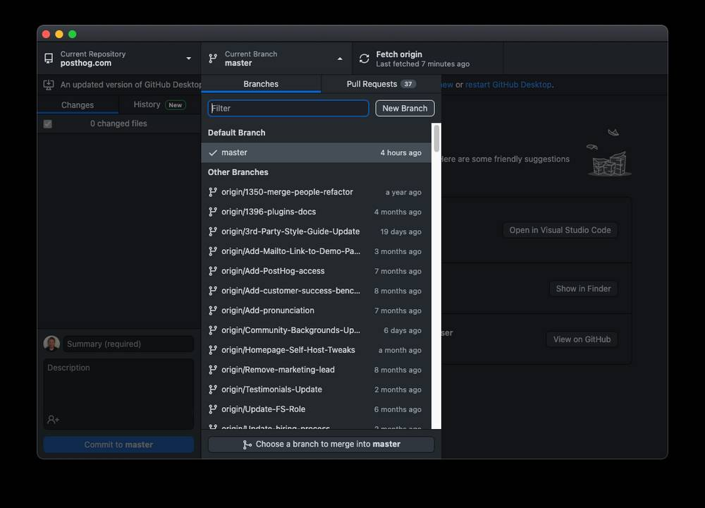
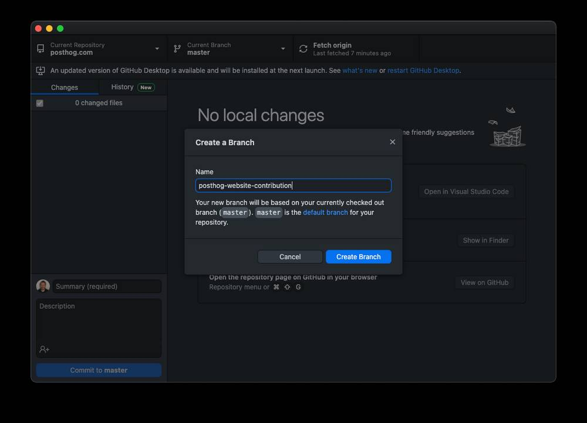
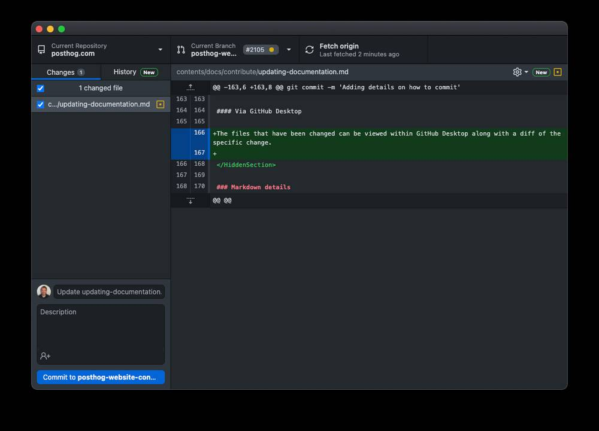
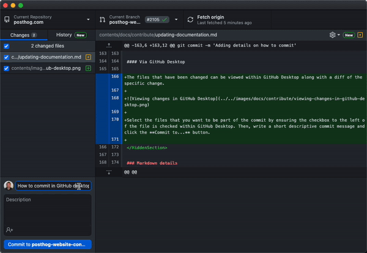

You can contribute to the PostHog documentation in two ways:

1. A pull request can be raised in GitHub for pages that have an **Edit this page** link on them. In this situation you must edit the page using the GitHub web editor interface. This method is suitable for text-only edits and basic file manipulation such as renaming.
2. By running the posthog.com website locally and making changes there. This is the recommended method as it allows you to quickly preview the changes you are making as well as performing complex changes.

## Editing posthog.com locally

### Before you begin

In order to run the PostHog website locally, you require the following to be installed:

- [Git](https://git-scm.com/book/en/v2/Getting-Started-Installing-Git)
- [Node.js](https://nodejs.org/en/download/)
- [Yarn](https://classic.yarnpkg.com/en/docs/install)

Optionally, if you are unfamiliar with using Git from the command line, you should also have the following installed:

- [GitHub Desktop](https://desktop.github.com/)
- [Visual Studio Code](https://code.visualstudio.com/download)

### Cloning the posthog.com repository

The [codebase for posthog.com](https://github.com/PostHog/posthog.com) is on GitHub.

You can clone the codebase from the terminal via:

```bash
git clone git@github.com:PostHog/posthog.com.git
```

<HiddenSection headingType='h3' title='Cloning using GitHub Desktop'>

You can also clone the repository with [GitHub desktop](https://desktop.github.com/) installed, from the [posthog.com repository page](https://github.com/PostHog/posthog.com), click the **Code** button and select **Open with GitHub Desktop** from the dropdown that appears.



You will then be prompted by the browser to confirm if you want to open an the GitHub Desktop application. Select the affirmative action that has text such as **Open GitHub Desktop**.

Once GitHub Desktop has opened you will be prompted to confirm the responsitory that is being cloned and the location on disk where you wish the code to be stored.



Click **Clone** to clone the posthog.com repostory to your local disk.



Once clone the GitHub Desktop interface will change to the following:



To view the code for the website click the **Open in Visual Studio Code** button. Dialogs may appear around permissions and trust as you open Visual Studio Code.

Once you have Visual Studio Code open, select the **Terminal** menu option. Within the dropdown select **New Terminal**. This will open a new terminal window within Visual Studio Code:



Don't worry! We only need to run a few commands in the terminal.

</HiddenSection>

### Running posthog.com locally

Type the following into the terminal and press return:

```bash
yarn
```

This runs the Yarn tool that was installed. Run standlone like this, it installs the dependency packages used by posthog.com.

Once this command has finished executing, run the following:

```bash
yarn start
```

The runs the website. It takes a bit of time for some file processing and compilation to take place. Once that's completed you will be able to access the a locally running version of posthog.com via `http://localhost:8080`.

> If you have something else running on port `8080` you'll be asked if you are okay in running on port `8081` in which case the website will be accessible on `http://localhost:8081`.

### Finding the content to edit

Once you have cloned the repo, the `contents/` directory contains a few key areas:

* `docs/` = all of the documentation for PostHog's platform
* `handbook/` = the PostHog company handbook
* `blog/` = our blog posts

Inside each of these are a series of markdown files for you to edit.

## Making edits

When editing locally, changes should be made on a new Git branch. Branches should be given an "at a glance" informative name. For example, `posthog-website-contribution`.

<HiddenSection headingType='h3' title='Creating a new Git branch'>

#### Via the terminal

You can create a new Git branch from the terminal by running:

```bash
git checkout -b [new-branch-name]
```

For example:

```bash
git checkout -b posthog-website-contribution
```

#### Via GitHub Desktop

You can also create a new branch in GitHub Desktop by selecting the dropdown next to the **Current Branch** name and clicking **New Branch**.



Then, in the dialog that follows, entering the new branch name.



Once you have a new branch, you can make changes.

</HiddenSection>

### Markdown details

#### Frontmatter

At the top of the file, it is necessary to have the following for the page to appear:

```markdown
---
title: Example Title
sidebarTitle: Example title shown in sidebar
sidebar: Example Sidebar
showTitle: true
---
```

- `title`: the page title
- `sidebar`: the sidebar menu that the page will attach to. You can see a list of available sidebars in `/src/sidebars/sidebars.json`. You can choose not to have a sidebar by setting this to `null`.
- `sidebarTitle`: the title shown in the sidebar. If this value isn't provided the `title` property is used.
- `showTitle` should always be set to `true`.

#### Images/GIFs

For our Markdown, we use [gatsby-remark-copy-linked-files](https://www.gatsbyjs.org/packages/gatsby-remark-copy-linked-files/).

This copies local files linked to/from Markdown files to the root directory.

Place images in `contents/images/`.

To include an image in a markdown file, you can use nice local references, like so:

```markdown

```

Note that it may be necessary to change the folder depending on your file structure. For example, if you needed to go up two directories, this *could* be:

```markdown

```

Notice the extra ```../```.

For most images, this plugin will automatically generate a range of sizes to optimize for the device and they'll even have a blurry low filesize loading image created to hold the place. Pretty cool.

#### Links to/from the navigation

Once you've made a new markdown file, you should link to it from the sidebar where appropriate.

The sidebar is generated from `/src/sidebars/sidebars.json`.

## Committing changes

Create commits that are focused on one specific area. For example, create one commit for textual changes and another for functional ones. Another example is creating a commit for changes to a section of the handbook and different commit for updates to the documenatation.

<HiddenSection headingType='h3' title='Creating a new Git branch'>

#### Via the terminal

First, stage your changes:

```bash
git add [path-to-file]
```

For example:

```bash
git add contents/docs/contribute/updating-documentation.md
```

Once all the files that have been changed are staged, you can perform the commit:

```bash
git commit -m '[short commit message]'
```

For example:

```bash
git commit -m 'Adding details on how to commit'
```

#### Via GitHub Desktop

The files that have been changed can be viewed within GitHub Desktop along with a diff of the specific change.



Select the files that you want to be part of the commit by ensuring the checkbox to the left of the file is checked within GitHub Desktop. Then, write a short descriptive commit message and click the **Commit to...** button.



</HiddenSection>

## Deployment

New changes should be created as a pull request.

To get changes into production, the website deploys automatically from `master`. The build takes 5-10 minutes.

#### Acknowledgements

This website is based on [Gatsby](https://gatsbyjs.org) and is hosted with [Netlify](https://www.netlify.com/).
