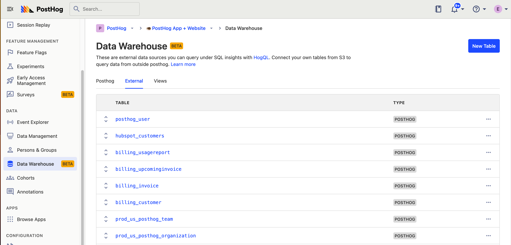

The PostHog data warehouse is accessed through the same interface as [HogQL](/docs/product-analytics/hogql). 

### Managing your data sources

You can find your data warehouse data sources under the "Data Warehouse" page found on the navigation bar. On this page, you can view and manage the tables and fields that power PostHog. These are all queryable on the HogQL interface. You will also be able to view and manage the external tables that you have added.

