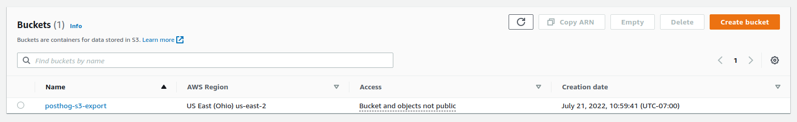
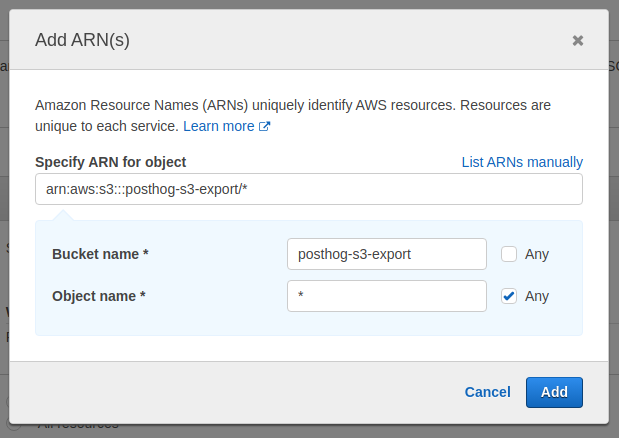
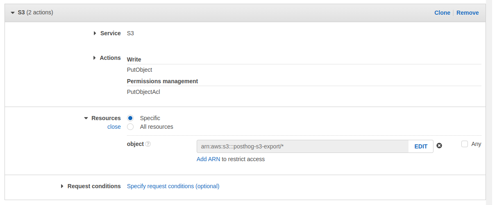
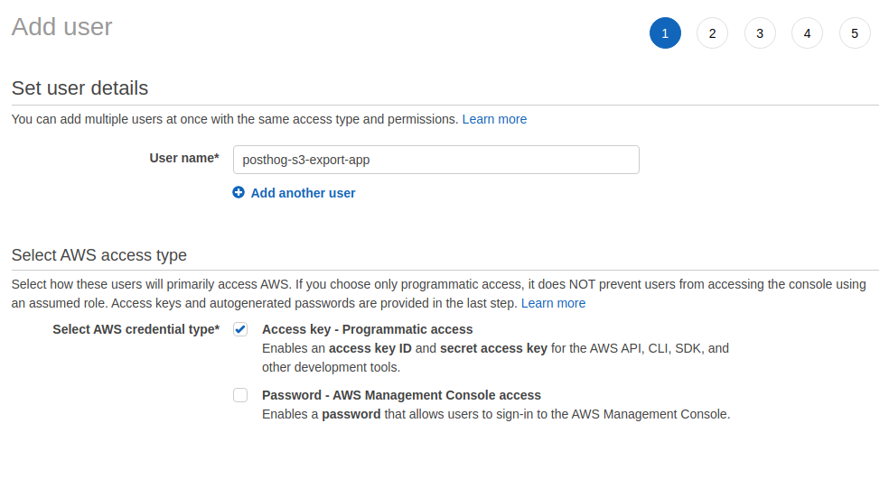
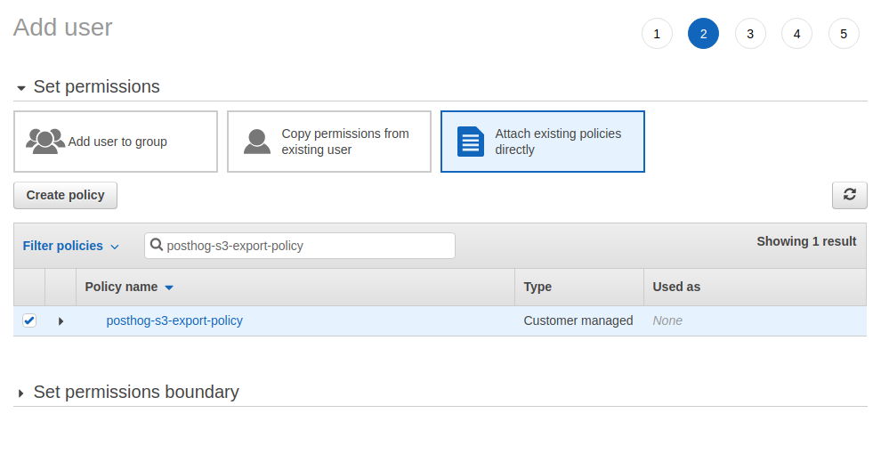
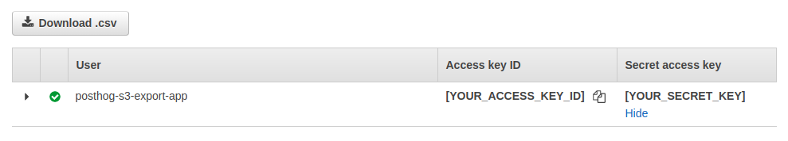
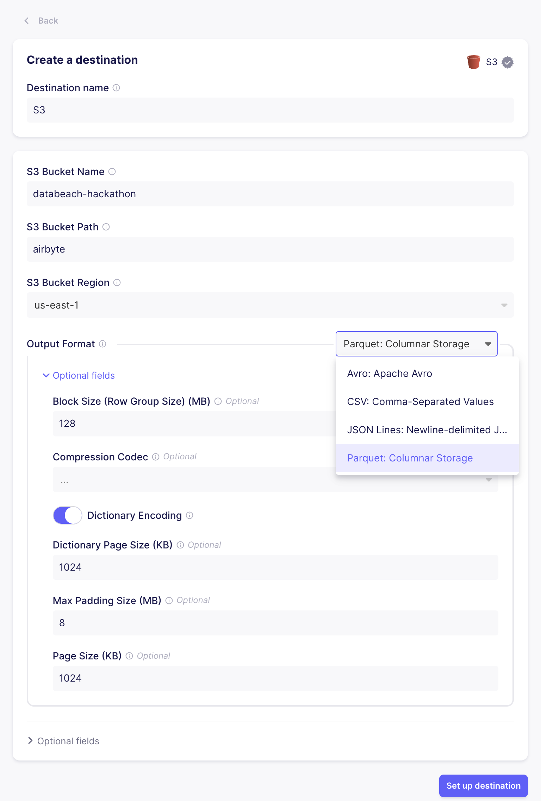
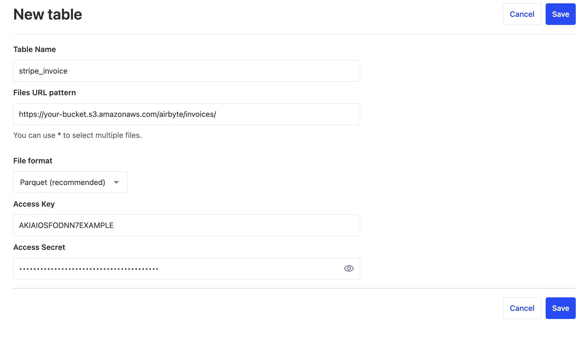

import { ProductScreenshot } from 'components/ProductScreenshot'
export const SettingsLight = "https://res.cloudinary.com/dmukukwp6/image/upload/v1710055416/posthog.com/contents/images/features/data-warehouse/settings-light.png"
export const SettingsDark = "https://res.cloudinary.com/dmukukwp6/image/upload/v1710055416/posthog.com/contents/images/features/data-warehouse/settings-dark.png"

The PostHog data warehouse enables you to link your most important data into PostHog from sources like your CRM, payment processor, or database. Once linked, you can combine this data with the product analytics data already in PostHog and query across all of it.

You can link a source to PostHog by either using one of our pre-built connectors below or by [creating a custom source](#linking-a-custom-source).

> The data warehouse is currently in beta. To access it, enable the [feature preview](https://us.posthog.com#panel=feature-previews) in your instance. It is free to use during the beta period.

## Stripe

The Stripe connector can link charges, customers, invoices, prices, products, subscriptions, and balance transactions to PostHog. 

To link Stripe:

1. Go to the [data warehouse tab](https://us.posthog.com/data-warehouse) in PostHog
2. Click "Link Source" and select Stripe
3. Get your Account ID from your [Stripe user settings](https://dashboard.stripe.com/settings/user) under Accounts then ID
4. Get your Client Secret from your [Stripe API keys](https://dashboard.stripe.com/apikeys) under Standard keys then Secret key
5. Add both of these to PostHog (and optionally a table name prefix) and click "Link"

The data warehouse then starts syncing your Stripe data. You can see details and progress in the [data warehouse settings tab](https://us.posthog.com/data-warehouse/settings).

## Hubspot

The Hubspot connector can link contacts, companies, deals, emails, meetings, quotes, and tickets to PostHog.

To link Hubspot:

1. Go to the [data warehouse tab](https://us.posthog.com/data-warehouse) in PostHog
2. Click "Link Source" and select Hubspot
3. Select the Hubspot account you want to link and click "Connect app"
4. *Optional:* Add a prefix to your table names

The data warehouse then starts syncing your Hubspot data. You can see details and progress in the [data warehouse settings tab](https://us.posthog.com/data-warehouse/settings).

## Postgres

The Postgres connector can link your database tables to PostHog.

To link Postgres:

1. Go to the [data warehouse tab](https://us.posthog.com/data-warehouse) in PostHog
2. Click "Link Source" and select Postgres
3. Enter your database connection details:
    - **Host:** The hostname or IP your database server like `db.example.com` or `192.168.1.100`.
    - **Port:** The port your database server is listening to. The default is `5432`.
    - **Database:** The name of the database you want like `analytics_db`.
    - **User:** The username with the necessary permissions to access the database.
    - **Password:** The password for the user.
    - **Schema:** The schema for your database where your tables are located. The default is `public`.
4. Click "Link"

The data warehouse then starts syncing your Postgres data. You can see details and progress in the [data warehouse settings tab](https://us.posthog.com/data-warehouse/settings).

## Linking a custom source

The data warehouse can also link to data in your object storage system like S3 or GCS. To start, you'll need to:

1. Create a bucket in your object storage system
2. Set up an access key and secret
3. Add data to the bucket (we'll use Airbyte)
4. Create the table in PostHog

> These docs are written for AWS S3 using Airbyte, but you can also use Google Cloud Storage (GCS) and Fivetran, Stitch, or other ETL tools.

### Step 1: Creating a bucket in S3

1. Log in to [AWS](https://console.aws.amazon.com/).
2. Open [S3](https://s3.console.aws.amazon.com/) in the AWS console and create a new bucket. We suggest `us-east-1` if you're using PostHog Cloud US, or `eu-central-1` if you're using PostHog Cloud EU.

> Make sure to note both the name and region of your bucket, we'll need these later.

### Step 2: Set up access policy and key

Next, we need to create a new user in our AWS console with programmatic access to our newly created bucket.

1. Open [IAM](https://console.aws.amazon.com/iam/home) and create a new policy to enable access to this bucket
2. On the left under "Access management," select "Policies," and click "Create policy"
3. Under the service, choose "S3"
4. Under "Actions," select:
    1. "Write" -> "PutObject"
    2. "Permission Management" -> "PutObjectAcl"
5. Under "Resources," select "Specific," and click "object" -> "Add ARN"
6. Specify your bucket name and choose "any" for the object name. In the example below, replace `posthog-s3-export` with the bucket name you chose in the previous section

7. Your config should now look like the following

6. Click "Next" until you end up on the "Review Policy" page
7. Give your policy a name and click "Create policy"

The final step is to create a new user and give them access to our bucket by attaching our newly created policy.

1. Open [IAM](https://console.aws.amazon.com/iam/home) and navigate to "Users" on the left
2. Click "Add Users"
3. Specify a name and make sure to choose "Access key - Programmatic access"

4. Click "Next"
5. At the top, select "Attach existing policies directly"
6. Search for the policy you just created and click the checkbox on the far left to attach it to this user

6. Click "Next" until you reach the "Create user" button. Click that as well.
7. **Make sure to copy your "Access key" and "Secret access key". The latter will not be shown again.**

### Step 3: Add data to the bucket

> For this section, we'll be using **Airbyte**. However, we accept any data in CSV or Parquet format, so if you already have data in S3 you can skip this section.

1. Go to [Airbyte](https://airbyte.com) and sign up for an account if you haven't already.
2. Go to connections and click "New connection"
3. Select a source. For this example, we'll grab data from **Stripe**, but you can use any of Airbyte's sources.
4. Click "Set up a new destination"
5. Select "S3" as the destination
6. Fill in the "S3 Bucket Name", "S3 Bucket Region" with the name and region you created earlier.
7. For "S3 Bucket Path", use `airbyte`.
8. For the "Output Format", pick Parquet. You can use the default settings
9. Under "Optional fields", you'll want to add the access key and secret from step 1.
10. In the next step, pick the streams you want to fill. Given you'll manually need to create a table for each stream, we suggest being selective.
11. Wait for the sync to finish

### Step 4: Create the table in PostHog

1. In PostHog, go to the "Data Warehouse" tab and click "New table"
2. Fill in the table name.
3. For the URL pattern, copy the URL from S3, up to the bucket name. Replace the file name with `*`, as Airbyte will split larges streams out into multiple files.
  - For example: `https://your-bucket.s3.amazonaws.com/airbyte/invoices/*`
4. For file format, select Parquet. Fill in the access key and secret key.

> You'll want to repeat this step for each "stream" or folder that Airbyte created in your S3 bucket.

### Step 5: Query the table.

Amazing! You can now [query](/docs/data-warehouse/query) your new table.

## Syncing

Once you add a source, you can see its status, sync frequency, and last successful run in the [data warehouse settings page](https://us.posthog.com/data-warehouse/settings). You can also reload or delete sources here.

When you expand each source, you can see:

- Schema name
- Enable or disable syncing for that table
- Synced table name in PostHog
- Time the table was last synced

<ProductScreenshot
    imageLight={SettingsLight} 
    imageDark={SettingsDark} 
    alt="Data warehouse settings in PostHog" 
    classes="rounded"
  />
