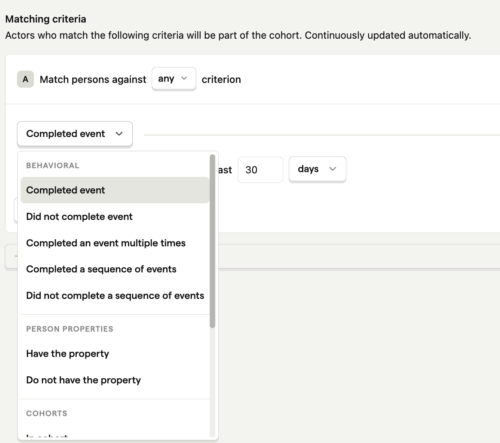

Cohorts enable you to easily create a list of users who have something in common, such as completing an action or having the same property.

Here are a few examples of the cohorts you can create:

- Users who work at the same company.
- Users who used your app in the last week.
- Users who have churned from your product.
- Users who signed up recently.
- Users who viewed the signup page, but didn't convert.

You can also analyze [trends](docs/product-analytics/trends), [insights](docs/product-analytics/insights), and [dashboards](/docs/product-analytics/dashboards) for your cohorts. This enables you to understand things like:

- "Are people at company X using our app frequently?"
- "What percentage of the users who signed up last week are still using our app?"
- "Which features are our power users using?"

## Cohorts vs. groups

Cohorts are often confused with [groups](/docs/data/groups), but they each serve different purposes:

- Cohorts represent a specific set of users – e.g., a list of users that all belong to the same company.
- Groups aggregate events based on entities, such as organizations or companies, and do not necessarily connect to a user. They enable you to analyze trends, insights, and dashboards at an entity-level, as opposed to a user-level.
 
Groups require additional code in your app to set up, while cohorts are created in PostHog and don't require additional code. This makes cohorts easier to use and quicker to get started. If your only goal is to create a list of **users** with something in common, we recommend cohorts instead of groups.

## How to create a cohort

There are two methods to create a new cohort:

### Method 1: Create a new cohort directly from an insight

You can create cohorts using data from insights such as trends, [funnels](/product-analytics/funnels), [user paths](/docs/product-analytics/paths) and [lifecycles](/docs/product-analytics/lifecycle).

**Step 1:** Go to [insights](https://app.posthog.com/insights) and open any insight. Click a data point on the visualization to view the [persons](/docs/data/persons) represented in the underlying data.

**Step 2:** In the modal popup, click 'Save as cohort' in the bottom right.

The video below shows how to create a new cohort from a trend, although you can similarly create a cohort from a funnel, user path, or any other insight.

### Method 2: Create a new cohort from the cohorts page

**Step 1:** Navigate to the [Cohorts](https://app.posthog.com/cohorts) page in the sidebar:

**Step 2:** Click '+ New Cohort' on the top right.

## Static vs. dynamic cohorts

When creating a cohort, you'll choose between a static or dynamic cohort:

**Static cohorts** are lists of users that do not change over time. For example, all users who signed up for your app in January 2023. 

Static cohorts are created by uploading a csv of users, or from insights. You can then update the list manually if you'd like to add or remove users.

On the other hand, **dynamic cohorts** are defined by a continuously evaluated condition. This means that the members of the cohort can change over time. For example, a dynamic cohort could be all users who have have used a certain feature in your app.

Dynamic cohorts are created by matching users who meet a certain criteria. You can define this criteria by combining any number of the following conditions:

- Users who have performed a specific event or [action](/docs/user-guides/actions) within a certain time frame.
- Users who have certain properties.
- Users based on their lifecycle event. For example, users who have recently stopped performing an event.
- Users matching other cohorts.

## Using cohorts to differentiate traffic from your team vs. your users

You may want to differentiate between traffic from your team and traffic from your users. To do so, you can identify your team members in PostHog by:

1. Either using [`posthog.identify`](/docs/getting-started/identify-users) and, for example, setting an email as the ID, or
2. By setting [properties](/docs/getting-started/user-properties) on your team members – e.g., `is_team_member = true`.

You can then create a cohort of your team members, or a cohort that excludes your team. This enables you to differentiate between your team and your users when analyzing your data.

Using this method, you'll continue receiving events for both your team members and your users. However, if you want to stop receiving events from your team completely, you should use [`posthog.opt_out_capturing`](/docs/integrate/client/js#opt-users-out).

### Further reading

Want to know more about what's possible with Cohorts in PostHog? Try these tutorials:

-   [Analyzing user behavior with cohorts](/tutorials/cohorts)
-   [How to filter our internal users](/tutorials/filter-internal-users)
-   [How to segment users](/tutorials/how-to-segment-users)

Want more? Check our [full list of PostHog tutorials](https://posthog.com/tutorials).
