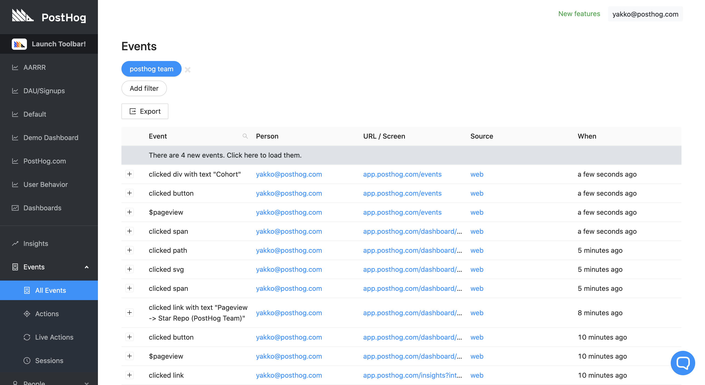
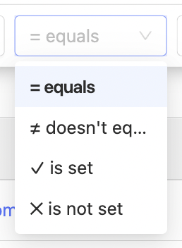
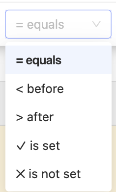
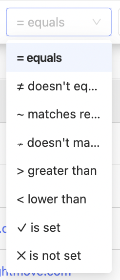
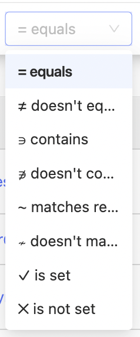

The most important thing that PostHog does is to capture events from your website or application. An event is any action a user takes on your website or in your application - if they click a button or visits a page, that's an event.

## Live events

To see your live events table, click 'Events' on the left sidebar. Here you will see a live feed of Events as they are happening.

## Event properties

You can view the properties of each event by clicking on the items in the ‘Event’ column:

You can also click each user to view a their entire event history.

## Default events and properties

You may notice that some events or properties are prefixed with `$` e.g., `$pageview`, `$feature_flag_called`, `$current_url`, or `$os_version`. This indicates that these are default PostHog events or properties.

### Pageview events

`$pageview` events are automatically sent when using the [JavaScript snippet or SDK](/docs/libraries/js). You can disable this by setting `capture_pageview: false` in the initialization [config](/docs/libraries/js#config).

You can manually send pageview events by calling `posthog.capture('$pageview')`. This is necessary for single-page applications like [React](/docs/libraries/react), [Next.js](/docs/libraries/next-js#pages-router) or [Vue](/docs/libraries/vue-js#capturing-page-views), since otherwise a pageview event is only sent for the first page.

### Pageleave events

Similar to pageview, `$pageleave` events are automatically sent. You can disable them by setting `capture_pageleave: false` in the [config](/docs/libraries/js#config). For single-page applications, you'll also need to manually send these events using `posthog.capture('$pageleave')`.

## Event filtering

You can filter events by [properties](/docs/integrate/client/js#sending-user-information) and [cohorts](/docs/user-guides/cohorts) to focus on specific events that are occurring in your project.

While ingesting events in the plugin server PostHog detects some type information for properties to allow more intelligent filtering.

PostHog detects:

-   Boolean
-   Dates and Timestamps
-   Numbers
-   Strings
-   Everything else

If you feel something has been detected incorrectly, you can manually change the type by going to `Data management -> Properties -> Choose event -> Edit`, and then changing the property type manually.

### Boolean (true or false)

PotHog detects boolean values and allows filtering by only:

-   equals
-   doesn't equal
-   is set
-   is not set

### Dates and Timestamps

PostHog detects several formats of string as dates and times

-   YYYY-MM-DD,
-   Date and date and time strings from [the ISO8601 standard](https://en.wikipedia.org/wiki/ISO_8601),
-   YYYY-MM-DD HH:mm:SS,
-   DD-MM-YYYY HH:mm:SS,
-   DD/MM/YYYY HH:mm:SS,
-   YYYY/MM/DD HH:mm:SS
-   [the RFC 822 standard](https://datatracker.ietf.org/doc/html/rfc822)

In detection day and month are interchangeable so MM-DD-YYYY would be detected as a date.

Ten and Thirteen digit numbers are detected as [timestamps](https://en.wikipedia.org/wiki/Unix_time) if the property name includes "time" or "timestamp"

Filtering against that property will then show a date picker and allows filtering only:

-   equals
-   before
-   after
-   is set
-   is not set

### Numeric

PostHog detects numeric properties and allow filtering by only:

-   equals
-   doesn't equal
-   matches regex
-   doesn't match regex
-   greater than
-   lower than
-   is set
-   is not set

### Strings (text)

PostHog detects text content. If it is not true/false, numeric, or a date time. You can filter by:

-   equals
-   doesn't equal
-   contains
-   doesn't contain
-   matches regex
-   doesn't match regex
-   is set
-   is not set

### Everything else

If PostHog does not detect a type for an event property. You can choose any of the possible filters.

## Autocapture event tracking

PostHog can capture all frontend events automatically. This means you do not need to manually add tracking to individual buttons or other parts of your product to start analyzing user behavior.

To get started, see our [autocapture docs](/docs/data/autocapture).

## Push-based event tracking

Most users of PostHog will want to combine their back-end data, such as user information, with the front end actions of those users in their UI. There are three ways of passing data to PostHog:

-   Our [API](/docs/api/overview)
-   JS [snippet](/docs/integrate)
-   Client- and server-side [libraries](/docs/integrate)

### Further reading

Want to know more about what's possible with Events in PostHog? Try these tutorials:

-   [How to trigger Discord notifications when an action is detected in PostHog](/tutorials/how-to-connect-discord-to-posthog-with-zapier)
-   [How to automatically organize PostHog actions in Notion](/tutorials/how-to-connect-posthog-and-notion-with-zapier)
-   [The complete guide to event tracking](/tutorials/event-tracking-guide)

Want more? Check our [full list of PostHog tutorials](https://posthog.com/tutorials).
