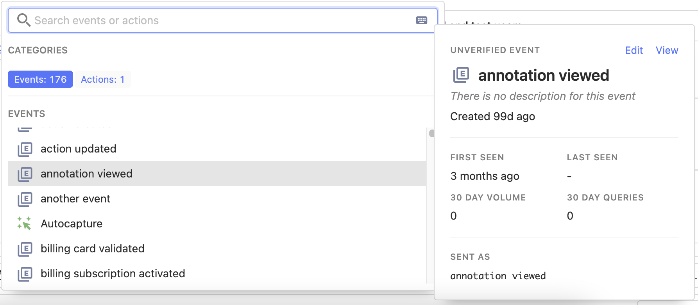
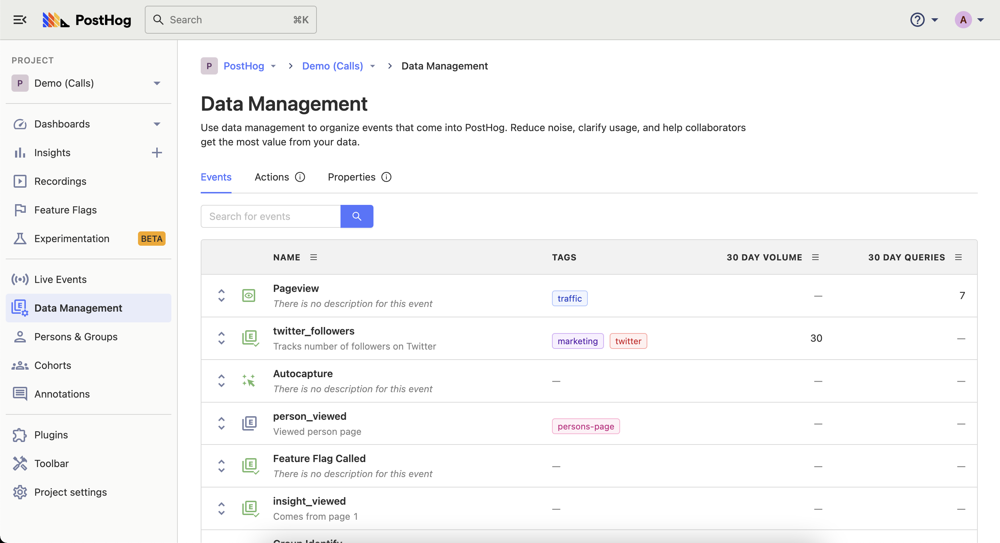
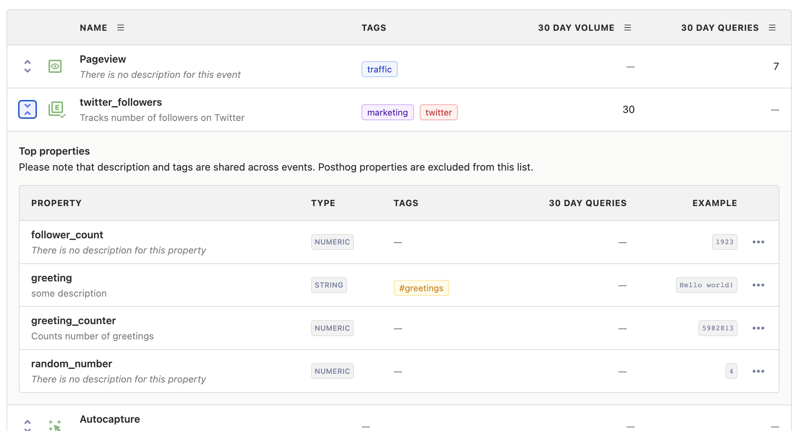

[//]: # 'On restricted plans, users cannot create definitions and view any 30d metrics for events and event properties.'

Data management lets you keep events and properties organized. Managing your data becomes especially helpful in situations where:

-   It is hard to understand events, actions, and properties that you yourself didn't set up.
-   Data decays quickly, and most of the time fails to stay up-to-date with instrumentation.
-   Event-level context in insights and dashboards is difficult to share with external people and new team members.

## What is a definition?

Definitions are the basic building blocks for how you manage data at PostHog. You don't need to create definitions in order to get started analyzing your data on PostHog, but your team's experience on PostHog can be greatly enriched when your events are defined with best practices in mind.

It is also important to note that PostHog will implicitly create a skeleton definition for every event and event property it ingests, and each definition
can be enriched with more context at any time.

## When do I need a definition?

Instrumentation is always changing and it can become difficult to keep track of events as their meanings and usage change across teams and over time. This is where definitions can come in handy as they are mutable representations of their immutable counterparts (events and their properties), making them ideal candidates for storing information that can adapt to changes in your product.

## What can I define?

### Event Definition

An event definition is a mutable representation of an event. A single definition can be used to describe a set of events that share the same name.

Event definitions differ from actions in that a definition can represent exactly one type of event, whereas actions are composed of multiple matching groups and therefore multiple events. We recommend using actions if your data managing use case cannot be solved with simple definitions.

### Event Property Definition

An event property definition is a mutable representation an event property that is nested inside an event. Event property definitions are globally defined, meaning that the same properties shared across events will share one definition.

### Definition attributes

Today, you can add descriptions and tags to both events and event property definitions. Event definitions can also be verified which tells collaborators that an event should be favored over other similar events.

You can learn about how to best use these attributes by going to our [best practices](/docs/user-guides/data-management/#data-management-best-practices) section.

## Creating definitions

Before creating your first definition, make sure at least one event of that type has been sent to PostHog. You can use the "Live Events" page to observe that your event has been ingested properly.

### Creating a definition from a filter

Definitions can be created on the fly anywhere in the app where there is a filter.

Open the filter and hover over the item you'd like to create a definition for. See that a definition pops up on the side.

This card represents the definition that has already been created. If you haven't created a definition here, PostHog will display an empty definition you can fill out here.

Click "Edit" in the definition card.

From here you can add some context that captures some context about this event or property. Keep in mind this definition will persist everywhere this event is displayed in the app.

Once you've finalized everything, save your definition, and you're good to go!

### Creating a definition from the Data Management page

If you'd like one central place to manage all your definitions, go to the Data Management page to see a flat list of event and event property definitions.

From here you may hover over event and event property names to edit definitions.

You may also explore all properties nested under each event to quickly understand how your data is structured.

#### Adding tags and descriptions to events

<FeatureAvailability availability={_frontmatter.availability.features.tagging} />

Tags and descriptions can additionally be added to events after they are created. This makes using them in insights much easier, especially as the number of distinct event types grows.

## Ingestion warnings

Sometimes we run into problems during ingestion from suboptimal usage of PostHog, for example to maintain data integrity we don't merge with generic IDs like `null`.
If this happens we'll do our best to still ingest the event and we'll additionally log an ingestion warning. These warnings can be seen in the Data Management section.
The rest of this page contains more details on the specific warnings.

### Refused to merge with an illegal distinct id

See [identifying users - considerations](/docs/integrate/identifying-users#considerations) for background.

### Refused to merge an already identified user

See [identifying users - considerations](/docs/integrate/identifying-users#considerations) for background.

### Refused to process event with invalid uuid

The events with invalid uuids are dropped.
There are very few cases where it would be good to provide an event uuid.
Furthermore there are some gotchas to be aware of, for example deduping based on event uuid is not guaranteed due to how merges work in ClickHouse.

### Ignored an invalid timestamp, event was still ingested

When sending events, the `timestamp` and `sent_at` fields should be in `ISO 8601` format. Because parsing failed,
these fields were ignored and [the event timestamp was computed](#how-event-timestamps-are-computed) as if they
were omitted. These events have still been ingested, but their timestamp might be off.

### An event was sent more than 23 hours in the future

This warning indicates a bug in your instrumentation, as we don't expect events to be sent from the future.
Read about [how we compute event timestamps](#how-event-timestamps-are-computed) and review your
instrumentation code (the `sent_at` or the `offset` values might be wrong).

These events have been ingested and stored, but will not show up in the UI. If these events
create new persons, these persons will have a "first seen" property in the future.

### Discarded Event Exceeding 1MB Limit

Events that exceed 1 megabyte in size after processing are discarded. This may
happen if an exceptionally large number of properties are sent along with the
event (including person properties), or one or more installed apps transformed
the event and enriched it with a large amount of additional property data.

## How event timestamps are computed

If you are using one of our [libraries](/docs/integrate#libraries) event timestamps will be handled for you. However, users doing manual instrumentation, we provide you with several mechanisms to set event timestamps:

* If the payload contains `timestamp` and `sent_at` fields, the `sent_at` field is compared to the server time to account for clock skew. The event's `timestamp` is adjusted by this difference before being stored. This is the method our libraries use.
* If the payload includes a `timestamp` but no `sent_at` field, then `timestamp` will directly be used as the event timestamp.
* If `offset` is included in the payload, then this value is interpreted as milliseconds and will be subtracted from the capture time recorded by the server to obtain the event timestamp. The first two alternatives have higher priority so `offset` will be ignored if `timestamp` is present.
* Finally, as a fallback when no `timestamp` or `offset` are included in the payload, the capture time recorded by the server is used as the event timestamp.

To ensure maximum compatibility with PostHog, `timestamp` and `sent_at` fields should be in `ISO-8601` format.

## Data Management best practices

**1. The more definitions you add, the easier it will be for your teammates to understand what each event and property represents**

Over time, it's easy to generate similar sounding events that are subtly different. You could, for example, have several `sign_up` custom events from different sources, such as a second app pushing data to the same instance, or `sign up` events from your frontend and backend. Describing these events properly avoids confusion for teammates and new users who weren't involved in setting up the events.

2. **Official organization-wide events should be verified so that teammates can discover and use them easily**

Verified events are prioritized in filters and other selection components to signal to the rest of the team that this event should be used in favor of other similar events. An example where this comes in handy is if there are two events that sound familiar, `signed up` and `signed_up`. Verifying the first tells others very explicitly that one is still being used and the other has gone stale.

3. **Tagging is an easy way to categorize events into custom groups, be it for a product, feature or new page**

We highly recommend using tags to organize events coming in from different parts of your product. At PostHog for example, we use tags called `session-recordings`, `funnels`, and `feature-flags` to keep track of insights and dashboards related to those features.

Tags can also be useful for organizing PostHog for internal use. We create tags for each of our internal [small teams](/handbook/small-teams/team-structure/why-small-teams) to signal which dashboards are interesting to our respective teams.

### Further reading

Want to know more about what's possible with Data Management in PostHog? Try these tutorials:

-   [How to delete bulk data](/tutorials/deleting-data)
-   [How to automatically organize PostHog actions in Notion](/tutorials/how-to-connect-posthog-and-notion-with-zapier)

Want more? Check our [full list of PostHog tutorials](https://posthog.com/tutorials).
