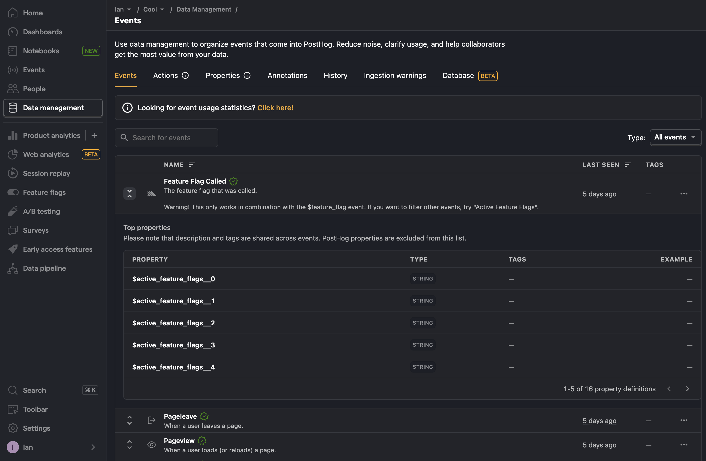
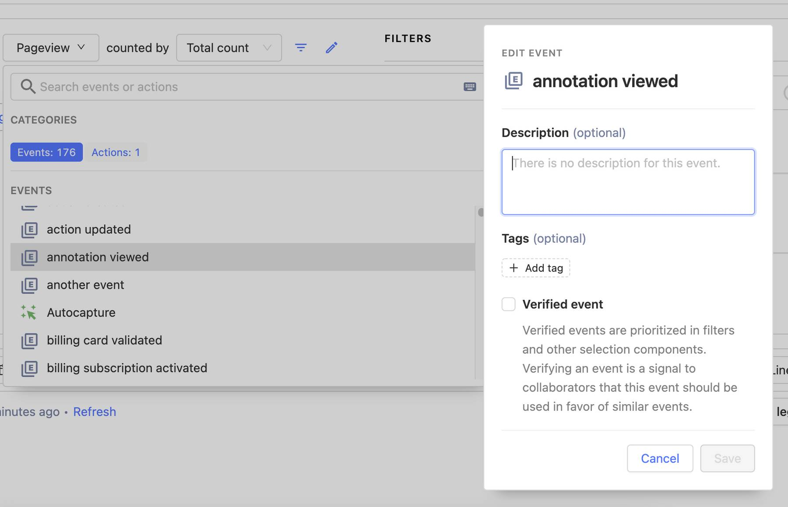

You can manage all your PostHog data on the [Data](https://us.posthog.com/data-management/events) and [People](https://us.posthog.com/persons) pages.

## Events

The [event tab](https://app.posthog.com/data-management/events) contains a list of all the events captured into your PostHog instance. They are sortable by name, last seen, and type (custom vs default).

Each event also contains the top custom properties for that event including their type, tags, and an example.

### Event details

Clicking on an event from this list shows more details about it, such as:

- An editable description
- The raw event name
- First and last seen dates
- Top custom properties
- Matching events

Clicking the edit button enables you to edit the description along with the event's tags and verification status. You can see and edit the description, tags, and verification status wherever you use this in PostHog, such as insights. 

This is useful for keeping track of what data is up-to-date and relevant.

## Actions

The [actions tab](https://app.posthog.com/data-management/actions) contains a list of all the [actions](/docs/data/actions) created. They are sortable by name, who created them, creation date, and whether they post to a webhook. 

The actions list also contains the type of action such as an event, autocapture, or pageview URL along with a description and tags. Clicking on an action takes you to that action's details page where you can edit it. 

## Properties 

The [properties tab](https://app.posthog.com/data-management/properties) contains a list of event, person, and group properties that have been captured into your PostHog instance. They are sortable by name and each listing also contains their type and tags.

## Annotations

The [annotations tab](https://app.posthog.com/data-management/annotations) enables you to create and edit [annotations](/docs/data/annotations). These enable you to add written notes to specific dates and times that show insights and dashboards.

You can also sort by date and time, scope (project), creator, and creation date.

## History

The [history tab](https://app.posthog.com/data-management/history) contains a log of all the changes to event and property descriptions and tags along with deletion and verification of events.

## Ingestion warnings

Sometimes PostHog runs into problems during ingestion due to incorrect or suboptimal usage of PostHog. For example, if you capture an event with a generic ID like `null`, PostHog doesn't ingest it.

If this happens, we do our best to still ingest the event and we log an ingestion warning. 

See [ingestion warnings docs](/docs/data/ingestion-warnings) for a complete list.

## Database (beta)

The database tab shows a list of the tables in your PostHog instance. You can then query the supported tables using [HogQL](/docs/hogql).

## Further reading

- [Event ingestion explained](/handbook/engineering/databases/event-ingestion)
- [5 ways to improve your product analytics data](/product-engineers/5-ways-to-improve-analytics-data)
- [A non-technical guide to understanding data in PostHog](/tutorials/non-technical-guide-to-data)
