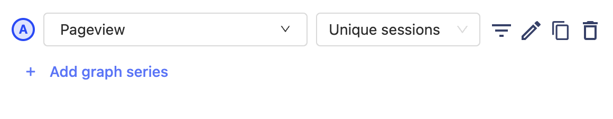
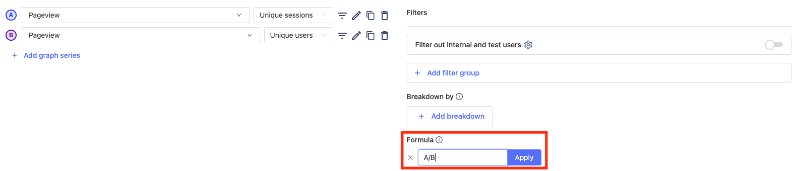
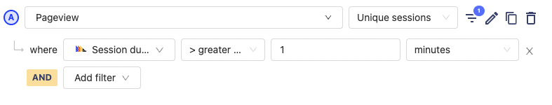
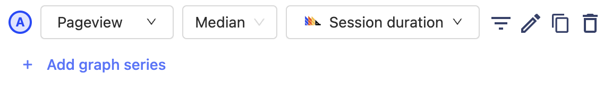
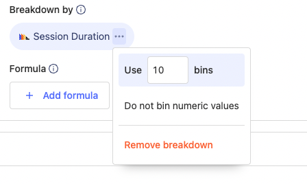

Session analysis helps you to understand product usage by uncovering the amount of time users spend on your product and how often they return.

This helps you to understand which of your features drive the most engagement and how to improve your product.

## What is a session?

A session is a set of events that have been grouped together to try to capture a single "use" of your product.

As events are sent to PostHog, they are grouped into sessions on the client. If there isn't activity for more than 30 minutes, then the session is ended, and the subsequent events are grouped into a new session.

### Common questions

-   **Can a session span different devices?:** No, sessions are tied to a single device and instance of a PostHog client. This means if a user is using two different browsers (e.g. Chrome and Firefox) they will be treated as two separate sessions.
-   **Can a session span browser tabs and windows?:** Yes, as a user moves between different tabs and windows, their events will be grouped into a single session. However, if they open a completely new browser (e.g. move from Chrome to Firefox) then a new session will be created.
-   **Which clients support sessions?:** Today, PostHog-JS is the only client that supports sessions. However, we are planning to add it to the other front-end libraries.
-   **How are sessions split?:** Sessions are split when there is no user activity for more than 30 minutes.
-   **What defines user activity for a session?:** User activity is defined as any event sent from the client (including Autocapture events). Also, if recordings are enabled, then user activity from the recording (like mouse movement) will extend the session.
-   **Is there a limit on session length?:** Yes, the longest allowed session is 24 hours. If a session is longer than that, it will be split.
-   **Is a session the same as a recording?:** Both sessions and recordings are tracked using the same ID. So if a new session is created, then a new recording is created too.

## Session analysis

Within the trends tab of insights, you can analyze sessions along with your other data.

<blockquote class='warning-note'>
<b>IMPORTANT: </b> 
When performing session analysis, PostHog will only include events that have been been tagged with a session. Right now, that is only posthog-js events sent from version <code>1.16.1</code> (released Nov. 7 2021) and later.
</blockquote>

### Session counts

Within the trends tab, you can aggregate results by the count of unique sessions. This provides the count of unique sessions where the specified event occurred. If you have specific events that are sent a bunch of times within a single session, this can be helpful to remove the noise.

To do this analysis, simply select Unique sessions from the aggregation dropdown.

### Using session counts in formulas

Combining session counts with other trends is a very powerful way to understand things like:

-   The average number of sessions per user where a specific action occurs
-   The average number of a specific events per session

To do this analysis, simply make the series in your trends (e.g. unique sessions where an event occurs), and then use that series in a formula.

### Filtering by session duration

Sometimes, it can be helpful to filter out sessions that are either too short or too long. For example, this enables you to dig into users who only use your product for a few seconds, or filter those users out, so you can better understand those who stick around longer.

To accomplish this, you can use the 'Session duration' property in the property filters.

### Plotting session duration

You can plot session durations overtime to understand if your users are becoming more or less engaged with your product. To accomplish this, select one of the property aggregators (e.g median, 90th percentile etc) and then select 'Session duration' as the property to plot.

### Distribution of session duration

Breaking down data by the distribution of session durations can be useful when trying to understand why certain users behave a specific way. For example, you might find that users who complete a specific event are always in your product for over 10 minutes.

To look at the distribution of session durations, click 'Add breakdown' and then select the 'Session duration' property.

