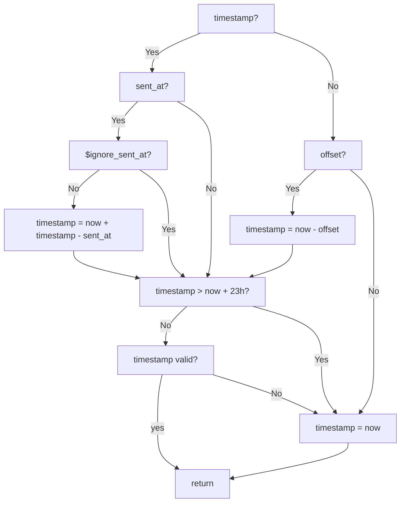

PostHog automatically computes timestamps for captured events, but you can also set them manually. For example:

- If the payload contains `timestamp` and `sent_at` fields, the `sent_at` field is compared to the server time to account for clock skew. The event's `timestamp` is adjusted by this difference before being stored. This is the method our libraries use.

- If the payload includes a `timestamp` but no `sent_at` field, then `timestamp` is directly used as the event timestamp.

- If the payload contains `timestamp`, `sent_at`, and `$ignore_sent_at` fields, then `timestamp` is used directly as the event timestamp. Using `$ignore_sent_at` could be useful during historical data imports.

- If `offset` is included in the payload, then this value is interpreted as milliseconds and is subtracted from the capture time recorded by the server to obtain the event timestamp. The first two alternatives have higher priority so `offset` is ignored if `timestamp` is present.

- Finally, as a fallback when no `timestamp` or `offset` are included in the payload, the capture time recorded by the server is used as the event timestamp.

To ensure maximum compatibility with PostHog, `timestamp` and `sent_at` fields should be in `ISO 8601` format like `2023-12-13T15:45:30.123Z` or `YYYY-MM-DDTHH:MM:SSZ`.

> **Note:** `posthog-js` also sends `$time` property, but this isn't used anywhere in the ingestion pipeline.

Here's a flowchart for how event timestamp is computed during ingestion:

## Recognized formats

Although we recommend using the `ISO 8601` format, PostHog can also detect several other formats of string as dates and times:

- YYYY-MM-DD,
- YYYY-MM-DD HH:mm:SS,
- DD-MM-YYYY HH:mm:SS,
- DD/MM/YYYY HH:mm:SS,
- YYYY/MM/DD HH:mm:SS
- [the RFC 822 standard](https://datatracker.ietf.org/doc/html/rfc822)

In detection, day and month are interchangeable so MM-DD-YYYY would be detected as a date.

Ten and thirteen digit numbers are detected as [timestamps](https://en.wikipedia.org/wiki/Unix_time) if the property name includes "time" or "timestamp."
