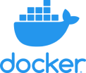

|                                                     |                                                             |                                                                                     |
| :-------------------------------------------------- | :---------------------------------------------------------: | ----------------------------------------------------------------------------------- |
| [](#heroku) | [](#docker-compose) | [](#helm-chart-kubernetes-installation) | [](#aws-ecs-fargate) | [](#source-installation) |
| <a href="#heroku" class="middle">Heroku</a>         |     <a href="#docker-compose" class="middle">Docker</a>     | <a href="#helm-chart-kubernetes-installation" class="middle">Kubernetes</a>         | <a href="#aws-ecs-fargate" class="middle">AWS</a> | <a href="#source-installation" class="middle">Source</a> |

## Heroku

[](https://heroku.com/deploy?template=https://github.com/posthog/posthog)

Heroku is the quickest way to get a production PostHog environment up-and-running.

We recommend getting at the very least a `hobby-dev` Postgres and Dyno for low volumes of events. If you run on the 'free' tier it will work, but there will be a big lag each time you visit the app if your site hasn't been visited for a while.

See our instructions on [upgrading PostHog](/upgrading-PostHog) on Heroku to the latest version.

## Docker images

We have [three types of images](https://hub.docker.com/r/posthog/posthog):

- `posthog/posthog:latest`, which builds straight of master
- `posthog/posthog:preview`, which is used for the preview image
- `posthog/posthog:release-[version number]`, so you can pin a specific version.

> We recommend using `posthog/posthog:latest`, so you always have the latest features and security updates

## Docker Compose

1. [Install Docker](https://docs.docker.com/installation/ubuntulinux/)
2. [Install Docker Compose](https://docs.docker.com/compose/install/)
3. Run the following:

```bash
sudo apt-get install git
git clone https://github.com/posthog/posthog.git
cd posthog
docker-compose up -d
```

If you're running locally:

1. Make sure to add `DEBUG: 1` as an environment variable, otherwise you'll get stuck in an infinite loop of SSL redirects.
1. PostHog assumes you want to use SSL and will redirect you to `https://...`. To avoid this, set `DISABLE_SECURE_SSL_REDIRECT=1`

If you run your Postgres database somewhere else (like RDS, or just a different server) you can set the DATABASE_URL property, and remove `services -> db` and `depends_on: - db` from your docker-compose file.

### Docker one line preview

If you would like to run the software locally, you can use a Docker preview. This is _not_ meant for production use.

Copy the following into your terminal:

```bash
docker run -t -i --rm --publish 8000:8000 -v postgres:/var/lib/postgresql posthog/posthog:preview
```

The image has everything you need to try out PostHog locally! It will set up a server on http://127.0.0.1:8000.

## Helm chart (Kubernetes) installation

We maintain a [helm chart for PostHog](https://github.com/PostHog/charts/tree/master/charts/posthog).

To install the latest version:

```shell script
helm repo add posthog https://posthog.github.io/charts/
helm repo update
helm install posthog posthog/posthog
```

See the [README](https://github.com/PostHog/charts/blob/master/charts/posthog/README.md) or
[`values.yaml`](https://github.com/PostHog/charts/blob/master/charts/posthog/values.yaml)
for configuration options.

## AWS ECS Fargate

We maintain a CloudFormation [config](https://github.com/fuziontech/posthog/blob/master/deployment/aws/ecs/combined.yaml) for deploying Posthog with Redis and Postgres to a stack on AWS. For the container hosting we use fargate so that you only pay for what you need.

For an in depth how-to on CloudFormations check out the [AWS Docs](https://docs.aws.amazon.com/AWSCloudFormation/latest/UserGuide/GettingStarted.Walkthrough.html)

The gist is this:

1. Grab YAML Configs from [here](https://github.com/PostHog/deployment/blob/master/aws/cloudformation/ecs/posthog.yaml)

1. Go to the CloudFormation page on your AWS [console](https://console.aws.amazon.com/cloudformation/)

1. Click **Create Stack -> With New Resources (standard)**

1. Select Upload a template and link to your newly downloaded YAML config

1. Choose a Stack Name and review the Parameters. You will need to update these if you want to modify default behaviours or setup SMTP configs as described below

1. Review the rest of the config wizard pages

1. On the Review stack page you can click **estimate cost** to get an estimate of how much your specific config will cost per month. The default configs cost about \$27 USD a month

1. If you are ready, click **Create Stack**!

1. Once deployment completes look under **Options** for the Publicly facing ELB Host

**⚠️ You should review all of the parameters in the config and also you should _definitely_ setup for TLS. Once you have TLS setup for your ELB you should disable insecure access via HTTP by removing the evironment variable `DISABLE_SECURE_SSL_REDIRECT=1` from the Task definition in ECS and deploy the updated Task definition revision.**

## Source installation

1. Make sure you have Python >= 3.7 and pip installed
2. [Install Yarn](https://classic.yarnpkg.com/en/docs/install/#mac-stable)
3. Have a Postgres and Redis server running
4. Run the following:

```bash
git clone https://github.com/posthog/posthog.git
yarn build
pip install -r requirements.txt
export DATABASE_URL=''
export REDIS_URL=''
python manage.py runserver
python manage.py collectstatic
```

5. To start the server and worker, run

```bash
./bin/docker-server & ./bin/docker-worker
```

Although it's optional, it's a good idea to use something like [Supervisor](https://github.com/Supervisor/supervisor) to keep this command running
