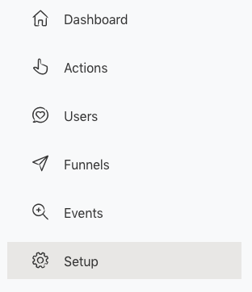
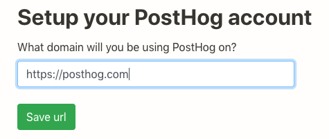
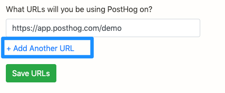
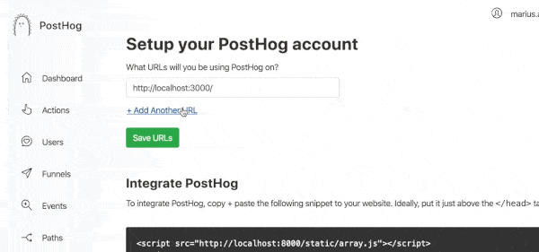
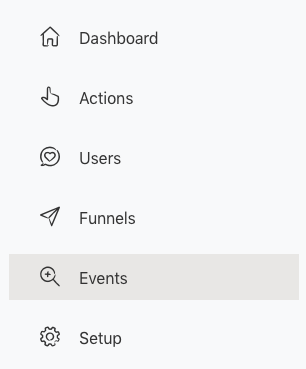
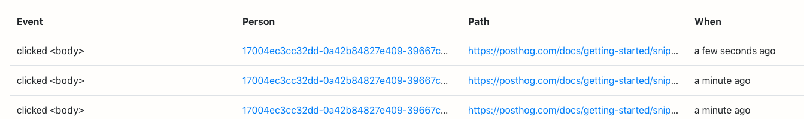

The easiest way to get going is to add a JavaScript snippet to your application.

## Finding the snippet

To find the snippet, login at app.posthog.com

Now, go to ‘Setup’ in the left hand navigation:



Enter the domain of your application then press ‘Save url’.



## Adding the snippet to your application or website

Now, under ‘Integrate PostHog’, copy the code snippet.

Paste this into the  tags of your application, ideally just above the </head> tag.

## Website vs App

We recommend putting PostHog both on your homepage and your application if applicable. That means you'll be able to follow a user from the moment they come onto your website, all the way through signup and actually using your product.

## Adding multiple urls 

PostHog can also support tracking across multiple urls and domains. In Setup you can select '+ Add Another URL'



You can then enter multiple urls that you would like to track activity for.



## Verify events tracking

To check events tracking is working, navigate to your application and check you can see the snippet in the right place.

Now, visit a URL of your application. Then go back to PostHog.

Click ‘Events’ in the left hand navigation:



You should be able to see a list of events, when they took place and the path containing the URL you visited.



You should be able to see a list of events, when they took place and the path containing the URL you visited.

## Ignore/censure elements
PostHog does lots of things to make sure it doesn't capture any sensitive data from your website. If there are other elements you don't want to be captured, you can add the `ph-no-capture` class name.

```html
<button class='ph-no-capture'>Sensitive information here</button>
```

## Event tracking via API (instead of JavaScript)

You can choose not to use a JavaScript snippet, and can instead push events to the PostHog API. See the Events documentation for more detail.