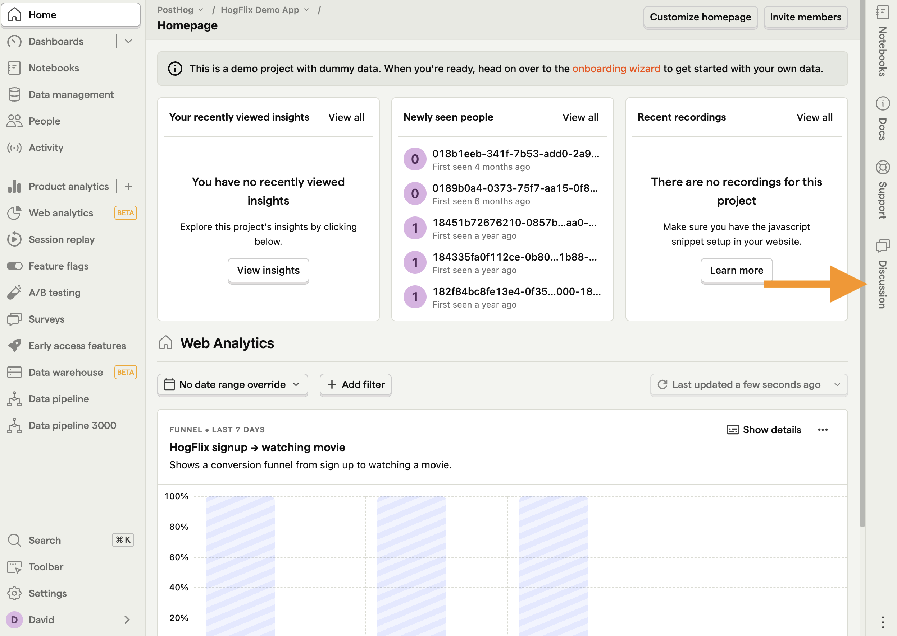
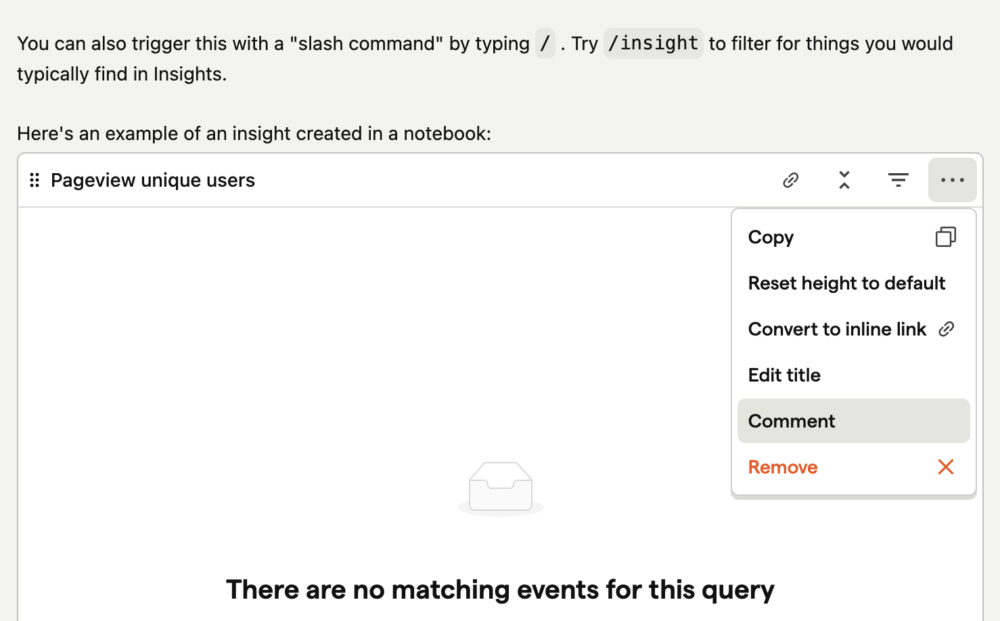

Discussions gives you a way to add comments to anything in PostHog for your team members to see. It is a great way of sharing context or ideas without getting in the way of the thing you are commenting on.

## Accessing the Discussion sidepanel

Discussion are accessible from the right hand sidebar.

### Discussion support

Every discussion is scoped to an element within PostHog, so you will see different conversations depending on what you're looking at on the left hand side.

Examples of what you might discuss include:

- Adding a note to a Person or Organization about a recent refund

- Sharing thoughts about what a user was doing during session recording

- Agreeing on a launch and rollout plan for a new Feature Flag

So far Discussions supports Insights, Dashboards, Session Replays, Surveys, Experiments, Early Access Features, People, Cohorts, Groups, Events and Notebooks.

## Adding a comment

Markdown support is included so you can format your messages and even include images or screenshots. Clicking 'Preview' shows you how your comment will appear before sending.

Threaded replies are supported by clicking the actions dropdown menu on a comment.

## Notebooks support

Discussion is integrated to work with Notebooks. You can highlight any text in a Notebook and click the comment icon in the floating toolbar to 

Anyone from your team who clicks the highlighted text will be shown the comment in the side panel

Comments can also be associated with nodes in a Notebook by clicking Comment in the actions menu of their header.

