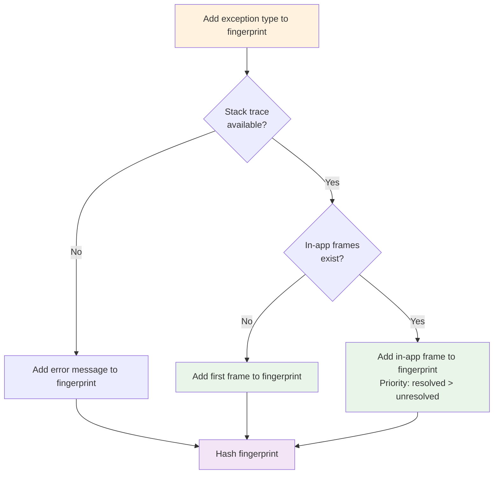

Every captured exception is assigned a fingerprint. This fingerprint is used to group similar exceptions into issues. Fingerprints can also be manually set during capture. This page covers how fingerprints are generated and how they're used.

## Fingerprint and issue grouping

Every exception has a fingerprint, whether generated or defined by the user. Each fingerprint links to exactly one issue. Exceptions that share the same fingerprint are grouped together.

Multiple different fingerprints can point to the same issue (a many-to-one relationship) if you [merge issues](/docs/error-tracking/managing-issues#merging-issues). 

## How are fingerprints generated?

Fingerprints are built iteratively using components of the exception event. The flowchart below shows how fingerprints are generated.

The flowchart in text

Fingerprints are generated by considering the following in combination:
- The exception type
- If there's no resolved stack trace
- If there are stack traces
  - If there are no in-app stack frames (frames from your code, not a dependency), use the first frame of the stack trace
  - Otherwise only use a frame if it's in app, **and** is either resolved or no other frames are resolved and available

If there are multiple exceptions leading to one another, a single fingerprint will be generated for that chain of exceptions.

### Ensuring accurate fingerprints

[Resolved stack traces](/docs/error-tracking/stack-traces) are critical for accurate fingerprinting. Without accurate stack traces, PostHog cannot group exceptions consistently. If you have not uploaded source maps, you should do so following this [guide](/docs/error-tracking/upload-source-maps).

This also means that if the exception **type** or **message** changes from one version to the next, the fingerprint will change. 

## When are generated fingerprints used?

Fingerprints are used to group similar exceptions into issues automatically. Automatic issue grouping is only done when:

- No [issue grouping rules](/docs/error-tracking/grouping-issues) are applied
- No [issue merging](/docs/error-tracking/managing-issues#merging-issues) has been configured
- No [custom fingerprint](#customizing-fingerprints) is set during capture

You can find details about how issue grouping works in the [issues and exceptions](/docs/error-tracking/issues-and-exceptions) guide.

## Customizing fingerprints

Fingerprints can be manually set during exception capture. This is a very useful way to group exceptions that are not related to each other. You can find examples of how to do this in the [custom issue grouping](/docs/error-tracking/grouping-issues#option-1-client-side-fingerprint) section.

You can also learn more about grouping issues using rules in the [grouping issues](/docs/error-tracking/grouping-issues) guide.