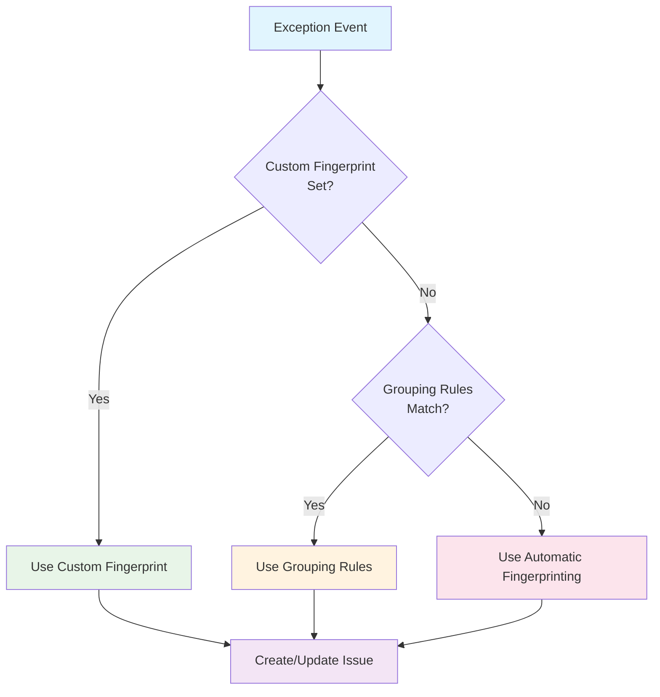

This page introduces the concept of issues and exceptions, how they fit into the error tracking workflow, and how you can work with them.

## What is an exception?

Errors are initially captured as individual `$exception` events. Like other [events](/docs/data/events) in PostHog, they contain properties that you can use to filter and group them. You can also use them to create insights, filter recordings, trigger surveys, and more. 

You can expect the following properties to be present in the exception events (in addition to the [standard event properties](/docs/data/events#default-properties)):

import ExceptionPropertiesTable from './_snippets/exception-properties-table.mdx'

<ExceptionPropertiesTable />

These captured properties are used to build a [fingerprint](/docs/error-tracking/fingerprints) of the exception, which is used to group similar exceptions into issues.

## What is an issue?

Issues are groups of similar `$exception` events that share common event information, such as the exception type, message, and stack trace. They're the primary way you interact with captured exceptions in error tracking.

<ProductScreenshot
    imageLight="https://res.cloudinary.com/dmukukwp6/image/upload/issue_light_f17781d806.png"
    imageDark="https://res.cloudinary.com/dmukukwp6/image/upload/issue_dark_5e825b1fe6.png"
    alt="Issue view"
    classes="rounded"
/>

When working in the context of error tracking, PostHog [groups similar exception events](/docs/error-tracking/grouping-issues) into issues to help you triage them and take action. You can do the following with issues:

- [Mark the issue as active, suppressed, or resolved](/docs/error-tracking/managing-issues#resolving-and-suppressing-issues)
- [Assign the issue to a team member or role](/docs/error-tracking/assigning-issues)
- [Connect the issue to an external tracking system like GitHub issues or Linear](/docs/error-tracking/external-tracking)
- [View session replays to help root cause the issue](/docs/error-tracking/monitoring#viewing-session-replays)

## How are issues grouped?

PostHog attempts to group similar issues automatically by their exception type, exception message, and [stack traces](/docs/error-tracking/stack-traces). The quality of automatic grouping can vary depending on the data available. 

You can also influence grouping by labeling issues with a [custom fingerprint](/docs/error-tracking/capture#customizing-exception-capture) or manually combine issues by [merging them](/docs/error-tracking/managing-issues#merging-issues).

The priority order from highest to lowest of these grouping methods is:

1. Client-side defined [custom fingerprint](/docs/error-tracking/capture#customizing-exception-capture) using `$exception_fingerprint`
2. Match [grouping rules](/docs/error-tracking/grouping-issues) defined in PostHog
3. If no user defined logic, fall back to [automatic fingerprinting](/docs/error-tracking/fingerprints)
 
> We're working on improving our grouping algorithm. If you spot two issues that you think should have been one, or one issue that you think should have been split into two, please [let us know in-app](https://us.posthog.com#panel=support%3Afeedback%3Aerror_tracking%3Alow%3Atrue).

## Working with issues

Issues are the primary way you interact with captured exceptions in PostHog. Here are some common workflows you can perform with issues:

- [Searching and monitoring issues](/docs/error-tracking/monitoring)
- [Assigning issues](/docs/error-tracking/assigning-issues)
- [Grouping issues](/docs/error-tracking/grouping-issues)
- [Alerting on issues](/docs/error-tracking/alerts)