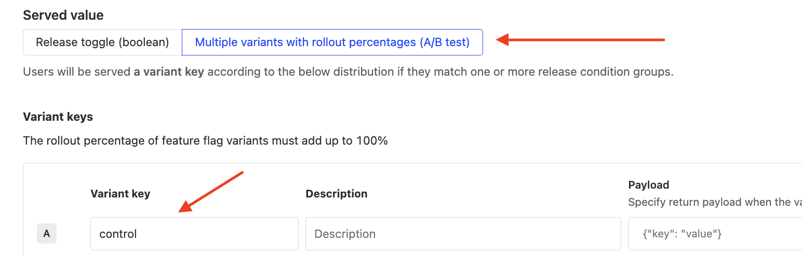

## How do I use an existing feature flag in an experiment?

We generally don't recommend this, since experiment feature flags need to be in a specific format (see below) or otherwise they won't work.

However, if you insist on doing this (for example, you don't want to make code change), you can do this for **multiple variant feature flags only** by doing the following:

1. Delete the existing [feature flag]((https://app.posthog.com/feature_flags) you'd like to use in the experiment
2. Create a new experiment and give your feature flag the same key as the feature flag you deleted in step 1.
3. Name the first variant in your new feature flag 'control'.

> **Note:** Deleting a flag is equivalent to disabling it, so it is off for however long it takes you to create the draft experiment. The flag is enabled as soon as you create the experiment (not launched).

## How do I run a second experiment using the same feature flag as the first experiment?

This is similar to running an experiment using an [existing feature flag](#how-do-i-use-an-existing-feature-flag-in-an-experiment). If you want to re-run an experiment (using the same feature flag key) while preserving the previous experiment results, delete the existing feature flag (not the experiment) and use the same key in the new experiment.

## How can I run experiments with my custom feature flag setup?

See our docs on [how to run an experiment without using feature flags](/docs/experiments/running-experiments-without-feature-flags).

## How do I assign a specific person to the control/test variant in an experiment?

Once you create the experiment, go to the feature flag, scroll down to "Release Conditions". For each condition, there is an "Optional Override". This enables you to choose a release condition and force all people in this release condition to have the variant chosen in the optional override.

## The "feature flag response" property shows values of "none" or "false" in addition to "control" and "test"

In the "Feature Flag Called" event, the "Feature Flag Response" property is "false" for users who called your feature flag but did not match any of the rollout conditions.

"none" indicates that feature flag is disabled or failed to load e.g., due to network error or something unexpected.

## How can I manage the volume of events my feature flags send?

Every SDK has the option to disable sending these events. Check the [relevant docs for your SDK](/docs/getting-started/install?tab=sdks) for the `send_events` parameter in your `posthog.isFeatureEnabled()` or `posthog.getFeatureFlag()` calls.

However, note that this has a few consequences:

1. The usage tab on the flag will stop showing events since we can't track them anymore.
2. Experiments that depend on trend goals won't work since we use this event to calculate relative exposure. Convert your trend experiments to funnel experiments instead to make this work.
