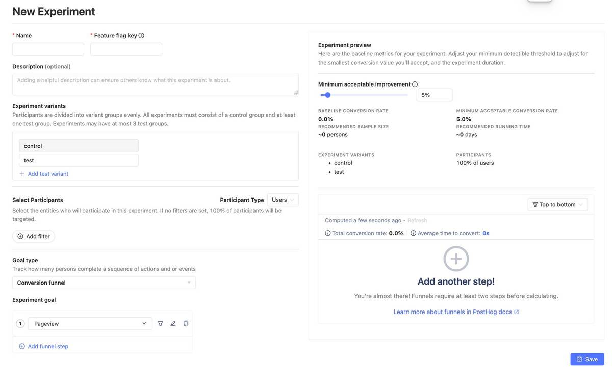
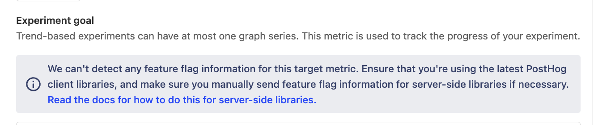

A/B testing enables you to test the impact of product changes and understand how they affect your users' behaviour. For example:

- How changes to your onboarding flow affect your signup rate.
- If different designs of your app's dashboard increase user engagement and retention.
- The impact a free trial period versus money-back guarantee to determine which results in more customers.

A/B tests are also referred to as "experiments", and this is how we refer to them in the PostHog app.

## How to create an experiment in PostHog

To create a new experiment, go to the [experiments tab](https://app.posthog.com/experiments) in the PostHog app, and click on the "New experiment" button in the top right.

This presents you with a form where you can complete the details of your new experiment:



Here's a breakdown of each field in the form:

### Feature flag key

Each experiment is backed by a [feature flag](/docs/feature-flags/manual). In your code, you use this feature flag key to check which experiment variant the user has been assigned to. 

> **Advanced:** It's possible to create experiments without using PostHog's feature flags (for example, if you you're a different library for feature flags). For more info, read our docs on [implementing experiments without feature flags](/docs/experiments/running-experiments-without-feature-flags) 

### Experiment variants

By default, all experiments have a 'control' and 'test' variant. If you have more variants that you'd like to test, you can use this field to add more variants and run multivariant tests. Participants are automatically split equally between variants.

Participants are automatically split equally between variants. If you want assign specific users to a specific variant, you can set up [manual overrides](/docs/experiments/common-questions#how-do-i-assign-a-specific-person-to-the-controltest-variant-in-an-experiment).

### Participant type

The default is users, but if you've created [groups](/docs/product-analytics/group-analytics), you can run [group-targeted experiments](/blog/running-group-targeted-ab-tests). This will test how a change affects your product at a group-level by providing the same variant to every member of a group.

### Participant targeting

By default, your experiment will target 100% of participants. If you'd like to target a more specific set of participants, or change the rollout percentage, you'll need to do this by changing the [release conditions](/docs/feature-flags/rollout-strategies) for the feature flag used by your experiment.

Below is a video showing how to navigate there:


### Experiment goal

Setting your goal metric enables PostHog to calculate the impact of your experiment and if your results are [statistically significant](/docs/experiments/significance). You can select between a "trend" or "conversion funnel" goal.

You set the minimum acceptable improvement below. This combines historical data from your goal metric with your desired improvement rate to show a prediction for how long you need to run your experiment to see statistical significant results.


> **Note:** If you select a server-side event, you may see a warning that no feature flag information can be detected with the event. To resolve this issue, see [step 2 of adding your experiment code and how to submit feature flag information with your events](#step-2-server-side-only-upload-the-feature-flag-property-with-your-events).
> 
> 

## Adding your experiment code

### Step 1: Fetch the feature flag

To check which variant of your experiment to show to your participants, use the following code to fetch the feature flag:

<MultiLanguage>

```js-web
// Ensure flags are loaded before usage.
// You'll only need to call this on the code the first time a user visits.
// See this doc for more details: https://posthog.com/docs/feature-flags/manual#ensuring-flags-are-loaded-before-usage
posthog.onFeatureFlags(function() {
    // feature flags should be available at this point
    if (posthog.getFeatureFlag('experiment-feature-flag-key')  == 'variant-name') {
        // do something
    }
})

// Otherwise, you can just do:
if (posthog.getFeatureFlag('experiment-feature-flag-key')  == 'variant-name') {
    // do something
}

// You can also test your code by overriding the feature flag:
// e.g., posthog.feature_flags.override({'experiment-feature-flag-key': 'test'})
```

```react
// You can either use the `useFeatureFlagVariantKey` hook,
// or you can use the feature flags component - https://posthog.com/docs/libraries/react#feature-flags-react-component

// Method one: using the useFeatureFlagVariantKey hook
import { useFeatureFlagVariantKey } from 'posthog-js/react'

function App() {
    const variant = useFeatureFlagVariantKey('experiment-feature-flag-key')
    if (variant == 'variant-name') {
        // do something
    }
}

// Method two: using the feature flags component
import { PostHogFeature } from 'posthog-js/react'

function App() {

    return (
        <PostHogFeature flag='experiment-feature-flag-key' match={'variant-name'}>
            <div>
                <!-- the component to show -->
            </div>
        </PostHogFeature>
    )
}


// You can also test your code by overriding the feature flag:
// e.g., posthog.feature_flags.override({'experiment-feature-flag-key': 'test'})
```

```react-native
// With the useFeatureFlag hook
import { useFeatureFlag } from 'posthog-react-native'

const MyComponent = () => {
    const variant = useFeatureFlag('experiment-feature-flag-key')

    if (variant === undefined) {
        // the response is undefined if the flags are being loaded
        return null
    }

    if (variant == 'variant-name') {
        // do something
    }
}           
```

```android
if (PostHog.with(this).getFeatureFlag('experiment-feature-flag-key')  == 'variant-name') {
    // do something
}
```

```iOS
// In Swift
if (posthog.getFeatureFlag('experiment-feature-flag-key')  == 'variant-name') {
    // do something
}
```

```node
const variant = await client.getFeatureFlag('experiment-feature-flag-key', 'user_distinct_id')

if (variant === 'variant-name') {
    // do something
}
```

```python
variant = posthog.get_feature_flag('experiment-feature-flag-key', 'user_distinct_id')

if variant == 'variant-name':
    # Do something
```

```php
$variant = PostHog::getFeatureFlag('experiment-feature-flag-key', 'user_distinct_id')

if ($variant === 'variant-name') {
    // Do something differently for this user
}
```

```ruby
variant = posthog.get_feature_flag('experiment-feature-flag-key', 'user_distinct_id')

if variant == 'variant-name'
    # Do something 
end
```

```go
variant, err := client.GetFeatureFlag(
            FeatureFlagPayload{
                Key:        "experiment-feature-flag-key",
                DistinctId: "user_distinct_id",
            })

if variant == "variant-name" {
    // Do something
}
```
</MultiLanguage>

> Since feature flags are not supported yet in our Java, Rust, and Elixir SDKs, see our docs on [how to run experiments without feature flags](/docs/experiments/running-experiments-without-feature-flags). This also applies to running experiments using our API.

### Step 2 (server-side only): Add the feature flag property to your events 

For any server-side events that are also goal metrics for your experiment, you need to include a property `$feature/experiment_feature_flag_name: variant_name` when capturing those events. This ensures that the event is attributed to the correct experiment variant (e.g., test or control).

This step is not required for events that are submitted via our client-side SDKs (e.g., JavaScript, iOS, Android, React, React Native).

<MultiLanguage>

```node
client.capture({
    distinctId: 'distinct_id',
    event: 'event_name_of_your_goal_metric',
    properties: {
        '$feature/experiment-feature-flag-key': 'variant-name'
    },
})
```

```python
posthog.capture(
    'distinct_id',
    'event_name_of_your_goal_metric',
    {
        '$feature/experiment-feature-flag-key': 'variant-name'
    }
)
```

```php
PostHog::capture(array(
  'distinctId' => 'distinct_id',
  'event' => 'event_name_of_your_goal_metric',
  'properties' => array(
    '$feature/experiment-feature-flag-key'  = 'variant-name'
  )
));
```

```ruby
posthog.capture({
    distinct_id: 'distinct_id',
    event: 'event_name_of_your_goal_metric',
    properties: {
        '$feature/experiment-feature-flag-key': 'variant-name',
    }
})
```

```go
client.Enqueue(posthog.Capture{
  DistinctId: "distinct_id",
  Event:      "event_name_of_your_goal_metric",
  Properties: posthog.NewProperties().
    Set("$feature/experiment-feature-flag-key", "variant-name"),
})
```

```java
posthog.capture(
  "distinct_id",
  "event_name_of_your_goal_metric",
  new HashMap<String, Object>() {
    {
      put("$feature/experiment-feature-flag-key", "variant-name");
    }
  }
);
```

</MultiLanguage>

## Testing and launching your experiment

Once you've written your code, it's a good idea to test that each variant behaves as you'd expect. If you find out your implementation had a bug after you've launched the experiment, you lose days of effort as the experiment results can no longer be trusted.

The best way to do this is adding an optional override to your release conditions. For example, you can create an override to assign a user to the 'test' variant if their email is your own (or someone in your engineering team). You can do this by:

1. Go to your experiment feature flag.
2. Ensure the feature flag is enabled by checking the "Enable feature flag" box.
3. Add a new condition set with the condition to `email = your_email@domain.com`. Set the rollout percentage for this set to 100%.
4. Set the optional override for the variant you'd like to assign these users to.
5. Click "Save".


Once you're satisfied, you're ready to launch your experiment.

> **Note:** The feature flag is activated only when you launch the experiment, or if you've manually checked the "Enable feature flag" box.

> **Note:** While the [PostHog toolbar](/docs/toolbar) enables you to toggle feature flags on and off, this only works for active feature flags and won't work for your experiment feature flag while it is still in draft mode.

## Viewing experiment results

While the experiment is running, you can see results on the page:


Sometimes, in the beginning of an experiment, results can be skewed to one side while enough data is being still gathered. While peeking at preliminary results is not a problem, making quick decisions based on them is [problematic](/blog/ab-testing-mistakes#3-conducting-an-experiment-without-a-predetermined-duration). We advise you to wait until your experiment has had a chance to gather enough data.

## Ending an experiment

Here is checklist of things to do when ready to end your experiment:
-   [ ] Click on "Stop" button on the experiment page. This will ensure final results are stored.
-   [ ] Roll out the winning variant of your experiment by setting the feature flag conditions accordingly. This ensures that your users see the winning variant without needing to make any code changes.
-   [ ] Remove the experiment and losing variant's code to launch the winning variant to all your users.
-   [ ] Share results with your team.
-   [ ] Document conclusions and findings in the "description" field your PostHog experiment. This will help preserve historical context for future team members.
-   [ ] Archive the experiment.

### Further reading

Want to learn more about how to run successful experiments in PostHog? Try these tutorials:

- [A software engineer's guide to A/B testing](/blog/contents/ab-testing-guide-for-engineers) 
- [8 annoying A/B testing mistakes every engineer should know](/blog/ab-testing-mistakes)
- [When and how to run group-targeted A/B tests](/blog/running-group-targeted-ab-tests)

