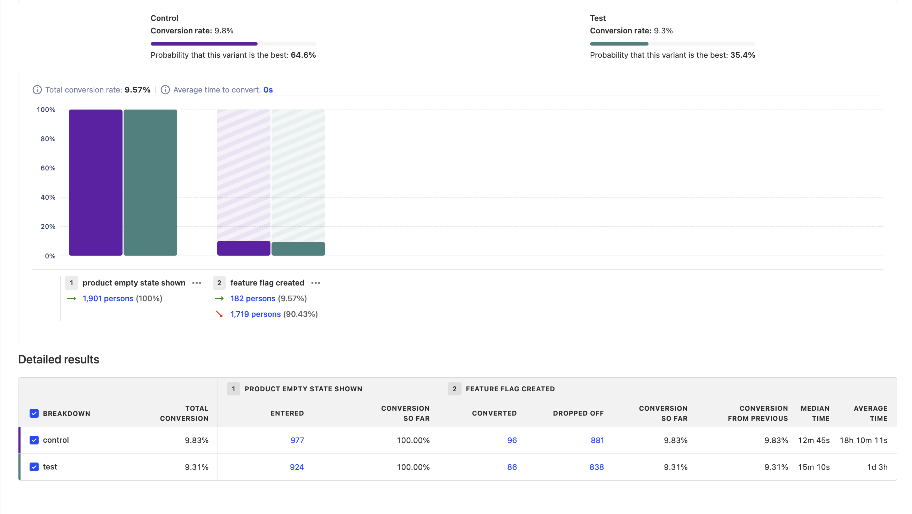

Once you've written your code, it's a good idea to test that each variant behaves as you'd expect. If you find out your implementation had a bug after you've launched the experiment, you lose days of effort as the experiment results can no longer be trusted.

The best way to do this is **adding an optional override** to your [release conditions](/docs/feature-flags/creating-feature-flags#release-conditions). For example, you can create an override to assign a user to the 'test' variant if their email is your own (or someone in your team). To do this:

1. Go to your experiment feature flag.
2. Ensure the feature flag is enabled by checking the "Enable feature flag" box.
3. Add a new condition set with the condition to `email = your_email@domain.com`. Set the rollout percentage for this set to 100%.
   
   - In cases where `email` is not available (such as when your users are logged out), you can use a parameter like `utm_source` and append `?utm_source=your_variant_name` to your URL.

4. Set the optional override for the variant you'd like to assign these users to.
5. Click "Save".

Once you test it works, you're ready to launch your experiment.

> **Note:** The feature flag is activated only when you launch the experiment, or if you've manually checked the "Enable feature flag" box.

> **Note:** While the [PostHog toolbar](/docs/toolbar) enables you to toggle feature flags on and off, this only works for active feature flags and won't work for your experiment feature flag while it is still in draft mode.

## Viewing experiment results

While the experiment is running, you can see results on the page:

Sometimes, in the beginning of an experiment, results can be skewed to one side while enough data is being still gathered. While peeking at preliminary results is not a problem, making quick decisions based on them is [problematic](/blog/ab-testing-mistakes#3-conducting-an-experiment-without-a-predetermined-duration). We advise you to wait until your experiment has had a chance to gather enough data.

## Ending an experiment

Here is checklist of things to do when ready to end your experiment:
-   [ ] Click on "Stop" button on the experiment page. This will ensure final results are stored.
-   [ ] Roll out the winning variant of your experiment by setting the feature flag conditions accordingly. This ensures that your users see the winning variant without needing to make any code changes.
-   [ ] Remove the experiment and losing variant's code to launch the winning variant to all your users.
-   [ ] Share results with your team.
-   [ ] Document conclusions and findings in the "description" field your PostHog experiment. This will help preserve historical context for future team members.
-   [ ] Archive the experiment.

## Further reading

Want to learn more about how to run successful experiments in PostHog? Try these tutorials:

- [A software engineer's guide to A/B testing](/blog/contents/ab-testing-guide-for-engineers) 
- [8 annoying A/B testing mistakes every engineer should know](/blog/ab-testing-mistakes)
- [When and how to run group-targeted A/B tests](/blog/running-group-targeted-ab-tests)

