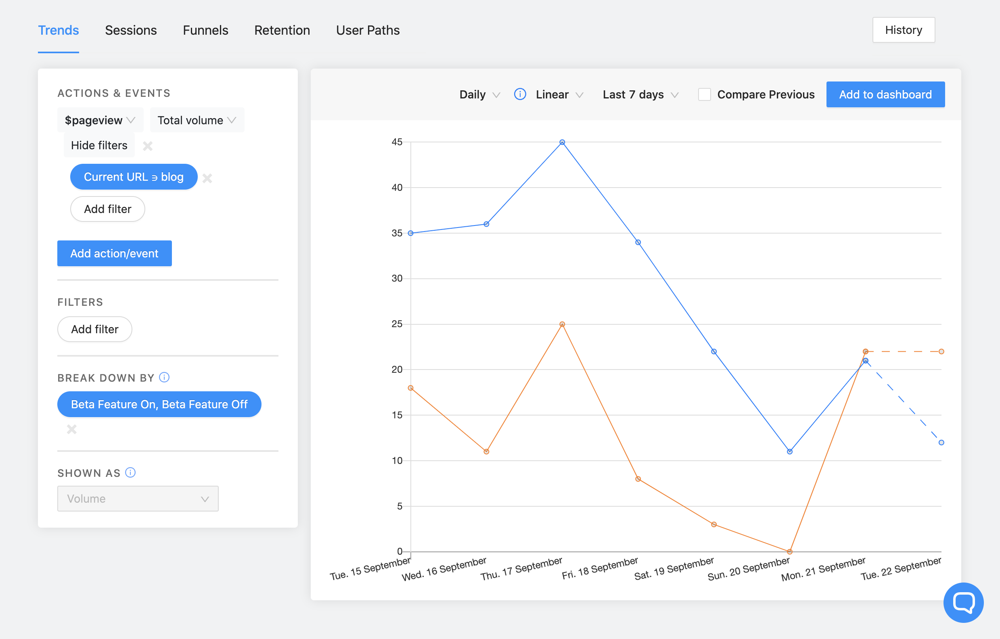

Feature flags are a very powerful piece of functionality that can be used in a wide variety of ways. How you use them will depend on your particular painpoints and internal [best practices](/product-engineers/feature-flag-best-practices). 

For us, here are some suggestions of use cases that could fit nicely with feature flags:

### A/B Testing

In simple terms, A/B testing is a method for determining how to provide the best user experience or meet other product goals by testing how different features perform. 

This could be used to answer questions such as "Do users click a button more often if it is blue or red?" or more complex questions like "How much more time do active users who have signed up for a free trial spend on our blog pages if we add a banner image?".

A great way to do this is by using [Cohorts](/docs/user-guides/cohorts). If you filter your flags by cohort, you can then easily see the differences in behavior across different cohorts. 

Here's an example view of Trends in PostHog filtering pageview events that contain the term "blog" in the URL, showing a breakdown between Cohort A (Beta Feature On) and Cohort B (Beta Feature Off):

### Gradual Rollouts

There are many occasions when you might want to roll out a feature to your users slowly. Maybe you only want to enable it for Beta users, or you simply want to give users a transition period.

Whatever the case may be, feature flags let you easily roll out features in an incremental way, increasing the portion of users that have the feature as fast or slow as you wish. 

### "Master Toggles"

If you have to ship a big piece of functionality and follow [trunk-based development](/product-engineers/trunk-based-development), chances are that you'll be doing it across multiple PRs.

As such, rather than attempt to coordinate a merge spree to ensure everything is live at once, you can create a feature flag that wraps all the new logic in all the pull requests. Then, once everything is merged and ready to go, you can simply flip the switch to release it.

Better yet, you can then release it slowly to make sure nothing breaks, and, if it does, you can easily turn it off with one click.

And this brings us to the next example.

### Kill Switches

You don't need feature flags _per se_ to implement kill switches, but having the ability to immediately turn a flag off is a nice add-on to the functionality.

Perhaps your goal all along was to do A/B testing for your UX, but, when something breaks, you can always roll it back safely with minor consequences (if implemented correctly).