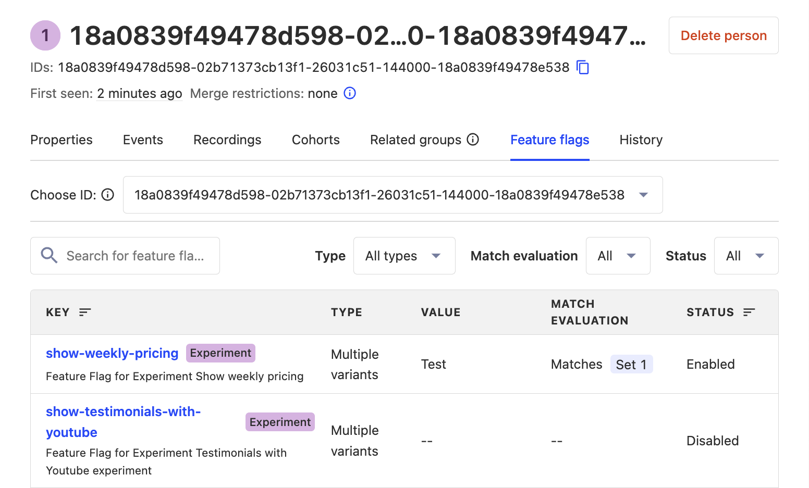
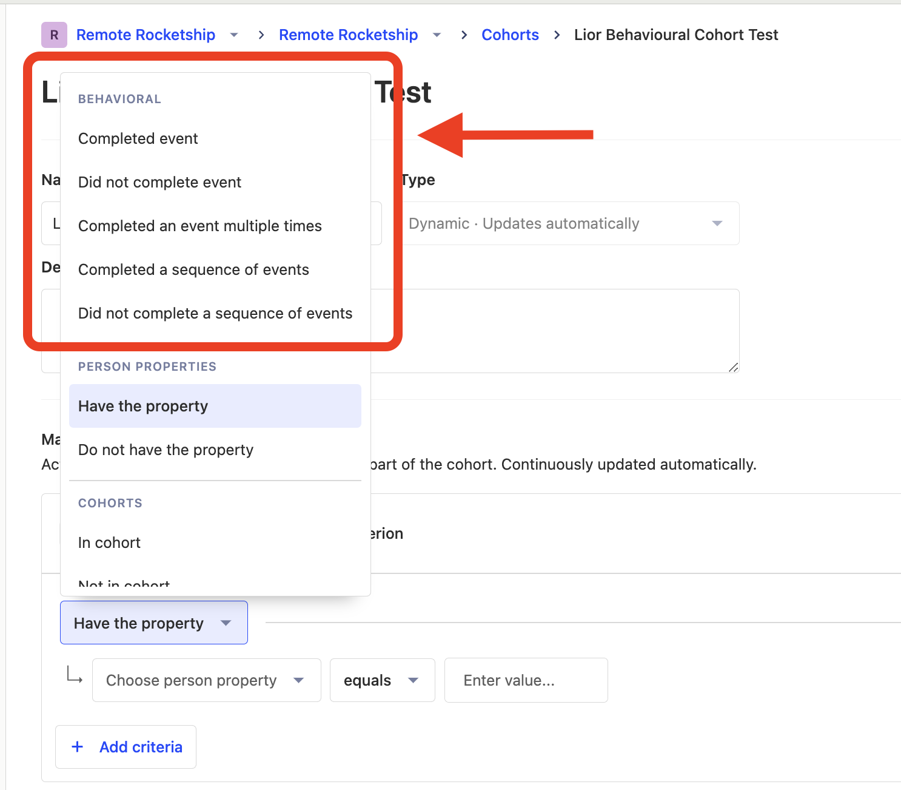
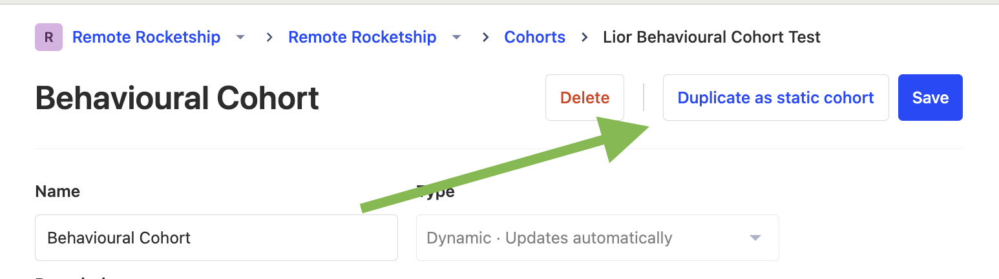

## Why is my feature flag not working as expected?

Here's a list of suggestions to troubleshoot your flag:

### 1. Check your flag evaluation on the feature flags tab

Check the **feature flags tab** on [the persons page](https://app.posthog.com/persons) for your specific person.

- If the flag is shown as disabled here, check the "match evaluation" column to know the understand why.
- If the flag is shown as enabled here, there may be a problem in your code. Double-check the steps to [add feature flag code](/docs/feature-flags/adding-feature-flag-code).

### 2. Check you're calling `identify()` before evaluating the flag

If you're [identifying](/docs/product-analytics/identify) users, they may see a different value for a feature flag before and after you call `identify()`. 

To ensure they experience consistent behavior, check that you call `identify()` before evaluating the feature flag.

### 3. An ad-blocker may be blocking calls

Check if an ad-blocker is interfering with PostHog calls. If this is the case, you can fix this by [deploying a reverse proxy](/docs/advanced/proxy).

### 4. User or group properties may not have been ingested yet

If your [release conditions](/docs/feature-flags/creating-feature-flags#release-conditions) depend on user or group properties, and you immediately evaluate the feature flag after updating them, the properties may not be ingested in time to calculate the correct flag value.

In this case, when making your `getFeatureFlag()` call, you can [manually include in these properties](/docs/feature-flags/adding-feature-flag-code#advanced-overriding-server-properties) in the method arguments.

### 5. Raise a support ticket

If none of the above resolve your issue, you can [raise a support ticket](https://app.posthog.com/home#supportModal) to see if we can help debug.

import FAQFalseOrNoneEvents from "./snippets/faq-false-or-none-events.mdx"

<FAQFalseOrNoneEvents />

## How can I reduce the latency of feature flag requests on my server?

Evaluating feature flags requires making a request to PostHog. However, you can [evaluate feature flags locally](/docs/feature-flags/bootstrapping-and-local-evaluation#server-side-local-evaluation) instead – without having to make a request to PostHog.

## How can I estimate the number of feature flag requests I'll be charged for?

### Frontend SDKs

We make a request to fetch feature flags when:

1. The PostHog SDK is initialized
2. A user is [identified](/docs/data/identify) 
3. A user's [properties](/docs/product-analytics/user-properties) are updated.
4. You ask us to reload feature flags (`posthog.reloadFeatureFlags()`)

For your frontend, you can estimate feature flag requests roughly by doing the following:

1. Open your product page, and check the networks tab in chrome inspector tools for the number of `/decide` requests.
2. Find out your number of monthly page views

A rough estimate for the total requests is (1)*(2). For example, if on refresh, you see 2 `/decide` requests per pageview and you have ~150,000 pageviews, your monthly feature flag requests should be around ~300,000.

### Backend SDKS

If you're not using local evaluation, a request to get feature flags is made every time you call `posthog.get_feature_flag()` on your backend. To estimate total usage here, you'll need to figure out what your business logic is for calling this - it could be once per request, in which case it's the same as the number of your backend API requests.

If you're using local evaluation, the number of requests per day is always 10*(number of posthog instances initialised per server)*(number of servers)*(60 / posthog SDK's poll interval in seconds)*60*24

So, for example, if your poll interval is 30 seconds (the default on most SDKs), and you have one server, and one posthog instance, your number of requests per day comes out to be 10*(60/30)*60*24, or 28,800 per day.

Note that local evaluation costs are independent of how many times you evaluate feature flags. So, more often than not, it's a good deal to use local evaluation on your backend.

## How can I reduce the cost of feature flags?

If your feature flag usage or costs are too high, there a few methods to reduce them:

### 1. Reduce client-side feature flag requests

In our [JavaScript web](/docs/libraries/js) and [React Native](/docs/libraries/react-native) SDKs, you can reduce the cost of feature flags by reducing the number of requests your client makes to fetch feature flag values for your users.

1. Using the the [advanced configuration](/docs/libraries/js#advanced-configuration), set `advanced_disable_feature_flags_on_first_load` to `true`. This stops automatically requesting feature flags whenever a page loads. This is useful when you're immediately calling `posthog.identify()` anyway, which requests flags again.

2. Using the the [advanced configuration](/docs/libraries/js#advanced-configuration), set `advanced_disable_feature_flags` to `true`. This stops PostHog automatically requesting feature flags. Instead, use [bootstrapping](/docs/feature-flags/bootstrapping) to load flags exactly once.

### 2. Reduce local evaluation costs

If you're using [local evaluation](/docs/feature-flags/local-evaluation), your bill may be high because of too many requests to fetch feature flag definitions. By default, PostHog fetches these every 30 seconds.

Each request charges 10 credits, so assuming your server is constantly running and making 2 requests per minute, this will charge `10 * 2 * 60 * 24 * 30 = 864,000 credits` each month.

You can reduce this by increasing the [feature flag polling interval](/docs/feature-flags/local-evaluation#step-2-initialize-posthog-with-your-personal-api-key) when initializing PostHog. For example, every 5 minutes instead of every 30 seconds.

The drawback of this approach is that whenever you make an update to a feature flag using the PostHog UI, it takes 5 minutes (instead of 30 seconds) for that change to roll to your server.

> **Note:** Do not use local evaluation in an edge / lambda environment, as this initializes a PostHog instance on every call, which can raise your bill drastically. It's best to use regular flag evaluation instead.

## Why do feature flags sometimes cause my app to flicker?

By default, fetching flags from our servers takes about 100-500ms. During this time, the flag is disabled. When the request is complete, the flag is updated. This may be the cause of the flickering.

To fix this, you can [bootstrap feature flags](/docs/feature-flags/bootstrapping).

## Why can't I use a cohort with behavioral filters in my feature flag?

Behavioral cohorts are [dynamic cohorts](/docs/data/cohorts#dynamic-cohorts) created using an event or action filter (i.e., the options under the "behavioral" subheading)

<Caption>
Behavioral cohorts are dynamic cohorts created using the options under the "behavioral" subheading.
</Caption>

Feature flags require fast evaluation and behavioral queries are relatively slow. Thus enabling these queries would significantly impact the performance of feature flags. 

A workaround is to create a dynamic behavioral cohort and then duplicate it as a static cohort (using the button on the top right of the cohort page).

