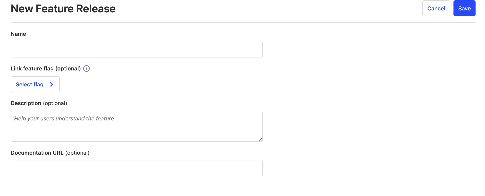
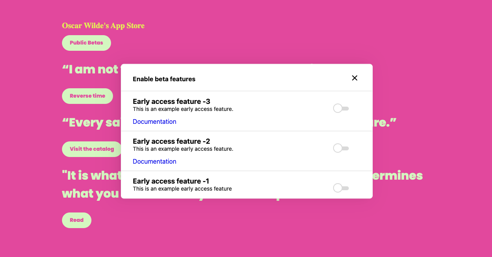

Early access feature management enables your users the ability to opt-in to betas and other early features. This is esepcially useful if you don't want to run a beta application process, or if you ship frequent updates and want users to control their own experience. 

Users can also decide to opt-out of betas they do not want to be part of. PostHog tracks opt-ins and opt-outs, so you can see how popular a beta is with your users. 

## How it works

Early access features can be configured in the early access menu. Features are powered by feature flags, so each early access feature must be linked to an existing feature flag or a feature flag with the equivalent name to the feature will be implicitly created and linked.

The default stage of an early access feature is beta. Users who opt-in to the feature will appear in the person list.

> Important: Early access feature opt-in is an *overriding condition*. This means that a user opt-in or opt-out will override any existing release condition on the feature flag. Only when a user has not explicitly selected to opt-in or opt-out will the release conditions on the feature flag be used to determine feature flag availability.

## Setup

### Option 1

We've prebuilt [a site app](/tutorials/build-site-app) that gives you a widget out of the box. The site app just requires that you specify a `data-attr` that should be clicked on to trigger the widget to appear.

Any configured early access features will appear on this panel, which you can configure to make your app visible for users. 

### Option 2

Posthog-js 1.55 exposes `getEarlyAccessFeatures` and `updateEarlyAccessFeatureEnrollment`, which enable you to wrap your own experience around early access features. [API Docs](/docs/libraries/js#early-access-feature-management)
