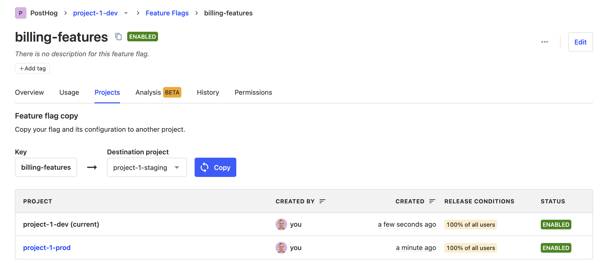

Sometimes, you may want to use the same feature flag keys across different PostHog [projects](/docs/data/organizations-and-projects). For example, when you're testing a new feature in staging before releasing to production. In this case, PostHog makes it easy to copy and sync feature flags across projects.

This eliminates the need for manual replication, which is error-prone.

## How to copy or update a feature flag across projects

> **Note:** If you copy a flag linked to a [dynamic cohort](/docs/data/cohorts#dynamic-cohorts) and a cohort with the same name does not exist in the target project, the entire cohort will be copied over.
>
>For [static cohorts](/docs/data/cohorts#static-cohorts), the cohort will be copied but it will be empty. This is because the associated persons might not exist in the target project.

Follow these steps to copy or update the flag in another project:

1. Navigate to the feature flag you want to copy.
2. Select the `Projects` tab.
3. Select the project you want to copy the flag to.
4. Click `Copy` or `Update` - this depends on whether the flag already exists in the target project.
5. View the table at the bottom to see the newly created or updated flag.

