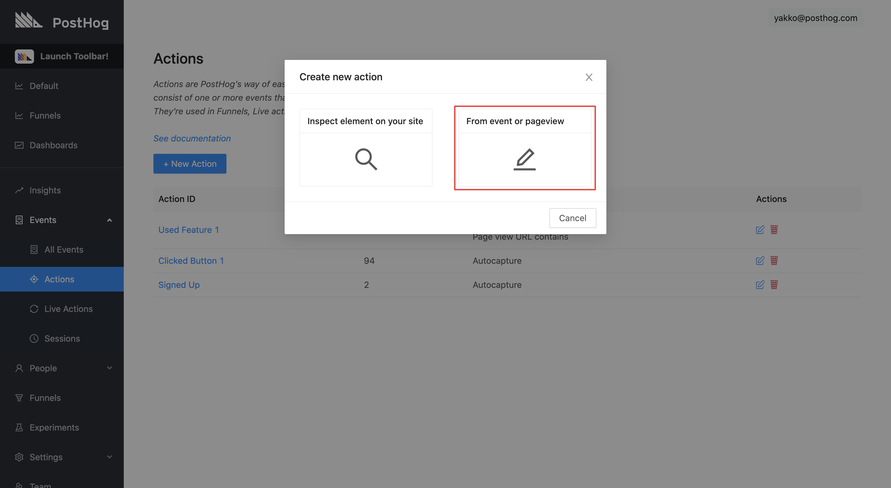
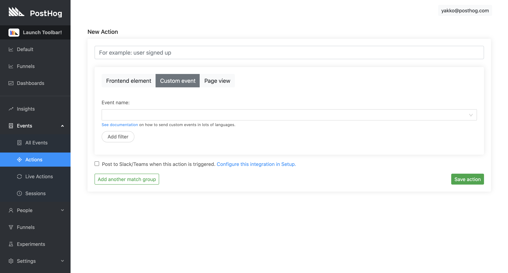

Actions are PostHog’s way of easily cleaning up a large amount of Event data.

Actions consist of one or more events that you have decided to put into a manually-labelled bucket. They're used in Funnels, Live actions and Trends.

For example, a typical action might be one of the following:

* ‘Sign up button – clicked’
* ‘Profile page – viewed’
* ‘Post submit – clicked’
* ‘Pricing page – viewed’
* ‘Watch movie – clicked’

You can watch our **old** tutorial videos on Actions [here](https://www.youtube.com/watch?v=7RcVfsXHG58) and [here](https://www.youtube.com/watch?v=NezwIa_PihU). However, please note that our functionality and UI has significantly changed since then. As a step by step tutorial, the videos may be out of date, but they could be helpful for understanding the concepts.

## Accessing Actions

To access the Actions page, go to the 'Events' section on the left-hand navigation sidebar which will open up a submenu including 'Actions':

 

## Creating Frontend Actions

### Pre-Requisites

Before creating an action from an element, you must have provided the domain you will be using PostHog on. This should be the root domain where your application is hosted e.g. http://example.com. You can do this by visiting 'Setup' > 'Setup your PostHog account'.
 

### Getting Started

The simplest way to create a frontend-based action is to visit your application and use the PostHog Toolbar to tag the elements that are relevant.

#### Inspect element on your site

We have a full [step-by-step tutorial](/docs/tutorials/toolbar) available about using our Toolbar, with a specific section dedicated to [creating actions from frontend elements](/docs/tutorials/toolbar#creating-actions).

#### From event or pageview

Alternatively you can create an event based on `pageview` or an existing [event](/docs/features/events) on your website.

To do so, click 'Create new action' and the following modal should appear (without the red rectangle):

 

If you select the 'From event or pageview' option, you will be taken to the following page, where you can then set up your action from exisiting events:

 

 
#### Note: Actions Containing Multiple Events 

It is possible for an action to match multiple events. To do this, click ‘Add another match group’ when you are creating your action (see picture above).

Actions with multiple events work based on `OR` operations. That means that an action like _"Clicked Read More Button" OR "Clicked More Information Button"_ will trigger as soon as the user clicks either of the buttons. Both clicks are not required for the action.

## Action Types

As shown above, there 3 types of Actions you can record:

**Pageview**

Page views can match urls containing a string or match exactly.

**Frontend Element**

Frontend Elements are actions based on some element on your website, such as a button or an input. The easiest way to select them is with the 'Inspect element on your site' functionality described above. However, you can also set them manually if you wish by providing something to identify the element, like a selector.

Our [Autocapture](/docs/features/integrations/js-integration#autocapture) functionality will capture a lot of frontend elements by default, but you will need to manually set anything else you want to be captured. Currently, autocapture will capture any click or change of input or submission of `a`, `button`, `form`, `input`, `select`, `textarea`, and `label` tags. All other elements need to be set manually. This important to note if you deviate from established HTML practices, such as using a `div` as a button.

Autocapture is also conservative regarding `input` tags to prevent grabbing sensitive data. See [Autocapture](/docs/features/integrations/js-integration#autocapture) for more details.

 

**Custom Event**

Custom Events can be sent to your PostHog instance by API we have several libraries to allow you to do [this](/Integrations).
 

  

## Identification Fields

There are three identification fields that you can use for most elements:

* Text: The text on the element, if applicable
* Selector: The type of element it is
* Only match if URL contains: The URL where this action needs to take place. 
 
You can have 1 or more identification fields selected. Having multiple fields selected is an `AND` statement, so all of them will need to match an event for it to count as the action.

### Identification Field: Example Uses

If you have buttons across your site, all saying ‘Sign Up’, you can track ALL of them, site-wide, as the same action, by choosing `Text: "Sign Up"` and not matching the URL.

If you choose to match the URL as well, it will track any button on that page if it contains the ‘Sign Up’ text (which could be more than one button).

If you have multiple sign up buttons on the same page, all with the same text and you want to track events relating to just one of them, you can use ‘Selector’. If they are technically the same element type **and** have the same classes, then you need to add a new class, `id` or `data-attr` to the button you wish to track separately, and use this to identify it.

