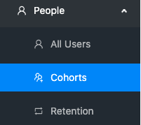
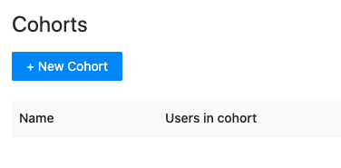
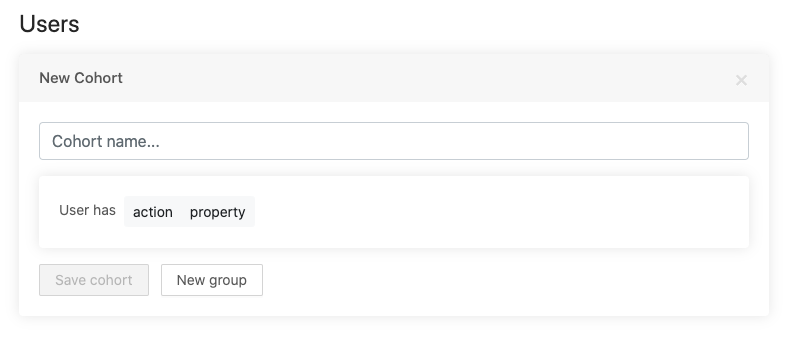

Cohorts are PostHog's way of letting you easily create a list of users who have something in common.

You can use the cohorts to:

* View a list of users who all did the same action or have the same property. A few examples of how you might use this are:
  * "Which users used the app today?"
  * "Which users work at the same company?"
  * "Who used the app once but never came back?"
* Segment other statistics. For example, to view user paths or action trends. This let's you understand things like:
  * "Are people at company X using the app much?"
  * "Is the number of Daily Active Users going up or down over time?"

A short video on Cohorts can be found here: https://youtu.be/8_SsZW1v56Q

## Creating a New Cohort

Go to 'People' in the left hand navigation.
 

Then click '+ New Cohort' on the top left:

## Cohort Settings

There are three key settings for a cohort: 'action', 'property', and 'New group'. See below:

#### Group Users by Actions

You can group users who have performed certain [actions](/features/actions). You need to already have configured actions for that to work.

#### Group Users by Property

You can also group users who have a certain property in common. Commonly, this used to combine users at a certain team, or from a certain marketing campaign via their UTM tags, or whatever other static property you need:

 

#### Group Users According to Multiple Conditions

You can add together multiple conditions by using the 'New group' button. This acts as an **AND** function i.e. all conditions must be **true** for the grouping to occur.

 

## Adjusting Time Frames

You may only want users who have performed a certain action within a certain timeframe.

On setting the cohort to 'user has *action*', you will be presented with the following:

We are working to [expand the power of this filter](https://github.com/PostHog/posthog/issues/199).

## Viewing Users in a Cohort

Go to 'People' > 'Cohorts' in the left-hand navigation (as shown in the beginning of this page) and select the cohort you want to view by clicking it, and you'll be presented with a list