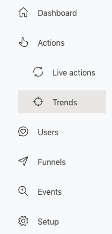
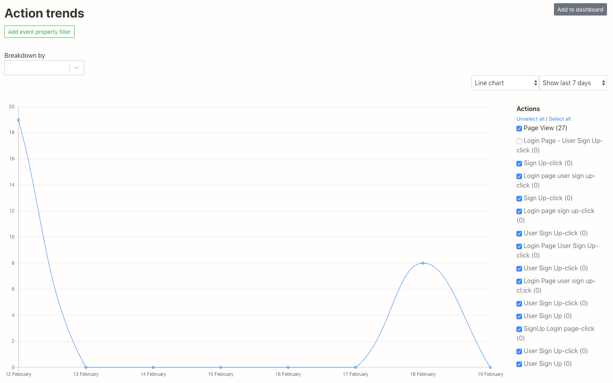
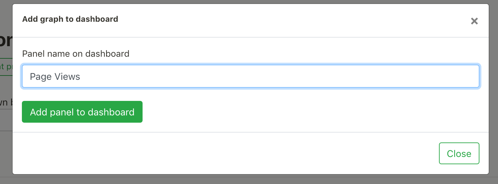
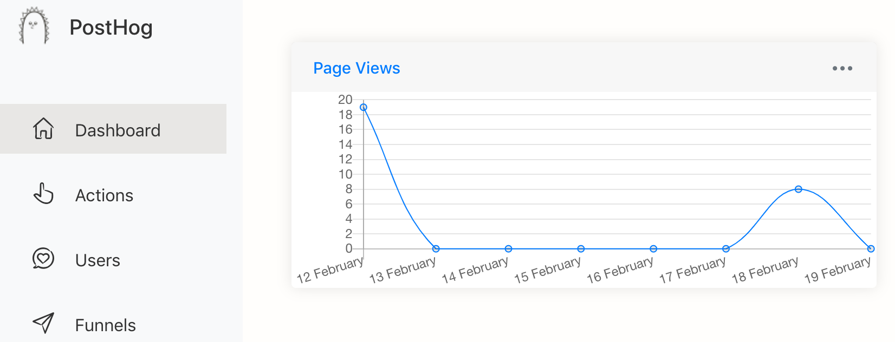
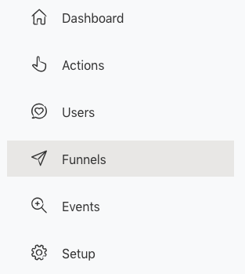

You can create dashboard panels to display information you are collecting with PostHog. It will be the first thing you see when you log on so that you can easily access the most important performance metrics in your product.

Dashboard panels can be created in two ways:

* From Action trends
* From Funnels 

This will give you the option to display information in tables, line charts or funnels .

## Creating an Action Trend Dashboard

Go to ‘Actions’>’Trends’ in the left-hand navigation:

You can now see the trend in these actions over time.

Once you have broken down your data by line chart or table you can then simply select "Add to dashboard" and you will then be asked to name your dashboard.

It will then appear on the dashboard home page.

## Creating a Funnel Dashboard

Go to ‘Actions’>’Funnels’ in the left hand navigation:

Select the funnel that you wish to display and select "Add to dashboard", once you give this a name it will also appear on the dashboard home page.

## Customizing Dashboards

Dashboards can be customized to suit your preferences.

### Dashboard Options

By clickiing on the three dots on the top right corner of each Dashboard, you are able to access Dashboard options. Here, you can:

* 'View Graph': Takes you to the appropriate page in PostHog where the Dashboard is derived from
* 'Rename': Give your dashboard any name you like
* 'Set Color': Allows you to set a different color for your Dashboard
* 'Duplicate': Create a replica of the Dashboard
* 'Delete': Remove the Dashboard

### Resizing

To resize Dashboard, hover your mouse over its edges until the cursor becomes an arrow. Then, drag in any direction until the Dashboard is the size you want it to be. That's it!

### Full Screen

Want to see everything in full screen? You can find the button to do so button next to 'Lock Dragging' on the top right corner. 

### Rearranging Location

Dashboards can be placed anywhere you like on the page. To drag them across the screen, hover your mouse over the top of the Dashboard until the cursor changes to the 'Drag' style. Then, just move them around as you wish.

To prevent accidental dragging, you may click 'Lock Dragging' on the top right corner.

