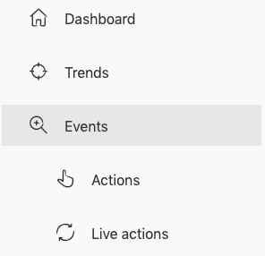
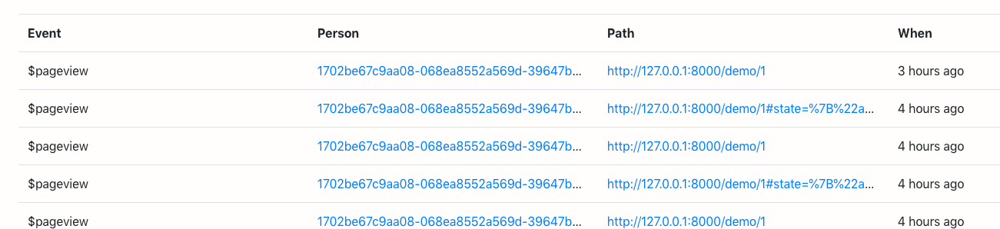
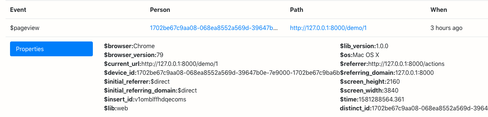
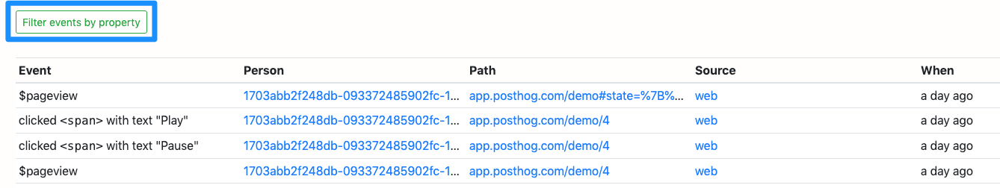
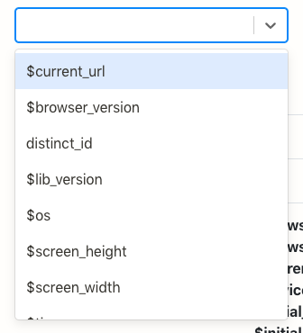

The most critical thing that PostHog does is to capture Events from your website or application. For example, if a user clicks a button, or visits a URL – those are Events.

## Live Events

Go to ‘Events’ in the left hand navigation:

You will see a live feed of Events as they are happening.

 

## Event Properties

You can view the Event properties by clicking on the items in the ‘Event’ column:

You can also click the ‘Person’ to view a full list of the Event history of that User.
 

## Events by Path

You can choose to view just the events at a particular Path. The quickest way to do this is to click the Event path item.
 

## Event Filtering

Alternatively, you can filter the Events:

You can have one or more filters.

These refine the view to show just Events with a selected property:

 

## Autocapture Event Tracking

PostHog has the capability to capture all front end events automatically from just a simple JS snippet.

This means you do not need to add track(‘event’) to individual buttons, or parts of your product any more. The end result is zero maintenance of your event tracking, and less developer time spent on analytics. Focus on making product decisions and building cool features!

The other advantage is that you won’t lose data. If you change your product a lot, you can always work backwards with your analytics.

#### Important Note on Autocapture

While autocapture allows you to track the majority of general events on your website right out of the gate, it is important to note that, for security reasons, PostHog is very conservative regarding `input` tags. In order to prevent passwords or other sensitive data from being collected, very little data is collected from inputs with autocapture.

Specifically, PostHog autocapture will grab only the `name`, `id`, and `class` attributes from `input` tags. 

As such, you should be aware of this when you start, in order to understand why you may be getting less data than expected.

If you need to collect more data from inputs, you should look into [Custom Events and Actions](/docs/features/actions).
 

## Push-based Event Tracking

Most users of PostHog will want to combine their back-end data, such as user information, with the front end actions of those users in their UI.

There are two ways of passing data to PostHog – the API or through the JS snippet.
 

### API

Our API documentation is available [here](/docs/integrations/api).
 

### JS Snippet

The snippet installation page explains how to push events through the front end.

In particular, we recommend pushing basic user information, such as email address, to make it much easier to understand the analytics.

