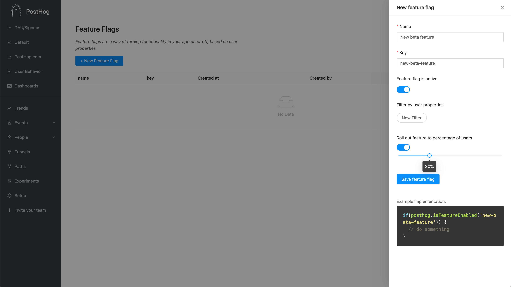

Feature flags allow you to safely deploy and roll back new features. It means you can deploy features and then slowly roll them out to your users. If something has gone wrong, you can roll back new features without having to re-deploy your application.

**Note:** At the moment, feature flags are only supported in combination with our posthog-js library.

## Creating feature flags

In the sidebar, go to "Experiments" and click "+ New Feature Flag".

Think of a descriptive name and select how you want to roll out your feature.



## Implementing the feature flag

When you create a feature flag, we'll show you an example snippet. It'll look something like this:

```js
if(posthog.isFeatureEnabled('new-beta-feature')) {
    // do something
}
```

What you do inside that if statement is up to you. You might change the css of a button, hide an entire section or move things around.

Behind the scenes, every time a user loads a page we call an endpoint to get the feature flags that apply to that user. We store those flags as a cookie. This means that for most pageviews the feature flags will be available immediately, *except* the very first time a user visits your site.

To combat that, there's a callback you can use to wait for the flags to come in:

```js
posthog.onFeatureFlag(function() {
    // feature flags are guaranteed to be available at this point
    if(posthog.isFeatureEnabled('new-beta-feature')) {
        // do something
    }
})
```

**Note:** To avoid "posthog has no attribute isFeatureEnabled" errors, make sure you're using the latest snippet. You can find that in the /setup page in PostHog.

## Develop locally

To test feature flags locally, you can open your developer tools and override the feature flags given. You will get a warning that you're manually overriding feature flags.

```js
posthog.feature_flags.override(['feature-flag-1', 'feature-flag-2'])
```

This will persist until you call override again with the argument `false`:

```js
posthog.feature_flags.override(false)
```

To see the feature flags that are currently active for you, you can call:

```js
posthog.feature_flags.getFlags()
```

## Roll out the feature flag

There are three options for deciding who sees your new feature. You can roll out the feature to:

1. a fixed percentage of users,
1. a set of users filtered based on their user properties,
1. or a combination of the two

### Roll out to a percentage of users

By rolling out to a percentage of users you can slowly ramp up who sees a new feature. The way this works is we "hash" a combination of the key of the feature flag and the unique distinct ID of the user.

This way a user will always fall on the same place between 0 and 100%, so they will consistently see or not see the feature controlled by the flag. As you move the slider towards 100%, more users will start seeing your feature.

The hashing means that the same user will fall along different points of the line for each new feature. For example, Alice will start seeing the feature at 5% for feature A, but only at 80% for feature B.

### Filter by user properties

This works just like any other filter in PostHog. You can select any property and users that match those filters will see your new feature.

By combining user properties and percentage of users you can say something like:

> "roll out this feature to 80% of users that have an email set"

## De-activating properties

If the feature has caused a problem (like a huge server load), or you don't need the feature flag anymore, you can disable it instantly and completely. Users won't be getting the flag anymore.