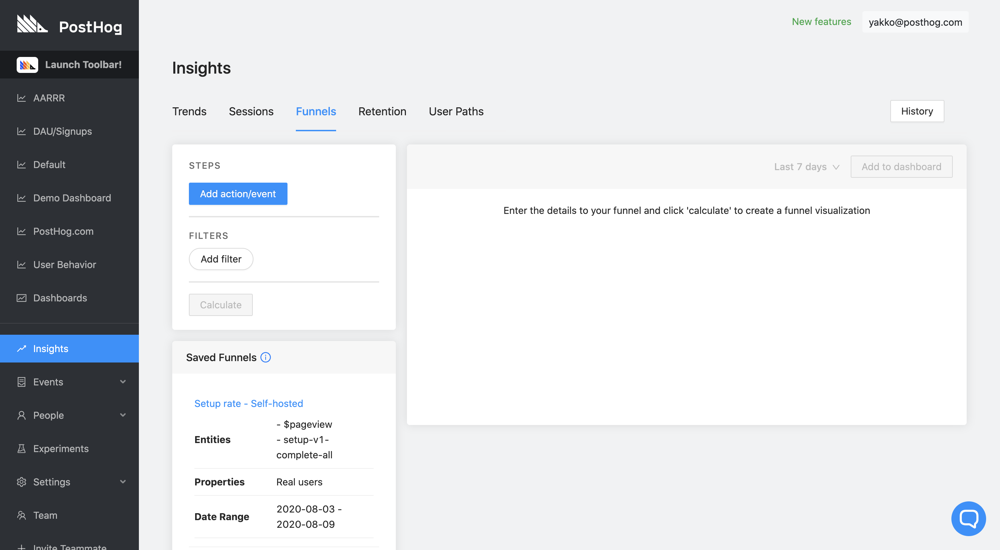

If you need your users to carry out a series of actions in a row, funnels are a way of working out where users are dropping off.

There are many valuable use cases for this data:

* If you need users to sign up and then perform a key action, you can easily analyze the percentage that are dropping out.
* If you need users to come back repeatedly to perform an action, you can see how many “first time” users return.
* If you are trying to understand where in your marketing funnel that you are getting drop off, funnel analytics will make clear what you need to focus on to grow.
 
A funnel is a series of actions and/or events.

## Learning Resources

### Video

If you'd like to watch a video about our Funnels feature, check out our demo video below. It is set to start on the Funnels section:

<iframe width="560" height="315" src="https://www.youtube.com/embed/aUILrrrlu50?start=515" frameborder="0" allow="accelerometer; autoplay; clipboard-write; encrypted-media; gyroscope; picture-in-picture" allowfullscreen></iframe>

### Tutorial

For a comprehensive tutorial on how funnels work, what you can use them for, and how to create your own, we highly recommend reading our [Step-By-Step Funnels Tutorial](/docs/tutorials/funnels).

## Creating a Funnel

To create a funnel, go to ‘Funnels’ in the left hand navigation:

 

### Adding actions or events

Next, create the first in the series of Actions or Events:

 

Add more Actions or Events as needed:

 

You'll end up with a graph - something like this:

 

The above image demonstrates that whilst there were 11 ‘Sign up’s, there was just one ‘Apply for Beta clicked’.
 

### Filter Funnels by Time

You can also filter funnels by time intervals. By default, funnels will show actions completed over the last 7 days, but this can be changed by selecting the time interval next to 'Add to dashboard'

 

## Funnel Drop-off User Breakdown

We can go even further with PostHog – to see which users were in this funnel, and how each of them behaved:

From here, it’s easy to click an individual user, to see their entire Events history – all you have to do is click the provided link.

## Important Note on Funnels

It is important to note that funnels calculate the drop off percentage between steps based on unique users *only*.

This means "action chains" are not calculated individually, but rather compiled based on a user's entire set of actions.

For example, if User X did Step 1 of a certain funnel 5 times, but then only did Step 2 a single time, this will still be shown as 100% conversion between the steps, instead of 20%. 

This happens because the conversion on that step for the user was 100%, even if the *individual conversion per action* was not.

