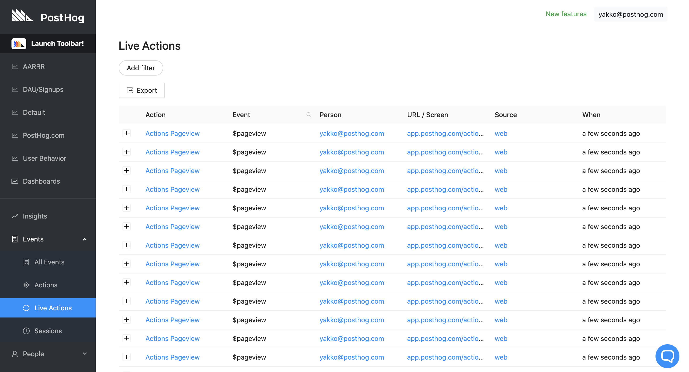
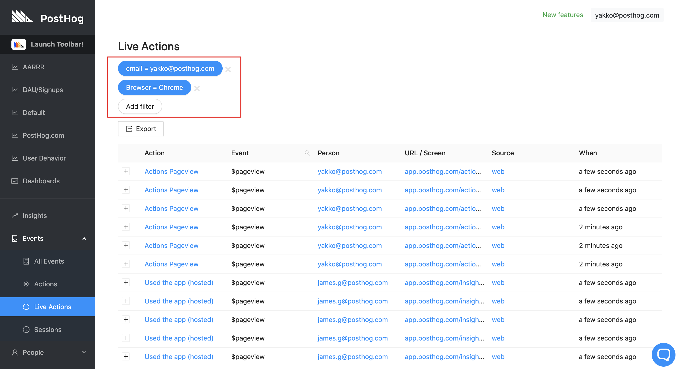

PostHog provides a simple list of all the Actions that are taking place in real time.

Get a sense in real time of how your Users are interacting with your site.

This is a useful area for debugging.

## Live Actions Log

To view this area, go to ‘Live actions’ in the left-hand navigation.

You will see a list of every action in real time.

## Action Filtering

It’s also possible to filter actions by the properties of the underlying events.

This helps display a stream of just the data you care about, to reduce noise:

In the above example, we see only the actions that were triggered by the user with email `yakko@posthog.com` from the Chrome browser.

