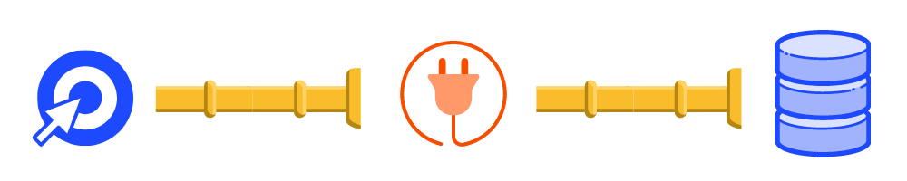

 

Plugins are a way to extend PostHog's functionality by either pulling data into or sending data out of PostHog. 

Our goal with plugins is to allow anyone to extend and customize PostHog in order to better fit their analytics and business needs. 

## Architecture

PostHog [uses Celery](/docs/stack) to execute tasks such as ingesting an event. 

## Demo Video

## Accessing Retention

1. Click 'Insights' on the left sidebar
2. Click the 'Retention' tab

 

## Understandin