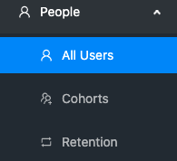
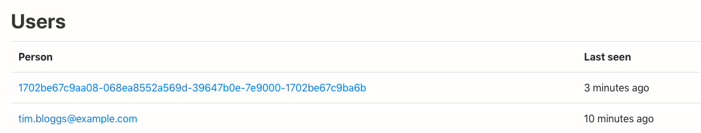
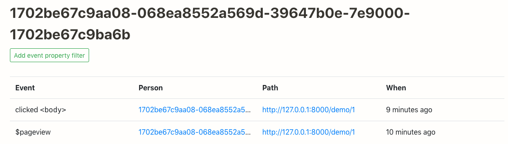
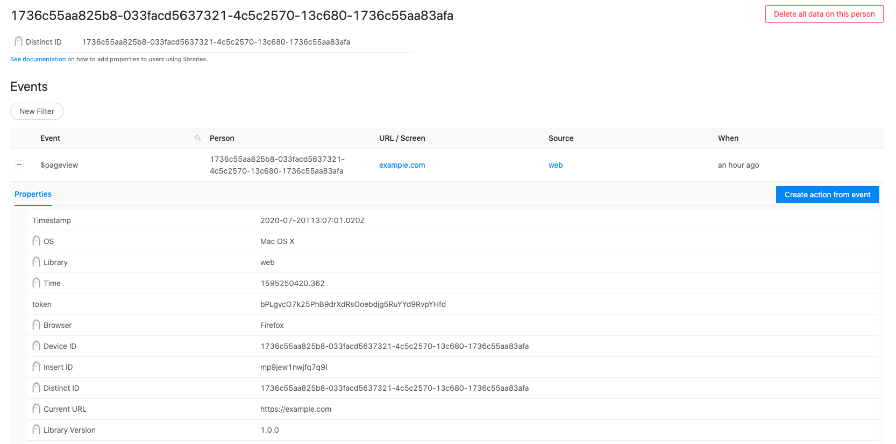
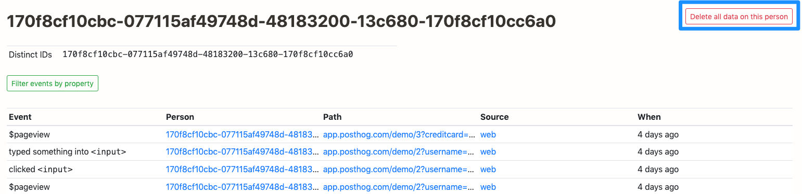

PostHog tracks user behaviour, whether or not the user is logged in and identifiable.

A short video on Users can be found [here](https://youtu.be/8_SsZW1v56Q);

## Viewing User List

Click on 'People' on the left-hand navigation. This will open a submenu containing 'Users', like so:

 

After clicking on 'All Users', you will see a list of users, something like this:

 

The first user has had no identifying information pushed to their profile in PostHog. That is why a string appears.

The second user has had their email address passed to PostHog.

## User History

Clicking on an individual user brings up their entire event history:

 

You can go even deeper by inspecting each event individually. Click on the event to bring up the event properties. This shows you the following information:

 

## Deleting User Data

You can also delete data on a user with ease. This can be done if you have created data by yourself for testing purposes or if a user asks you to do so.

When in the user history you can select 'Delete all data on this person' this will delete all information on that user permanently.

