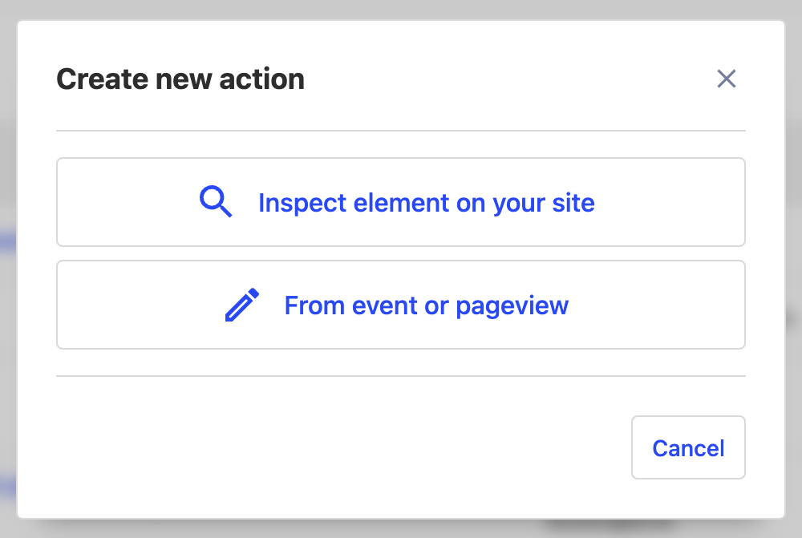
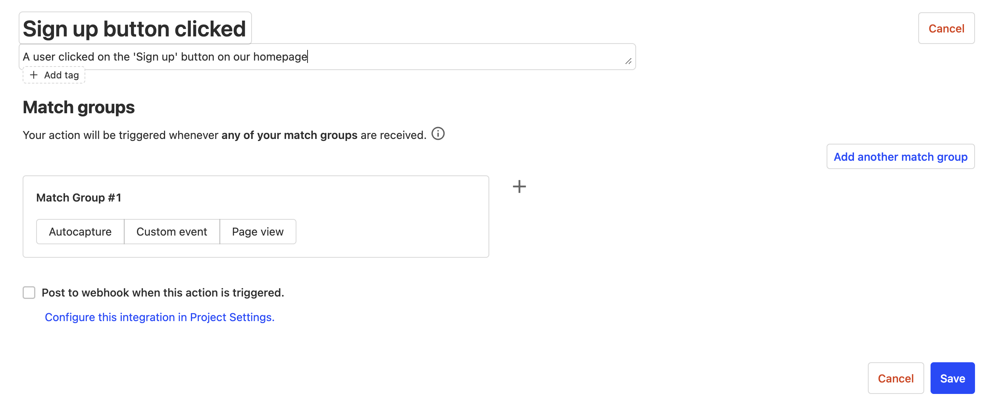
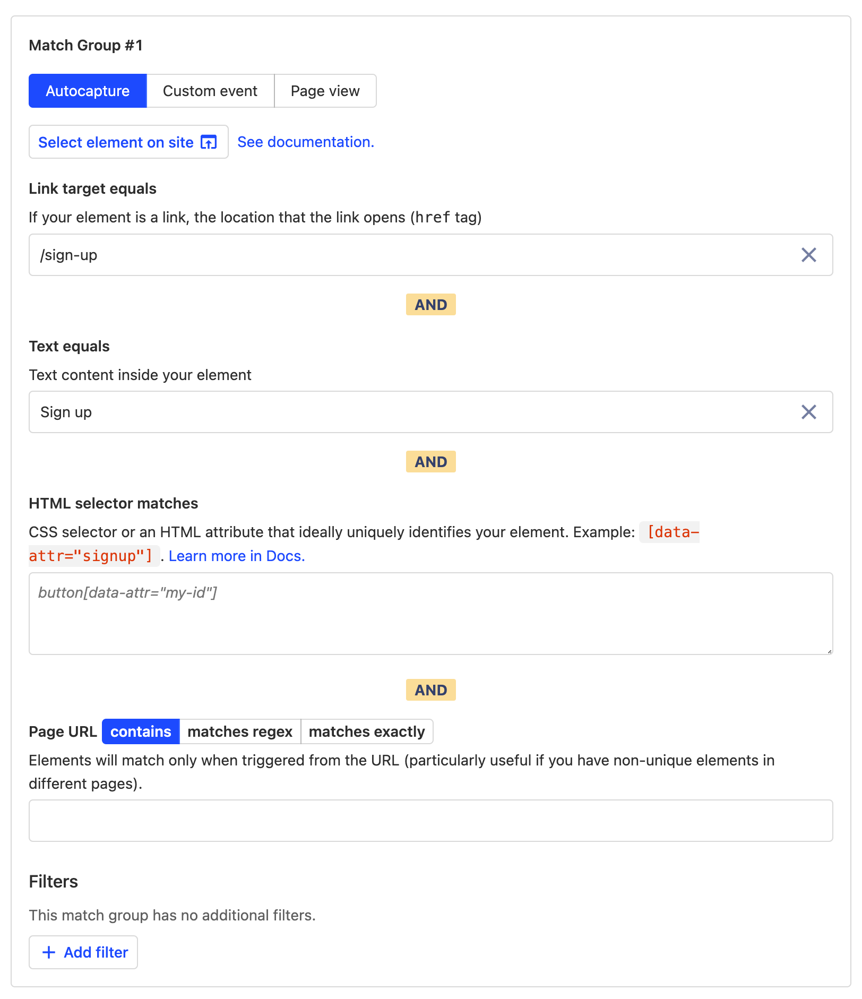
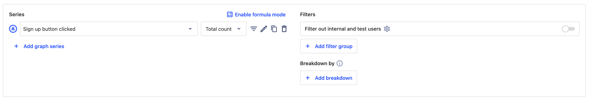
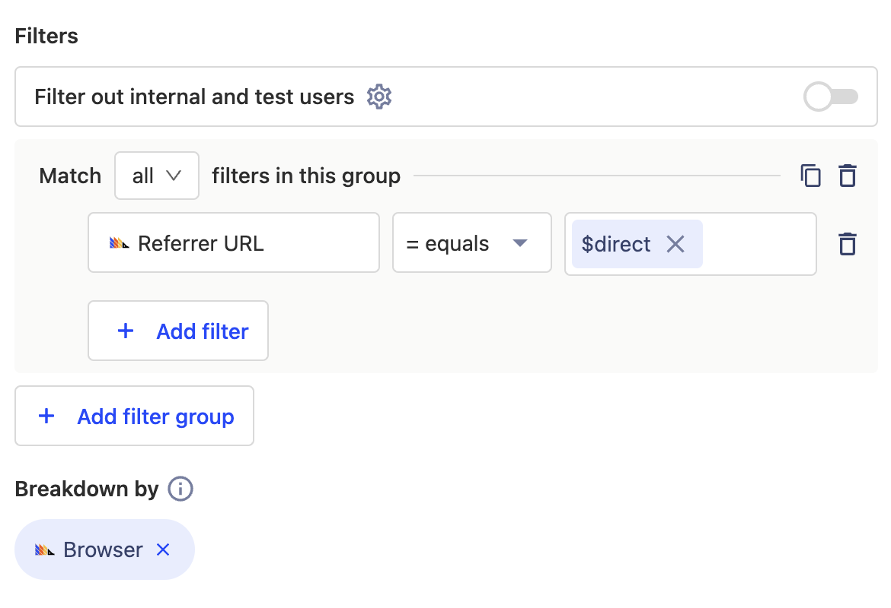

Actions and insights are two of the simplest, yet most powerful analysis tools within PostHog.
They're easy to get started with, tricky to fully master, but getting a good idea of all the features they offer will make analysis feel much, much smoother.

## 1. Creating a new action from autocapture events

Before we start, it's worth covering what an action actually is and what it's useful for. Concretely, an action is simply a way of either combining multiple different events together into one, or to track separate events based on specific properties.
Actions are generally used as a way of cleaning up your analytics to make it easier to create insights, which may not sound very important, but becomes critical as you start sending more, different events.

Actions are perhaps most powerful when paired with autocapture events, and offer an extremely quick way of setting up customizable tracking for your entire product in minutes.

To start, let's create an action from an autocaptured event when a user clicks a 'Sign up' button. Navigate to the 'Data management' section in your PostHog dashboard, and then to the 'Actions' tab, where you should then see a 'New action' button that we'll click.

In our case, we'll be using the second option to create an action from an existing event. We'll then fill out the name of the new Action we want to create - in this case, something along the lines of 'Sign up button clicked'.

> **Tip**: Make sure to set a description for all your actions - your team members and your future-self will thank you!

Next, we'll describe which raw autocapture events we'd like to include under this action. We'll start by selecting 'Autocapture' as our event type and then filling out the 'Link target equals' and 'Text equals' fields.

This means we'll only include autocapture elements where the user clicked on a link pointing to `/sign-up` with the text 'Sign up', which is exactly what we want!

> **Tip**: There are typically many different ways of specifying which autocapture events should be part of an action, and even in this case this isn't the _only_ correct way of doing so.
> You can also use the Toolbar to do this, which can sometimes work better if you have a large number of elements on a specific page.

Now click 'Save', and we'll have created our first Action! This action behaves in almost the exact same way as any other custom event and can be used in all the same places - we'll look at how to use our new action in an insight in the [funnels section](#4-creating-a-new-funnel)

## 2. Creating a new trends insight

We're now getting into some really fun stuff - finally answering all the burning questions you have about your product and your users!
Insights are at the core of the PostHog analytics platform, offering an easy way for anyone to answer questions about how users are actually using your product.

PostHog has 5 basic insight types:

-   [Trends](/manual/trends): Analyze how your core metrics change over time (_hopefully up and to the right_)
-   [Funnels](/manual/funnels): Identify conversion between key steps and reduce drop-off
-   [Retention](/manual/retention): Track how many of your users come back to your product again, and again
-   [User paths](/manual/paths): Find out the steps your users take to get from A to B, and where they go from there
-   [Stickiness](/manual/stickiness): See which features are used most frequently, and which users like them the most

In this guide we'll be covering both Trends and Funnels, which are the two most-core insight types and generally the ones you'll be reaching for the most when you have a question.

To start, let's create a new trends insight from the "Insights" section in our PostHog dashboard. Newly created insights will default to 'Trends'.

In this case, we'll use the 'Sign up button clicked' action we just created, but feel free to substitute this for whichever event you'd like.

## 3. Filtering events in our insight

Now that we have our insight set up, let's start drilling down a bit more.

First, let's start by seeing which browsers our users are using and how that correlates with our number of sign ups.

We can do this with a [Breakdown](/manual/trends#breaking-down-by-properties), which splits our graph based on the value of an event or person property, in this case the 'Browser' property.
Let's also add a [Filter Group](/manual/trends#filter-groups) so we're only at users who visited our site from a direct URL.

This works well, but let's try changing the display of our graph to make it a bit easier to analyze.

Great, we now have our insight all set up! There are still tons of powerful features within trends insights, but with actions, filtering, and breakdowns you'll be able to answer loads of product questions.
