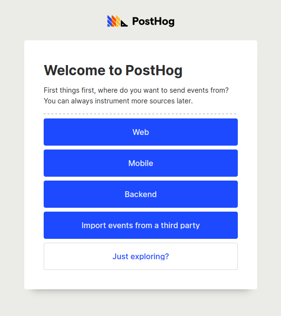
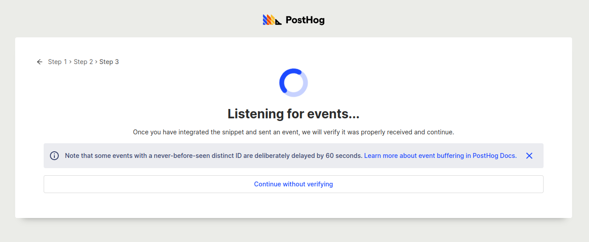
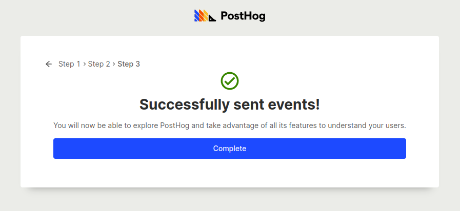

## Introduction

This guide walks through setting up PostHog Cloud and sending your first events.
PostHog Cloud is our hosted and managed version of the PostHog open-source platform.
It always runs on the latest release with updates and migrations managed for you.

We recommend PostHog Cloud for almost all our users, as it's the easiest way to get PostHog running and is able to scale to large events volumes.
It also comes with 1m events free each month.

> Need to keep full-control of your data? Check out our docs for [self-hosting PostHog](/docs/self-host).

## 1. Create an account

Set up a [PostHog Cloud account](https://app.posthog.com/signup) (hosted in the US), or if you're looking for a GDPR-ready environment, try [PostHog Cloud EU](https://eu.posthog.com/signup).

## 2. Set up your project

After signing up, you'll see a screen that asks you how you'd like to send events.
Select whichever option best matches your use case. If you're not ready to set up your integration yet, you can explore the demo project or invite a team member to help you start ingesting events.

> For web-based projects, the easiest way to get started is by adding the [JavaScript snippet](/docs/integrate) to your website and app.

## 3. Send your first events

After you've selected an option, you'll be shown some instructions to get PostHog integrated with your platform of choice.
If you've chosen the 'Just Exploring' option, you'll instead be shown the PostHog bookmarklet, which can be used to temporarily send events from a webpage you're viewing to test your integration.

After you've followed these steps, you'll then be sent to a waiting screen where PostHog will listen for events to ensure your integration is set up correctly.

Once PostHog receives its first event, you should then see a success screen with a 'Complete' button that will take you to your dashboard.

If you are having trouble getting events to show up, you can click the back arrow to go back to instructions for each specific platform, or you can checkout [this page](/docs/integrate/ingest-live-data) for more detailed information on ingesting events into PostHog.
We'd recommend you don't skip this step unless you've already set-up another PostHog account before or if you've used other product analytics platforms.

## 4. Next steps

Now that you have your PostHog Cloud account all set up, here are a bunch of cool things you can go and try out next:

- [Next steps after installing PostHog](/tutorials/next-steps-after-installing) - Our recommendations for what to do next after you've installed PostHog.
- [Product manual](/using-posthog) - Information on using specific features within PostHog.
- [Tutorials](/tutorials) - In-depth guides on popular use cases and integrations.
- [Set up a proxy](/docs/integrate/proxy) - Capture more events by using your own domain - even on Cloud!
- [Toolbar](/docs/user-guides/toolbar) - View heatmaps and customize your integration from your website.
- [Apps](/docs/apps) - PostHog provides over 50+ apps to connect with your favorite services.
- [API](/docs/api) - Get programmatic access to your data and insights.
