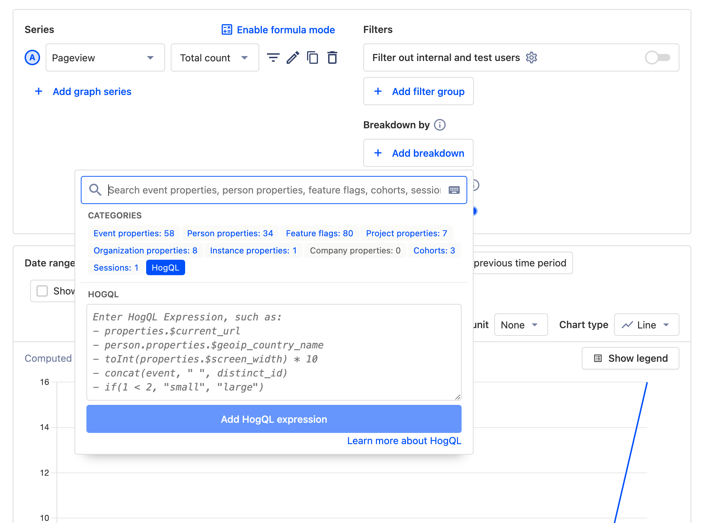
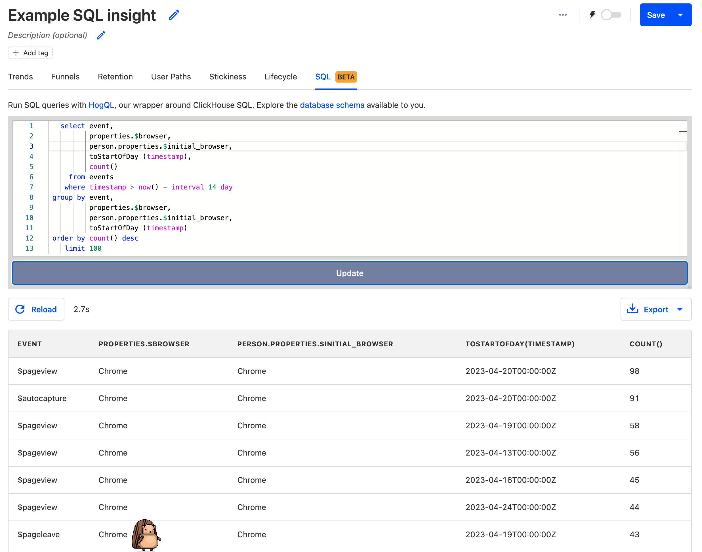
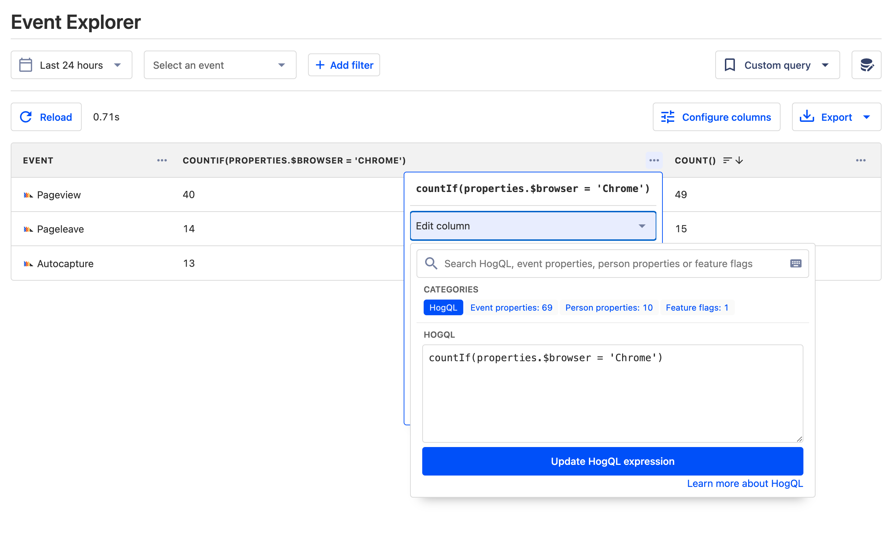
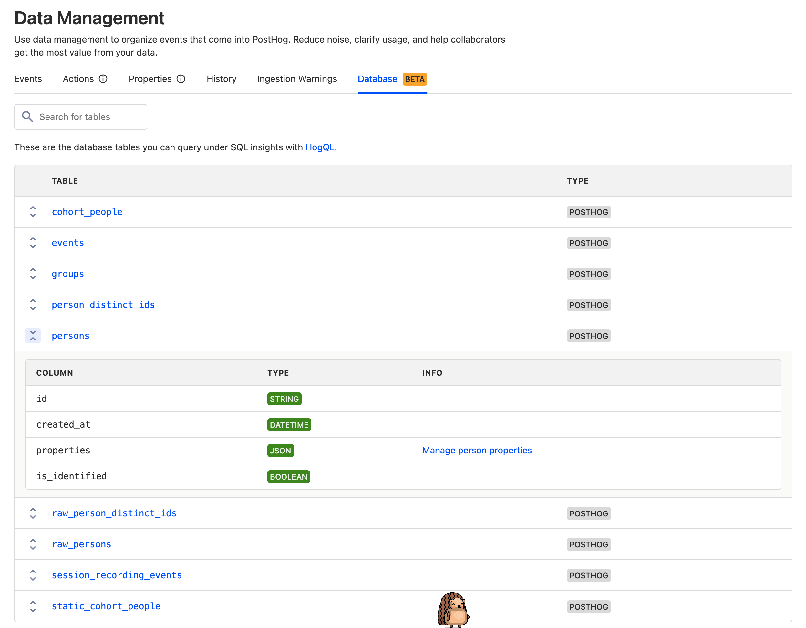

HogQL is our take on SQL (Structured Query Language), a language used to manage and access data. HogQL is effectively a wrapper around [ClickHouse SQL](https://clickhouse.com/docs/en/sql-reference), with a few tweaks, such as simplified event and person property access.

**Is HogQL _real_ SQL?** Yes, it's a translation layer over ClickHouse SQL. You can use most ClickHouse features in HogQL, including JOINs and subqueries. To learn more about ClickHouse, and how it differs from traditional SQL databases, read [PostHog's ClickHouse Manual](https://posthog.com/handbook/engineering/clickhouse).

> HogQL is currently in **public beta**. This means it's not yet a perfect experience, and the language itself may still change. Follow along with the development [here](https://github.com/PostHog/meta/issues/81).

## HogQL expressions

[HogQL expressions](/docs/hogql/expressions) enable you to directly access, filter, and breakdown your data using SQL. They can be used wherever event filters can including dashboards, trends, funnels, and the event explorer.

To use them, select the "HogQL" tab when filtering or breaking down and add your expression.



## SQL insights

[SQL insights](/docs/product-analytics/sql) enable you to create and edit insights using full SQL queries instead of the UI. Clicking the `{}` button in the top right corner of an insight shows you the SQL schema used to generate the insight which you can edit.



## Event explorer

The [event explorer](https://app.posthog.com/events) replaces the "Live Events" tab in PostHog. It provides more functionality including date filtering, event counts, HogQL queries, [aggregations](#supported-aggregations) and column configuration.



## Database

To display all the tables you can query, check out the new "[Database](https://app.posthog.com/data-management/database)" tab under "Data Management".



We're working hard on making all these public. Follow along in the [relevant Github issue](https://github.com/PostHog/meta/issues/81), or [send us a support ticket](https://app.posthog.com/home#supportModal) if you want to get access.

## API access 

> **Will there be API pricing?** The HogQL API is free to use while it's in the public beta, and we work out the details. After we launch for real, we plan to charge a competitive rate for heavy usage. Stay tuned.

To access HogQL via the [PostHog API](/docs/api), make a POST request to `/api/project/:project_id/query` with the following JSON payload:

```json
{"query": {"kind": "HogQLQuery", "query": "select * from events limit 100"}}
```

The response is in the format:

```ts
export interface HogQLQueryResponse {
    /** The input query */
    query?: string
    /** An array of result arrays */
    results?: any[][]
    /** Returned column types */
    types?: string[]
    /** Returned column names/aliases */
    columns?: string[]
    /** Generated HogQL query with expressions inlined */
    hogql?: string
    /** Generated ClickHouse query for debugging */
    clickhouse?: string
}
```

While in the public beta, the response format may still change. 

## Further reading

- [Guide to using HogQL](/docs/hogql/guide)
- [Supported ClickHouse functions](/docs/hogql/clickhouse-functions)
- [Supported aggregations](/docs/hogql/aggregations)
- [Tutorials](/docs/hogql/tutorials)
