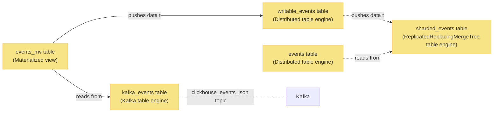

ClickHouse is our main analytics backend.

Instead of data being inserted directly into ClickHouse, it pulls data from Kafka. This makes our ingestion pipeline more resilient towards outages.

> **Further reading:** For more details on inserting data, how we use Kafka tables, and materialized views, check out [our ClickHouse manual entry on ingestion](/handbook/engineering/clickhouse/data-ingestion).

## Events

To make PostHog scalable, we use a sharded ClickHouse setup.



This includes the following tables:

### `kafka_events` table

The `kafka_events` table uses the [Kafka table engine](https://clickhouse.com/docs/en/engines/table-engines/integrations/kafka/)

Tables using this engine set up Kafka consumers that consume data on read queries to the table, advancing the offset for the consumer group in Kafka.

### `events_mv` materialized view

The `events_mv` table is a [materialized view](https://clickhouse.com/docs/en/sql-reference/statements/create/view/#materialized).

In this case, it acts as a data pipe which periodically pulls data from `kafka_events` and pushes it into the target (events) table.

### `writable_events` table

The `writable_events` table uses the [distributed table engine](https://clickhouse.com/docs/en/engines/table-engines/special/distributed/).

The schema looks something like as follows:

```sql
CREATE TABLE posthog.writable_events (
    `uuid` UUID,
    `event` String,
    `properties` String,
    `timestamp` DateTime64(6, 'UTC'),
    `team_id` Int64,
    `distinct_id` String,
    `elements_hash` String,
    `created_at` DateTime64(6, 'UTC'),
    `_timestamp` DateTime,
    `_offset` UInt64,
    `elements_chain` String
) ENGINE = Distributed('posthog', 'posthog', 'sharded_events', sipHash64(distinct_id))
```

This table:

- Gets pushed rows from `events_mv` table.

- For every row, it calculates a hash based on the `distinct_id` column.

- Based on the hash, sends the row to the right shard on the `posthog` cluster into the `posthog.sharded_events` table.

- Does not contain materialized columns as they would hinder `INSERT` queries.

### `sharded_events` table

The `sharded_events` table uses the [Replicated](https://clickhouse.com/docs/en/engines/table-engines/mergetree-family/replication/)[ReplacingMergeTree](https://clickhouse.com/docs/en/engines/table-engines/mergetree-family/replacingmergetree/).

This table:

- Stores the event data.
- Is sharded and replicated.
- Is queried indirectly via the `events` table.

### `events` table

Similar to `writable_events`, the `events` table uses the [distributed table engine](https://clickhouse.com/docs/en/engines/table-engines/special/distributed/).

This table is being queried from app and for every query, figures out what shard(s) to query, and aggregates the results from shards.

> **Note:** Even though the `ReplacingMergeTree` engine is used, we should avoid writing duplicate data into the table, as deduplication is not a guarantee.

## Persons

The source of truth for person info and person to `distinct_id` mappings is in PostgreSQL, but to speed up queries we replicate it to ClickHouse. Both tables use the [ReplacingMergeTree](https://clickhouse.com/docs/en/engines/table-engines/mergetree-family/replacingmergetree/) and collapse by the `version` column, which is incremented every time a person is updated.

> **Note:** Querying both tables _requires_ handling duplicated rows. Check out [PersonQuery code](https://github.com/PostHog/posthog/blob/master/posthog/queries/person_query.py) for an example of how it's done.

In sharded setups, `person` and `person_distinct_id` tables are not sharded and instead replicated onto each node to avoid JOINs over the network.
