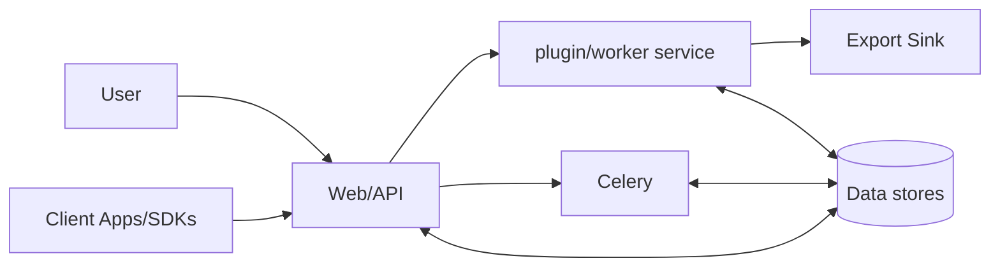
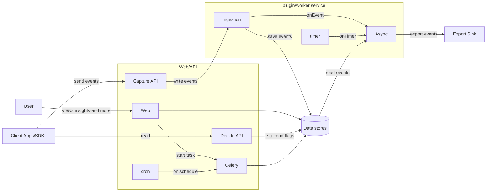
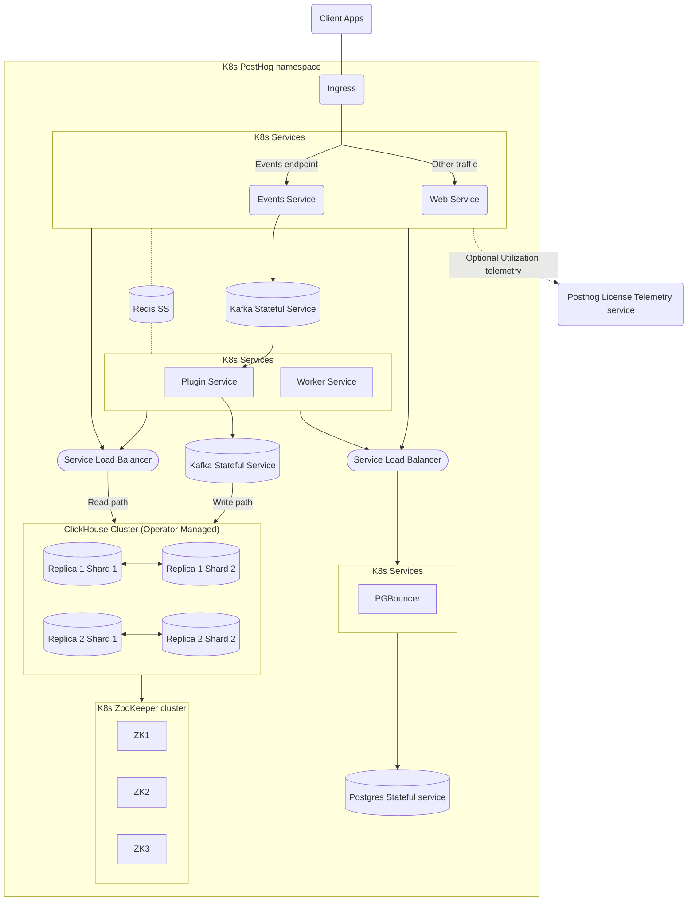

This section covers PostHog's [data model](/docs/how-posthog-works/data-model), [ingestion pipeline](/docs/how-posthog-works/ingestion-pipeline), [ClickHouse setup](/docs/how-posthog-works/clickhouse) and [data querying](/docs/how-posthog-works/queries). This page provides an overview of how PostHog is structured.

## Broad overview

There are only a few systems to consider. 

- A website and API for users
- An API for client apps
- A plugin service for processing events on ingestion
- A worker service for processing events in response to triggers

## Zooming closer

Adding detail reveals the flow between parts of the system.

## Zoomed right in

No communication is needed into or out of this namespace other than the ingress controller for the app and collecting data.
