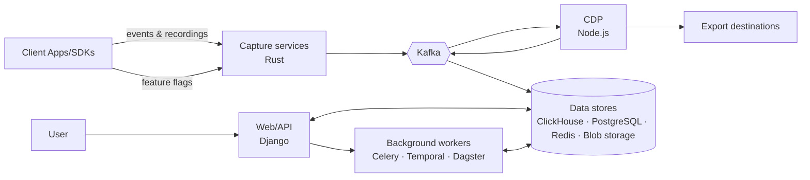
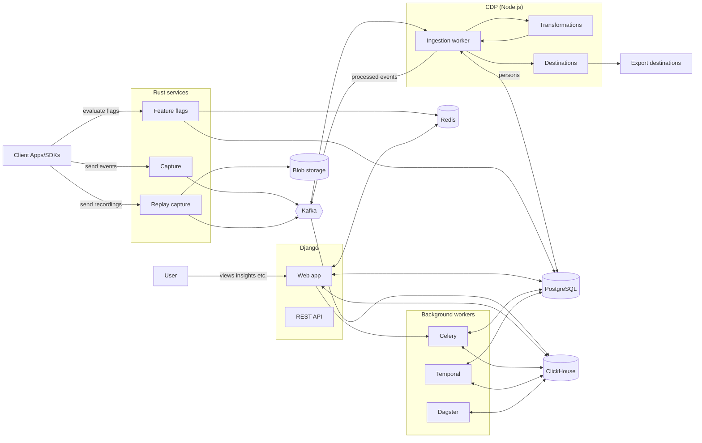
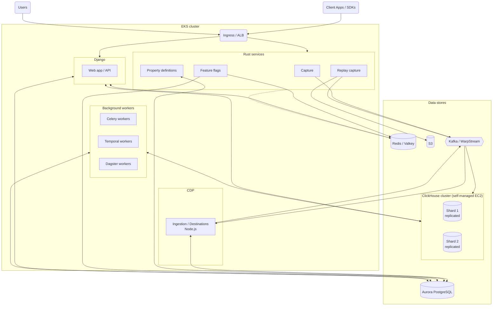

This section covers PostHog's [data model](/docs/how-posthog-works/data-model), [ingestion pipeline](/docs/how-posthog-works/ingestion-pipeline), [ClickHouse setup](/docs/how-posthog-works/clickhouse) and [data querying](/docs/how-posthog-works/queries). This page provides an overview of how PostHog is structured.

## Broad overview

PostHog has a few main systems:

- **Web app and API** – Django serves the UI and REST API for users
- **Rust microservices** – High-throughput services for event capture, feature flag evaluation, and session replay ingestion
- **Kafka** – Central message bus connecting ingestion to storage
- **Background workers** – Celery (short tasks), Temporal (reliable workflows), and Dagster (scheduled data pipelines)
- **CDP** (Customer Data Platform) – Processes events on ingestion and exports to destinations

```mermaid
graph LR
    sdk[Client Apps/SDKs]
    u[User]
    ex[Export destinations]

    capture[Capture services<br/>Rust]
    web[Web/API<br/>Django]
    cdp[CDP<br/>Node.js]
    workers[Background workers<br/>Celery · Temporal · Dagster]
    kafka{{Kafka}}
    ds[(Data stores<br/>ClickHouse · PostgreSQL · Redis · Blob storage)]

    sdk -->|events & recordings| capture
    sdk -->|feature flags| capture
    u --> web

    capture --> kafka
    kafka --> cdp
    cdp --> kafka
    kafka --> ds

    cdp --> ex
    web <--> ds
    workers <--> ds
    web --> workers
```

## Zooming closer

Adding detail reveals the individual services and how data flows between them.

```mermaid
graph LR
    u[User]
    sdk[Client Apps/SDKs]
    ex[Export destinations]

    subgraph "Rust services"
        cap[Capture]
        flags[Feature flags]
        replay[Replay capture]
    end

    subgraph "Django"
        web[Web app]
        api[REST API]
    end

    kafka{{Kafka}}

    subgraph "CDP (Node.js)"
        transform[Transformations]
        ingest[Ingestion worker]
        dest[Destinations]
    end

    subgraph "Background workers"
        celery[Celery]
        temporal[Temporal]
        dagster[Dagster]
    end

    pg[(PostgreSQL)]
    ch[(ClickHouse)]
    redis[(Redis)]
    blob[(Blob storage)]

    sdk -->|send events| cap
    sdk -->|evaluate flags| flags
    sdk -->|send recordings| replay

    u -->|views insights etc.| web

    cap --> kafka
    replay --> kafka
    kafka --> ingest
    ingest --> transform
    transform --> ingest
    ingest -->|processed events| kafka --> ch
    ingest <-->|persons| pg
    ingest --> dest --> ex

    flags --> redis
    flags --> pg

    web --> celery
    web <--> pg
    web <--> ch
    web <--> redis
    celery <--> pg
    celery <--> ch
    temporal <--> pg
    temporal <--> ch
    dagster <--> ch

    replay --> blob
```

## Infrastructure view

This shows the major infrastructure components as deployed on PostHog Cloud (AWS).

```mermaid
flowchart TD
    subgraph K8s ["EKS cluster"]
        Ingress(Ingress / ALB)

        subgraph RustServices ["Rust services"]
            Capture[Capture]
            Flags[Feature flags]
            ReplayCapture[Replay capture]
            PropDefs[Property definitions]
        end

        subgraph DjangoServices ["Django"]
            Web[Web app / API]
        end

        subgraph Workers ["Background workers"]
            Celery[Celery workers]
            TemporalWorker[Temporal workers]
            DagsterWorker[Dagster workers]
        end

        subgraph CDPServices ["CDP"]
            CDPNode[Ingestion / Destinations<br/>Node.js]
        end
    end

    subgraph DataStores ["Data stores"]
        PG[(Aurora PostgreSQL)]
        Redis[(Redis / Valkey)]
        Blob[(S3)]

        subgraph CH ["ClickHouse cluster (self-managed EC2)"]
            CH1[(Shard 1<br/>replicated)]
            CH2[(Shard 2<br/>replicated)]
        end

        Kafka{{Kafka / WarpStream}}
    end

    ClientApps(Client Apps / SDKs) --> Ingress
    Users(Users) --> Ingress

    Ingress --> RustServices
    Ingress --> DjangoServices

    Capture --> Kafka
    ReplayCapture --> Kafka
    ReplayCapture --> Blob
    Kafka --> CDPNode
    CDPNode --> Kafka
    Kafka --> CH

    CDPNode <--> PG
    PropDefs <--> PG

    DjangoServices <--> PG
    DjangoServices <--> CH
    DjangoServices <--> Redis

    Flags --> Redis
    Flags --> PG

    Workers <--> PG
    Workers <--> CH

    RustServices -.- Redis

    class K8s,RustServices,DjangoServices,Workers,CDPServices,DataStores,CH sgraph;
```
