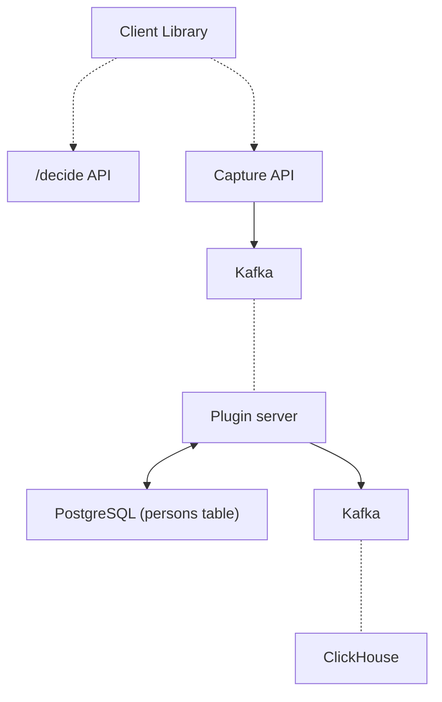
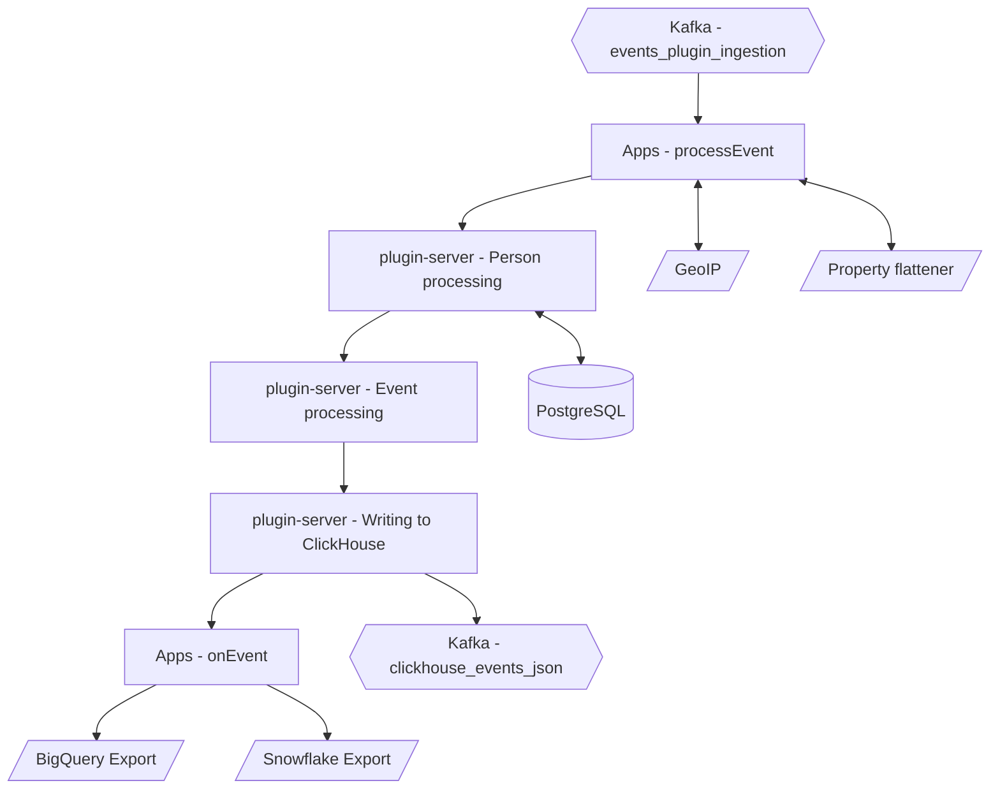

In its simplest form, the PostHog ingestion pipeline is a collection of services which listen for events as they are sent in, process them, and then store them for later analysis.
This document gives an overview of how data ingestion works, as well as some of the caveats to be aware of when sending events to PostHog.

## Why am I seeing duplicate events?

We recommend sending a `uuid` value with every captured event. Events with the same UUID, event name, timestamp, and `distinct_id` are considered duplicates and are eventually de-duplicated. 

This is important because failures and retries happen, so your application or our library might send the same event multiple times. If you don't send UUIDs for every event, we aren't able to know if it's the same event, and hence we are not able to de-duplicate it for you.  

If you're using a library which doesn't currently support UUIDs for every event, please consider creating a PR or filing an issue in GitHub.

## Capture API

The Capture API represents the user-facing side of the ingestion pipeline, and is exposed as a number of API routes where events can be sent.
Before an event reaches the Ingestion pipeline, there are a couple of preliminary checks and actions that we perform so that we can return a response immediately to the client.

These consist of:

-   Validating API keys
-   Anonymizing IPs according to project settings
-   Decompressing and normalizing the shape of event data for the rest of the system
-   Sending processed data to `events_plugin_ingestion` or `events_plugin_ingestion_overflow` Kafka topic

The goal of this step is to be as simple as possible, so that we can reliably get events into the ingestion pipeline, where Kafka can persist them until they are able to be processed.
Events are written to the Kafka topics, which are then consumed by the plugin-server.

## Plugin server

Within the plugin server events go through a number of different steps here is an overview:

In the sections below we will dive deeper into each step:

1. [Apps - `processEvent`](#1-apps---processevent)
2. [Person processing](#2-person-processing)
3. [Event processing](#3-event-processing)
4. [Writing to ClickHouse](#4-writing-to-clickhouse)
5. [Apps - `onEvent`](#5-apps---onevent)

If you would like to dive even deeper the related source code can be found [here](https://github.com/PostHog/posthog/blob/master/plugin-server/src/worker/ingestion/event-pipeline).

### 1. Apps - `processEvent`

After the event buffer, we start the first of a few steps that augment or transform our raw event before it gets written into ClickHouse.
This first step runs any workloads that come from [Apps](/apps) that you have installed and who have exported a `processEvent` function.
This is the only chance for apps to transform or exclude an event before it is written into ClickHouse.

An example of an app that uses the `processEvent` hook is the [GeoIP Enricher](https://github.com/PostHog/posthog-plugin-geoip). This app uses the `$ip` property to retrieve and add geographic information to each event as they are ingested.

### 2. Person processing

The next step in the ingestion pipeline is processing the Person who sent the event, which is determined by the `distinct_id` field.
A number of different actions can happen here depending both on if we've seen this `distinct_id` before, as well as which type of event is being sent.

This is one of the most complex steps in the entire pipeline, so to help make things easier we'll break down this step into a number of smaller sections:

1. **Associate the event with a person**
    1. `$identify` events
    2. `$create_alias` and `$merge_dangerously` events
    3. All other events
2. **Update person properties**

Note that in case there were any changes to persons we will update the persons info in ClickHouse too.

#### 1. Associate the event with a person

Based on which type of event is currently being processed, we perform a number of different steps.

#### 2.1.1 - `$identify` events

In the case of an `$identify` event, the first step is to use the `$distinct_id` and `$anon_distinct_id` fields that are sent with the event to determine what actions we will need to take.

-   `$anon_distinct_id` - The UUID associated with the client device that sent the event _(Only included for events sent from client-side libraries)_
-   `$distinct_id` - The distinct identifier for whichever user sent the event (Email, UUID, etc.). This can be set by the sender or is defaulted to `$anon_distinct_id` if it is not set

To determine what to do at this stage, we need to make a call to PostgreSQL to determine which scenario we are in:

|                                                                                            |                                                                                                                    |
| ------------------------------------------------------------------------------------------ | ------------------------------------------------------------------------------------------------------------------ |
| 1. Neither `$anon_distinct_id` nor `$distinct_id` have been associated with a Person       | Create a new Person and add a mapping in PostgreSQL to associate this `$distinct_id` with the new `person_id`      |
| 2. _Only one_ of `$anon_distinct_id` and `$distinct_id` have been associated with a Person | Create a new mapping to associate the `$distinct_id` and `$anon_distinct_id` with the already existing `person_id` |
| 3. _Both_ `$anon_distinct_id` _and_ `$distinct_id` have been associated with a Person      | We will [merge these two people](#merging-two-persons) and associate all future events with the `person_id` that was associated with the `$distinct_id` |

> **Note**: In the case the `$anon_distinct_id` is missing (e.g. events from backend libraries), we will treat this event like [all other events](#3.1.3---all-other-events).

###### Merging two Persons

In the third scenario, where we have inadvertently created two Persons for the same user, we will need to merge them. Note that PostHog has a few built-in protections, in which case the merge will not aborted. ([more info](https://posthog.com/docs/integrate/identifying-users#considerations)). 

In the case of an `$identify` call, we will merge the person tied to `$anon_distinct_id` (`person_2`) into the person identified by `distinct_id` (`person_1`). 
This means that we'll associate `$anon_distinct_id` with `person_1`, delete `person_2` and all future events for `$anon_distinct_id` will be associated with `person_1`.

If there are any conflicts when merging Person properties for these two persons, the values from the non-anonymous person (`person_1`) will take precedence.
We choose to prioritize the properties of the non-anonymous person (`person_1`), as it is far more likely that this person will have a history of previous events associated with the user that we want to preserve.
For more information on exactly how the merging of properties is done, check out this overview of [user properties](/docs/integrate/user-properties).

#### 2.1.2 - `$create_alias` and `$merge_dangerously` events

The process of handling `$create_alias` events is almost identical to the process for `$identify` events, except that instead of merging `$anon_distinct_id` into `$distinct_id`, we allow you to pass in two arbitrary `$distinct_id`'s you would like to combine and merge the second one (`alias`) into `distinct_id`.

#### 3.1.3 - All other events

For all other types of events, the process is much more straightforward.
If we have determined that this is a new `$distinct_id`, then we will create a new Person within PostgreSQL and associate them with this `$distinct_id`. Otherwise, we will retrieve the person associated with this `$distinct_id`.

#### 3.2. Update person properties

Now, once we have finished determining the Person who is associated with the event we are processing, we can finish by updating their properties within PostgreSQL.
This step takes into account any `$set`, `$set_once` or `$unset` arguments provided on the event, and merges these with any existing values for the Person.

For more information on exactly how this updating is done, check out this overview of [user properties](/docs/integrate/user-properties).

### 3. Event processing

Finally, now that we have our event and person all ready, we perform a few last processing steps before we write the event to ClickHouse.
This is our last chance to change anything about the event, which can include:

-   Adding [group properties](/manual/group-analytics) if the event has been assigned to a Group
-   Anonymizing IPs, if needed

### 4. Writing to ClickHouse

We combine the fully-processed event and the person from [Step 2](/docs/how-posthog-works/ingestion-pipeline#2-person-processing) and send it to a separate Kafka topic that ClickHouse will consume from and then write to the events table.

For more information on exactly how data is stored in ClickHouse, check out [this reference](/docs/how-posthog-works/clickhouse)

### 5. Apps - `onEvent`

The final step in the ingestion pipeline is calling the `onEvent` handler from any apps that we have enabled. This includes all of our export apps as well as some of our alerting/monitoring apps.
It's worth noting that since this event has already been written to ClickHouse, it is effectively immutable at this point as we do not allow apps to directly update events. Any apps that need to transform events should use the `processEvent` handler.
