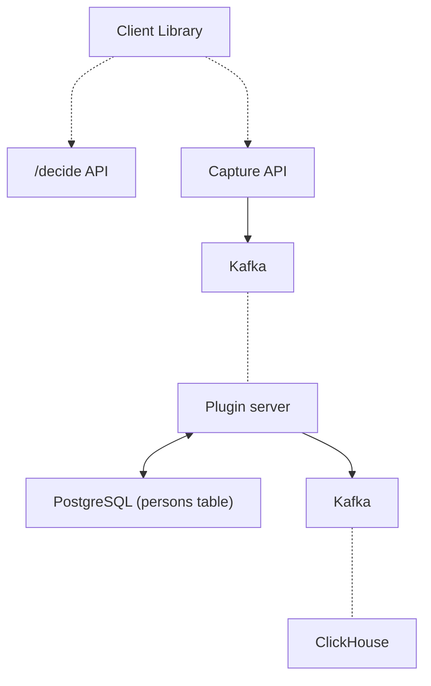
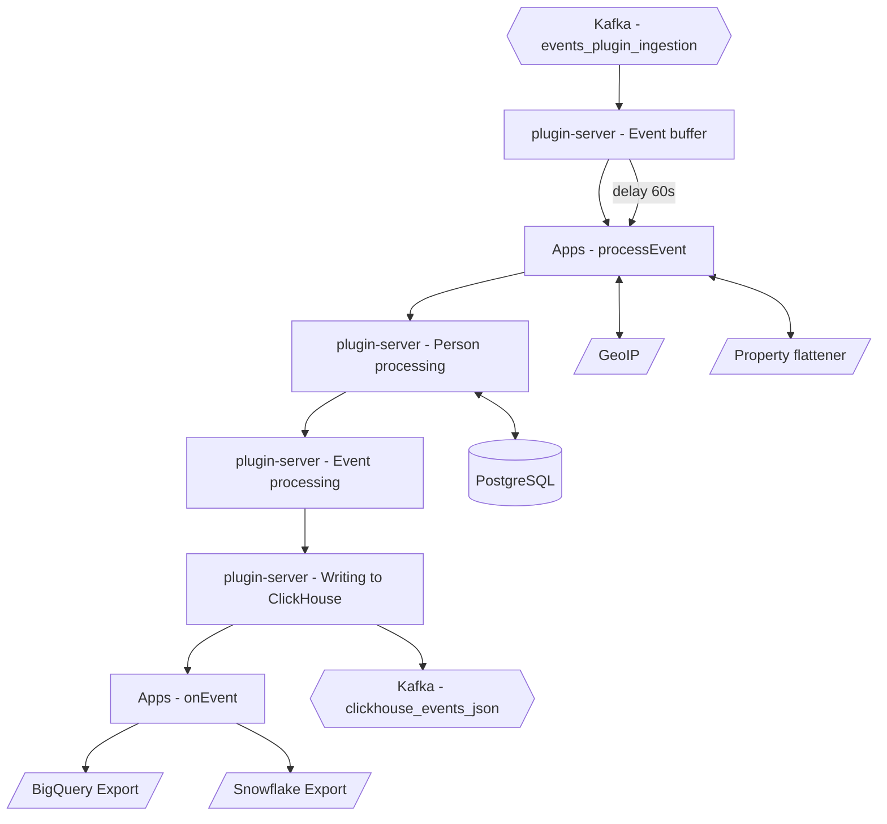

In its simplest form, the PostHog ingestion pipeline is a collection of services which listen for events as they are sent in, process them, and then store them for later analysis.
This document gives an overview of how data ingestion works, as well as some of the caveats to be aware of when sending events to PostHog.

## Capture API

The Capture API represents the user-facing side of the ingestion pipeline, and is exposed as a number of API routes where events can be sent.
Before an event reaches the Ingestion pipeline, there are a couple of preliminary checks and actions that we perform so that we can return a response immediately to the client.

These consist of:

-   Validating API keys
-   Anonymizing IPs according to project settings
-   Decompressing and normalizing the shape of event data for the rest of the system
-   Sending processed data to `events_plugin_ingestion` Kafka topic
-   If any of these operations fail (other than checking for data validity), logging events to the Kafka `dead_letter_queue` table

The goal of this step is to be as simple as possible, so that we can reliably get events into the ingestion pipeline, where Kafka can persist them until they are able to be processed.
Events are written to the `events_plugin_ingestion` Kafka topic, which is then consumed by the plugin-server.

## Ingestion

Ingestion is at the heart of the PostHog data pipeline, and is responsible for processing events coming in to PostHog and then writing them to storage.

The ingestion pipeline is made up of a number of different steps:

1. [Event buffer](#1-event-buffer)
2. [Apps - `processEvent`](#2-apps---processevent)
3. [Person processing](#3-person-processing)
4. [Event processing](#4-event-processing)
5. [Writing to ClickHouse](#5-writing-to-clickhouse)
6. [Apps - `onEvent`](#6-apps---onevent)

Here is an overview of how events flow through the pipeline:

### 1. Event buffer

The event buffer sits right at the beginning of the ingestion pipeline, and gives us the ability to selectively delay the processing of certain events. For more information, take a look at the [all about the event buffer](#all-about-the-event-buffer) section in the appendix.

### 2. Apps - `processEvent`

After the event buffer, we start the first of a few steps that augment or transform our raw event before it gets written into ClickHouse.
This first step runs any workloads that come from [Apps](/apps) that you have installed and who have exported a `processEvent` function.
This is the only chance for apps to transform or exclude an event before it is written into ClickHouse.

An example of an app that uses the `processEvent` hook is the [GeoIP Enricher](https://github.com/PostHog/posthog-plugin-geoip). This app uses the `$ip` property to retrieve and add geographic information to each event as they are ingested.

For more detail on this step, check out [this file](https://github.com/PostHog/posthog/blob/master/plugin-server/src/worker/ingestion/event-pipeline/2-pluginsProcessEventStep.ts) from the `plugin-server` codebase.

### 3. Person processing

The next step in the ingestion pipeline is processing the Person who sent the event, which is determined by the `distinct_id` field.
A number of different actions can happen here depending both on if we've seen this `distinct_id` before, as well as which type of event is being sent.

This is one of the most complex steps in the entire pipeline, so to help make things easier we'll break down this step into a number of smaller sections:

1. **Associate the event with a person**
    1. `$identify` events
    2. `$alias` events
    3. All other events
2. **Update person properties**

#### 1. Associate the event with a person

Based on which type of event is currently being processed, we perform a number of different steps.

#### 1.1 - `$identify` events

In the case of an `$identify` event, the first step is to use the `$distinct_id` and `$anon_distinct_id` fields that are sent with the event to determine what actions we will need to take.

-   `$anon_distinct_id` - The UUID associated with the client device that sent the event _(Only included for events sent from client-side libraries)_
-   `$distinct_id` - The distinct identifier for whichever user sent the event (Email, UUID, etc.). This can be set by the sender or is defaulted to `$anon_distinct_id` if it is not set

To determine what to do at this stage, we need to make a call to PostgreSQL to determine which scenario we are in:

|                                                                                            |                                                                                                                    |
| ------------------------------------------------------------------------------------------ | ------------------------------------------------------------------------------------------------------------------ |
| 1. Neither `$anon_distinct_id` nor `$distinct_id` have been associated with a Person       | Create a new Person and add a mapping in PostgreSQL to associate this `$distinct_id` with the new `person_id`      |
| 2. _Only one_ of `$anon_distinct_id` and `$distinct_id` have been associated with a Person | Create a new mapping to associate the `$distinct_id` and `$anon_distinct_id` with the already existing `person_id` |
| 3. _Both_ `$anon_distinct_id` _and_ `$distinct_id` have been associated with a Person      | We will [merge these two people](#merging-two-persons) and associate all future events with the first Person       |

> **Note**: In the case of an event sent from the backend, there will be no `$anon_distinct_id` field present. Instead, the same lookups and checks will be performed, but only on the `$distinct_id` which is required for all backend events

###### Merging two Persons

In the third scenario, where we have inadvertently created two Persons for the same user, we will need to merge them. In the case of an `$identify` call, we will create a mapping from the `distinct_id` of the anonymous user to the non-anonymous user.
If there are any conflicts when merging Person properties for these two users, the values from the non-anonymous user will take precedence.
We choose to prioritize the history of the non-anonymous user, as it is far more likely that this user will have a history of previous events associated with them that we want to preserve.

###### Consequences of merging

This scenario typically isn't ideal, as merging two users will only affect events that are sent in the future.
As a result, we will be left with two separate Persons that should be associated with the same user, but instead will be treated as entirely unique users.
The only way to fully 'merge' these two people would be to go back and rewrite the `person_id` field on past events, which is not practical or performant.

For more information on how these merges can affect the results of your queries, take a look at this page on how [querying data](/data/how-posthog-works/queries) works.

###### Avoiding a merge

Avoiding this scenario is the primary goal of the event buffer: by [buffering certain events](#1-event-buffer), we can avoid creating a duplicate Person when other events arrive before an `$identify` call.

On the integration side, the best way to avoid this scenario is to send `$identify` events as early into a user's session as possible.
This really only presents an issue when a user is logging in for the first time from a new device, and does not present any problems with users logging out and logging back in on an already seen device and platform.

#### 1.2 - `$alias` events

The process of handling `$alias` events is almost identical to the process for `$identify` events, except that instead of using `$distinct_id` and `$anon_distinct_id` as our two identifiers, we allow you to pass in two arbitrary `$distinct_id`'s you would like to combine.

It's worth noting that in the case that both `$distinct_id`'s already have different Persons they are associated with, the `$distinct_id` that was provided second will be merged into the Person associated with the first `$distinct_id`

#### 1.3 - All other events

For all other types of events, the process is much more straightforward.
If we have determined that this is a new `$distinct_id`, then we will create a new Person within PostgreSQL and associate them with this `$distinct_id`. Otherwise, we will retrieve the `person_id` associated with this `$distinct_id`, which will later be added as a field on the event in [Step 5](/docs/how-posthog-works/ingestion-pipeline#5-writing-to-clickhouse).

#### 2. Update person properties

Now, once we have finished determining the Person who is associated with the event we are processing, we can finish by updating their properties within PostgreSQL.
This step takes into account any `$set`, `$set_once` or `$unset` arguments provided on the event, and merges these with any existing values for the Person.

For more information on exactly how this updating is done, check out this overview of [user properties](/docs/integrate/user-properties).

### 4. Event processing

Finally, now that we have our event and person all ready, we perform a few last processing steps before we write the event to ClickHouse.
This is our last chance to change anything about the event, which can include:

-   Adding [group properties](/manual/group-analytics) if the event has been assigned to a Group
-   Anonymizing IPs, if needed

### 5. Writing to ClickHouse

Now that we have our fully-processed event, the last step before we write to ClickHouse is to add the `person_id` and person properties to our event, both of which were determined in [Step 3](/docs/how-posthog-works/ingestion-pipeline#3-person-processing).
Once we have all the person properties attached, we are ready to persist our event, which is done by sending it to a separate Kafka topic that ClickHouse will consume from and then write to its tables.

For more information on exactly how events are stored in ClickHouse, check out [this reference](/docs/how-posthog-works/clickhouse)

### 6. Apps - `onEvent`

The final step in the ingestion pipeline is calling the `onEvent` handler from any apps that we have enabled. This includes all of our export apps as well as some of our alerting/monitoring apps.
It's worth noting that since this event has already been written to ClickHouse, it is effectively immutable at this point as we do not allow apps to directly update events. Any apps that need to transform events should use the `processEvent` handler.

## Appendix

### All about the event buffer

#### Determining if an event should be buffered

After an event is consumed from Kafka, the plugin server will check a number of things in order to determine whether or not to buffer an event.
If any of these conditions are true the event will not be buffered and will immediately move on to the [next step](#2-apps---processevent).

-   If the `distinct_id` on the event is already associated with an existing Person
-   If the event is _anonymous_ (In this case this means the `distinct_id` matches the `device_id` generated by the library that sent the event)
-   If the event is an `$identify` or `$alias` call
-   If the event is coming from one of our mobile libraries, as it is not easy to determine if an event is _anonymous_ and we don't want to delay all events from mobile

If an event coming in satisfies none of these checks, then it will be added to the buffer and sent back through the ingestion pipeline after 60s.
Since this means that events would be delayed, our goal is to use the buffer as sparingly as possible.

Choosing to use the event buffer is a trade-off between events arriving quickly and events being associated the desired person.

For more detail on this step, check out [this file](https://github.com/PostHog/posthog/blob/master/plugin-server/src/worker/ingestion/event-pipeline/1-emitToBufferStep.ts) from the plugin-server codebase.

#### Why are events buffered?

Since events coming into PostHog can arrive in a suboptimal order, we sometimes decide to delay the processing of specific events.
There are two scenarios where events can arrive in suboptimal order that the event buffer is designed to handle:

1. Events that are sent from the same library and session may arrive out of order due to network uncertainty
2. During the initial signup flow the backend event might arrive before frontend has identified the user

It will become more obvious why it is better to buffer events in these two cases as we dive deeper into the example below.

Let's look at a initial sign-up flow (identify event is used to sign-up/log-in).

In the case that we're sending a signup event from the backend, this event will typically arrive before the identify event on the frontend.
If we did not use the buffer, here is the events table we would see.

| ID  | Event          | `distinct_id`                         | person_id | Details                                |
| --- | -------------- | ------------------------------------- | --------- | -------------------------------------- |
| 1   | pageview       | `anon-1`                              | `user-1`  | New person with id `user-1` is created |
| 2   | backend signup | `Alice`                               | `user-2`  | New person with id `user-2` is created |
| 3   | identify       | `Alice` (anon_distinct_id = `anon-1`) | `user-2`  | Merge `user-1` into `user-2`           |

As you can see, we end up with two different `person_id`'s in the events table for the same user. See the impact this has on queries [here](/docs/how-posthog-works/queries).

Now, let's take a look at how the event buffer can help to prevent this.

| ID  | Event          | `distinct_id`                         | person_id | Details                                                  |
| --- | -------------- | ------------------------------------- | --------- | -------------------------------------------------------- |
| 1   | pageview       | `anon-1`                              | `user-1`  | New person with id `user-1` is created                   |
| 3   | identify       | `Alice` (anon_distinct_id = `anon-1`) | `user-1`  | distinct_id `Alice` is associated with `user-1`          |
| 2   | backend signup | `Alice`                               | `user-1`  | This event is now processed last because it was buffered |

As you can see, since we delayed the processing of event `2`, we were able to avoid creating an unnecessary Person.

A similar scenario can occur when events with non-anonymous `distinct_id` arrive before an identify call due to network uncertainty.

When the buffer can't help us and we don't do anything else either.
The buffer is designed to help with the initial sign-up flow, and has no effect on events that are sent after this point.

As an example, let's take a look at the following series of events:

| ID  | Event    | `distinct_id`                         | `person_id` | Details                                                            |
| --- | -------- | ------------------------------------- | ----------- | ------------------------------------------------------------------ |
| 1   | pageview | `anon-1`                              | `user-1`    | New person with id `user-1` is created                             |
| 2   | identify | `Alice` (anon_distinct_id = `anon-1`) | `user-1`    | distinct_id `Alice` is associated with `user-1`                    |
| 3   | pageview | `anon-2`                              | `user-2`    | Imagine this was the same user opening the page in incognito mode. |
| 4   | identify | `Alice` (anon_distinct_id = `anon-2`) | `user-1`    | Alice logs in. Merge `user-1` into `user-2`                        |

Since event `3` is anonymous, we do not buffer it and create a new Person with id `user-2`.
