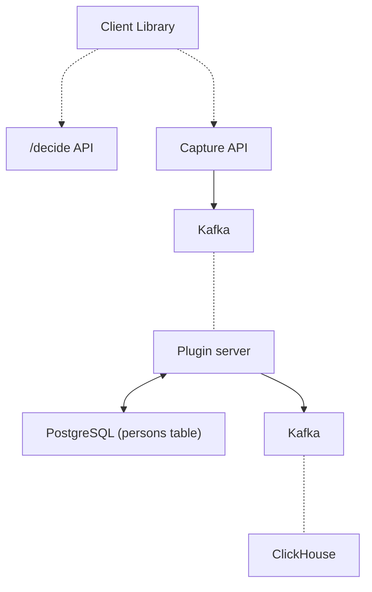
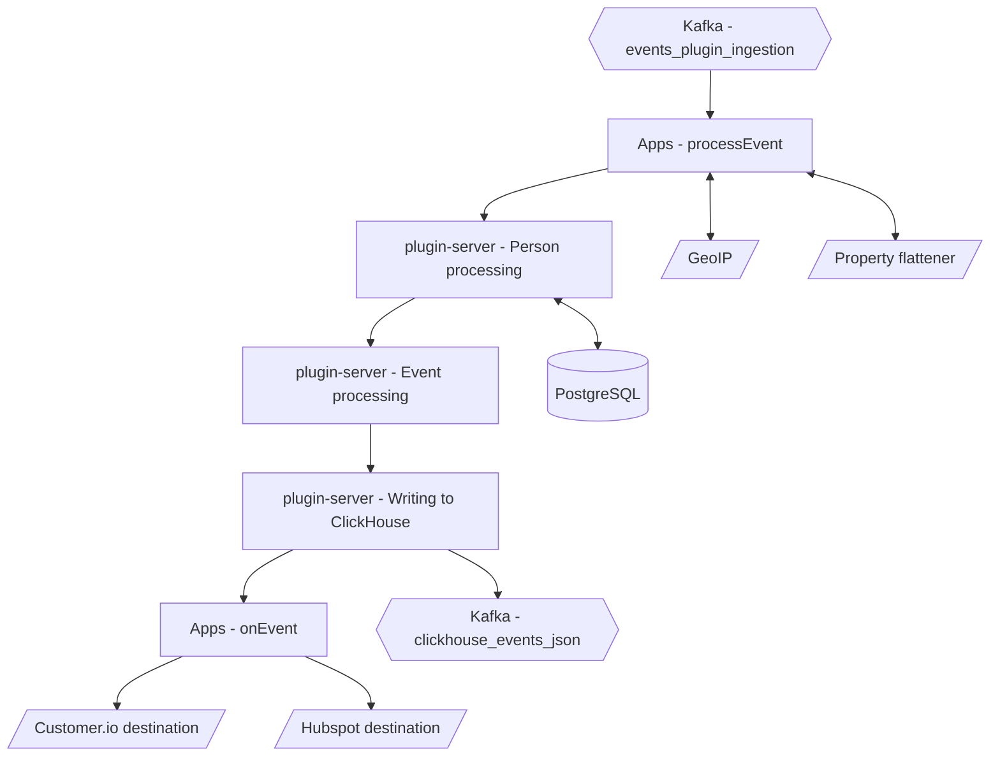

In simple terms, the ingestion pipeline is a collection of services which listen for events as they are sent in, processed, and stored for later analysis.

## Capture API

The Capture API represents the user-facing side of the ingestion pipeline and is exposed as API routes where events can be sent.

Before an event reaches the ingestion pipeline, there are a couple of preliminary checks and actions that we perform so that we can return a response immediately to the client:

- Decompressing and normalizing the shape of event data for the rest of the system
- Sending raw data to `events_plugin_ingestion`, `events_plugin_ingestion_overflow`, or `events_plugin_ingestion_historical` Kafka topic for further processing

The goal of this step is to be as simple as possible so that we can reliably get events into the ingestion pipeline, where Kafka can persist them until they can be processed.

Events are written to the Kafka topics, which are then consumed by the plugin server.

## Plugin server

Here is an overview of the steps events go through in the plugin server:

In the sections below we will dive deeper into each step:

1. [Apps - `processEvent`](#1-apps---processevent)
2. [Person processing](#2-person-processing)
3. [Event processing](#3-event-processing)
4. [Writing to ClickHouse](#4-writing-to-clickhouse)
5. [Apps - `onEvent`](#5-apps---onevent)

If you would like to dive even deeper the related source code can be found [here](https://github.com/PostHog/posthog/blob/master/plugin-server/src/worker/ingestion/event-pipeline).

### 1. Apps - `processEvent`

Once data reaches the plugin server, we start the first of steps that augment or transform our raw event data before it gets written into ClickHouse.

This first step runs any workloads that come from [transformations](/docs/cdp) you installed and which export a `processEvent` function. This is the only chance for apps to transform or exclude an event before it is written into ClickHouse.

### 2. Person processing

The next step in the ingestion pipeline is processing the [person](/docs/how-posthog-works/data-model#person) who sent the event, which is determined by the `distinct_id` field.

Many actions can happen here depending on if we've seen this `distinct_id` before, as well as which type of event is being sent.

This is one of the most complex steps in the entire pipeline, so we'll break it into two parts:

1. **Associate the event with a person**
    1. `$identify` events
    2. `$create_alias` and `$merge_dangerously` events
    3. All other events
2. **Update person properties**

> **Note:** In case there were any changes to persons during processing, we will update the persons' info in ClickHouse too.

#### Part 1: Associate the event with a person

Based on which type of event is currently being processed, we perform multiple different actions.

##### Option 1: `$identify` events

In the case of an `$identify` event, the first step is to use the `$distinct_id` and `$anon_distinct_id` fields that are sent with the event to determine what actions we take.

- `$anon_distinct_id`: The UUID associated with the client device that sent the event _(Only included for events sent from client-side libraries)_

- `$distinct_id`: The distinct identifier for whichever user sent the event (email, UUID, etc.). This can be set by the sender or is defaulted to `$anon_distinct_id` if it is not set

> **Note**: In the case the `$anon_distinct_id` is missing (e.g. events from backend libraries), we will treat this event like [all other events](#3.1.3---all-other-events).

To determine what to do at this stage, we need to make a call to PostgreSQL to determine which scenario we are in:

|                                                                                            |                                                                                                                    |
| ------------------------------------------------------------------------------------------ | ------------------------------------------------------------------------------------------------------------------ |
| 1. Neither `$anon_distinct_id` nor `$distinct_id` have been associated with a Person       | Create a new Person and add a mapping in PostgreSQL to associate this `$distinct_id` with the new `person_id`      |
| 2. _Only one_ of `$anon_distinct_id` and `$distinct_id` have been associated with a Person | Create a new mapping to associate the `$distinct_id` and `$anon_distinct_id` with the already existing `person_id` |
| 3. _Both_ `$anon_distinct_id` _and_ `$distinct_id` have been associated with a Person      | We will [merge these two people](#merging-two-persons) and associate all future events with the `person_id` that was associated with the `$distinct_id` |

> **Merging two persons**
>
> In the third scenario, where we have inadvertently created two persons for the same user, we need to merge them. PostHog has a few built-in protections, in which case the merge will not be aborted ([more info](/docs/integrate/identifying-users#considerations)). 
>
> In the case of an `$identify` call, we merge the person tied to `$anon_distinct_id` (`person_2`) into the person identified by `distinct_id` (`person_1`). This means that we associate `$anon_distinct_id` with `person_1`, delete `person_2` and all future events for `$anon_distinct_id` are associated with `person_1`.
>
>If there are any conflicts when merging person properties for these two persons, the values from the non-anonymous person (`person_1`) take precedence. We do this as it is far more likely that this person has a history of associated events we want to preserve.
>
> For more information on exactly how the merging of properties is done, check out our [overview of person properties](/docs/integrate/user-properties).

##### Option 2: `$create_alias` and `$merge_dangerously` events

The process of handling `$create_alias` events is almost identical to the process for `$identify` events, except that instead of merging `$anon_distinct_id` into `$distinct_id`, we allow you to pass in two arbitrary `$distinct_id`'s you would like to combine and merge the second one (`alias`) into `distinct_id`.

##### Option 3: All other events

For all other types of events, the process is much more straightforward.

If we determined that this is a new `$distinct_id`, then we create a new person within PostgreSQL and associate them with this `$distinct_id`. Otherwise, we retrieve the person associated with this `$distinct_id`.

#### Part 2: Update person properties

Once we finish determining the person associated with the event we are processing, we can finish by updating their properties within PostgreSQL.

This step takes into account any `$set`, `$set_once` or `$unset` arguments provided on the event, and merges these with any existing values for the person.

> **Further reading:** [How to set and use person properties](/docs/product-analytics/person-properties)

### 3. Event processing

With our event and person ready, we perform a few last processing steps before we write the event to ClickHouse.

This is our last chance to change anything about the event, which can include:

- Validating API keys
- Adding [group properties](/manual/group-analytics) if the event has been assigned to a Group
- Anonymizing IPs according to project settings

### 4. Writing to ClickHouse

We combine the fully-processed event and the person, send it to a separate Kafka topic that ClickHouse consumes from, and then write to the events table.

> **Further reading:** 
> - [How data is stored in ClickHouse](/docs/how-posthog-works/clickhouse)
> - [How ClickHouse ingestion works](/handbook/engineering/clickhouse/data-ingestion)

### 5. Apps - `composeWebhook`

The final step in the ingestion pipeline is calling the `composeWebhook` handler from any destinations that we have enabled.

Since this event has already been written to ClickHouse, it is effectively immutable as we do not allow apps to directly update events. Any apps that need to transform events should use the `processEvent` handler.