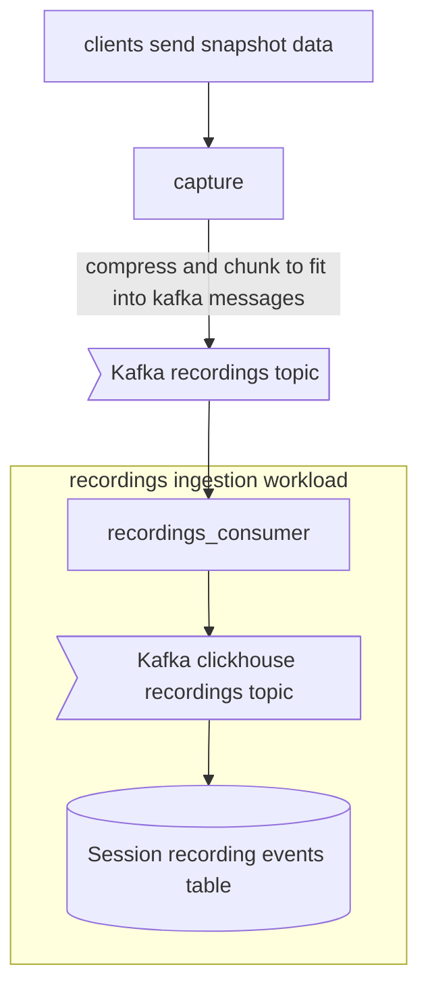
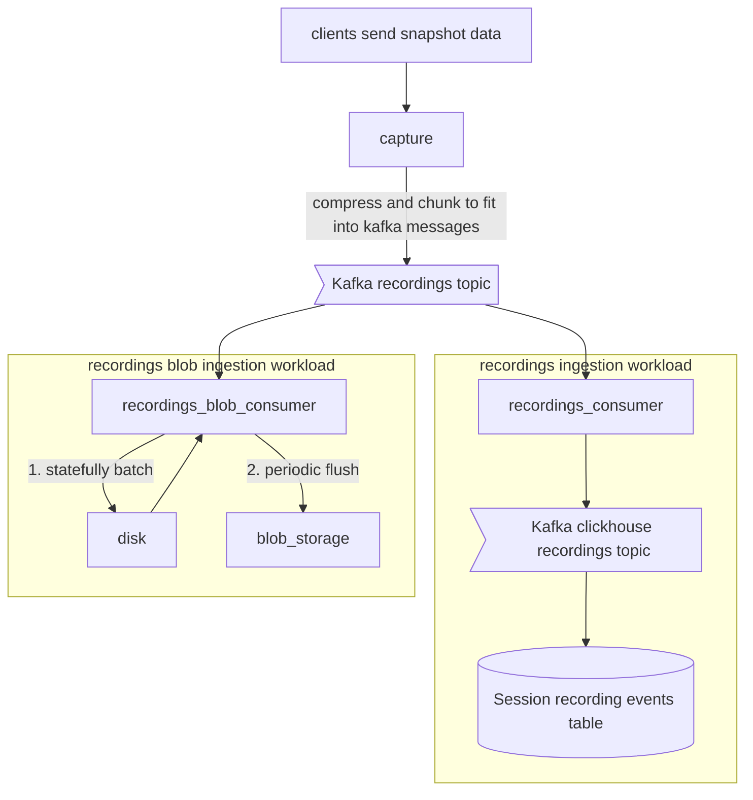
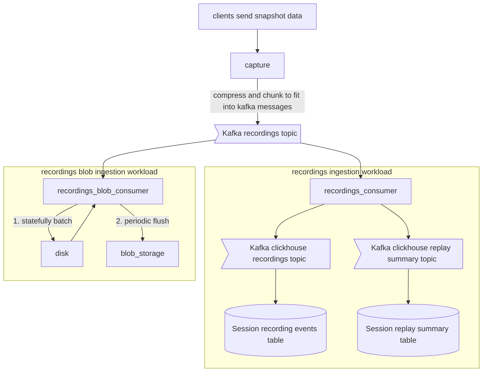

## Overview

This is aimed at PostHog employees and goes into detail in order to allow them to support recordings while we're evolving the architecture

We use `rrweb` to collect "snapshot data" from the browser. This data is gathered by the capture API and sent to ingestion.

Because we use kafka for ingestion there is a maximum allowed message size and snapshot data is often larger than that. 

So, in Capture we compress the data and split it into chunks. The plugin server runs a "recordings ingestion" workload which uses our ingestion pipeline to send each recording event for storage in ClickHouse

## Evolution to blob storage

This is in progress.

Storing snapshot data in ClickHouse is not ideal. It's not a good fit for the data model and it's not a good fit for the workload. So, recordings storage is being moved to blob storage. We use AWS S3 for blob storage but in theory any S3 compatible API such as Minio would work as well. 

This uses a new ingestion workload which batches sessions to disk and periodically flushes them to blob storage. This is to allow us to write fewer files to storage reducing the operational cost of the system.

## Recording metadata

This is in progress.

While the snapshot data is stored in ClickHouse [we use materialised columns](https://posthog.com/blog/clickhouse-materialized-columns) to generate metadata about the recording. Things like how long it is, or how many mouse clicks are in the recording.

Once we migrate storage out of ClickHouse that won't be possible any more.

So, we're adding a new ingestion workload which will generate this metadata and store it in a new table in ClickHouse. This will be used to power the session replay UI. It uses the [ClickHouse Aggregating MergeTree engine](https://clickhouse.com/docs/en/engines/table-engines/mergetree-family/aggregatingmergetree) to power the table. 

In combination with the blob storage ingestion workload this means we're storing at least a hundred times less data per row in ClickHouse. And compressing it about twice as much. 🔥

## End state

After 21 days have passed the (very large) session_recording_events table is redundant and the system simplifies to:

