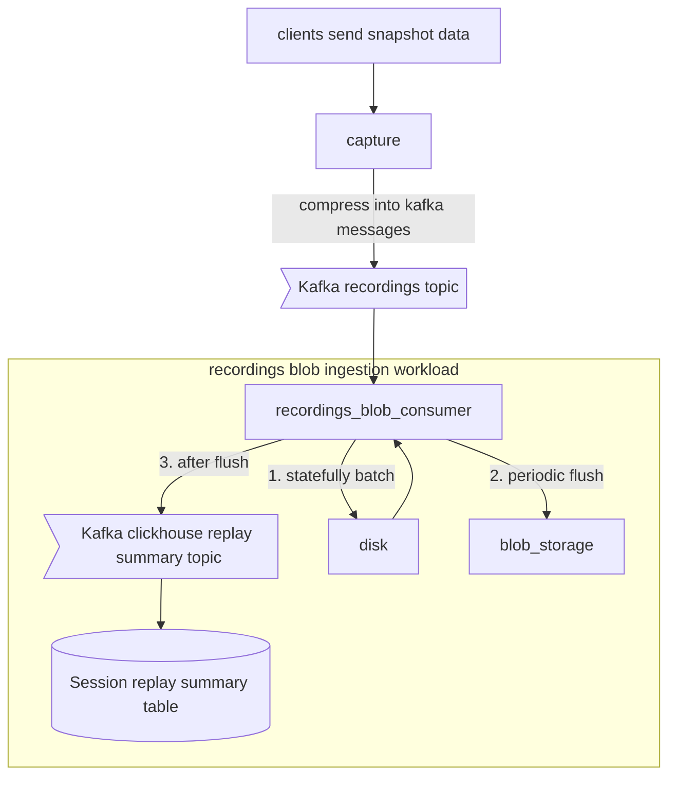

## Overview

This is aimed at PostHog employees and goes into detail in order to allow them to support the Session Replay product.

We use `rrweb` to collect "snapshot data" from the browser. This data is gathered by the capture API and sent to ingestion.

Because we use kafka for ingestion there is a maximum allowed message size and snapshot data is often larger than that. Replay has its own ingestion infrastrcture with larger limits. 

We store recording snapshot data in blob storage and aggregated session information in the `session_replay_events` table. As a result in Capture (`posthog-recordings` deployment) we no longer need to chunk recordings.

The ingestion workload batches sessions to disk and periodically flushes them to blob storage. This is to allow us to write fewer files to storage reducing the operational cost of the system.

## Recording metadata

The ingestion workload generates metadata and stores it in the `session_replay_events` table in ClickHouse. This will be used to power the session replay UI. It uses the [ClickHouse Aggregating MergeTree engine](https://clickhouse.com/docs/en/engines/table-engines/mergetree-family/aggregatingmergetree) to power the table. 

In combination with the blob storage ingestion workload this means we're storing at least a hundred times less data per row in ClickHouse than in the original infrastructure. And compressing it about twice as much. 🔥

