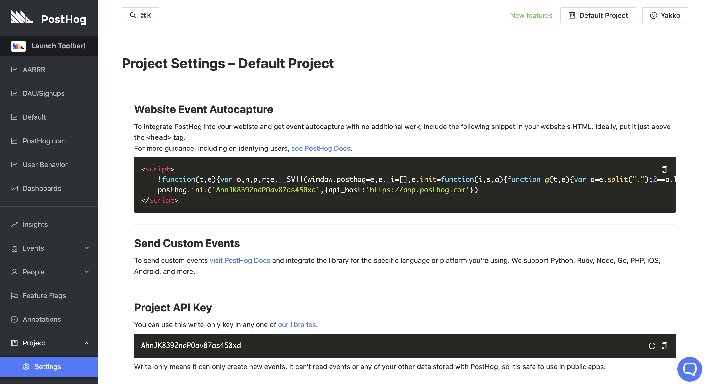

import Snippet from "../snippet.mdx"

This is the simplest way to get PostHog up and running on your website, and only takes a few minutes to set-up.

<Snippet />

After including the snippet on your website, it will automatically start to:

-   Capture `$pageview` events when a user visits a page
-   Track when users [click on links or buttons](/docs/user-guides/events#autocapture-event-tracking)
-   Record videos of [user sessions](/docs/user-guides/recordings) that you can play back

If you do need to set up more detailed tracking, take a look at our [client libraries](#client-libraries).

### Finding the snippet

This snippet will be provided to you during setup, but, if you need to access it afterwards, you can find it under 'Project' -> 'Settings':



### Adding the snippet to your website

Having copied the snippet from the Settings page, you should now paste this within the `<head>` tags of your website, ideally just above the closing `</head>` tag. You will need to do this for all pages that you wish to track.

### Website vs app

We recommend adding the PostHog snippet both on your homepage and your application (if you have one). That means you'll be able to follow a user from the moment they come onto your website, all the way through Sign Up and their actual usage of your product.

### Adding multiple domains

PostHog supports tracking across multiple domains - just include the same snippet on all the websites you wish to track under the same project.

However, you can also configure "permitted domains" in your 'Project Settings'. These are domains where you'll be able to record user sessions and use the PostHog toolbar.

### Ignore/censor elements

PostHog puts a great amount of effort into making sure it doesn't capture any sensitive data from your website. If there are other elements you don't want to be captured, you can add the `ph-no-capture` class name.

```html
<button class="ph-no-capture">Sensitive information here</button>
```
