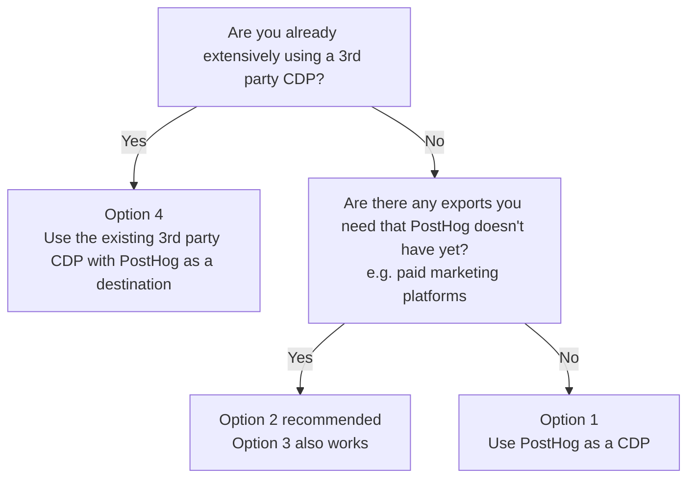
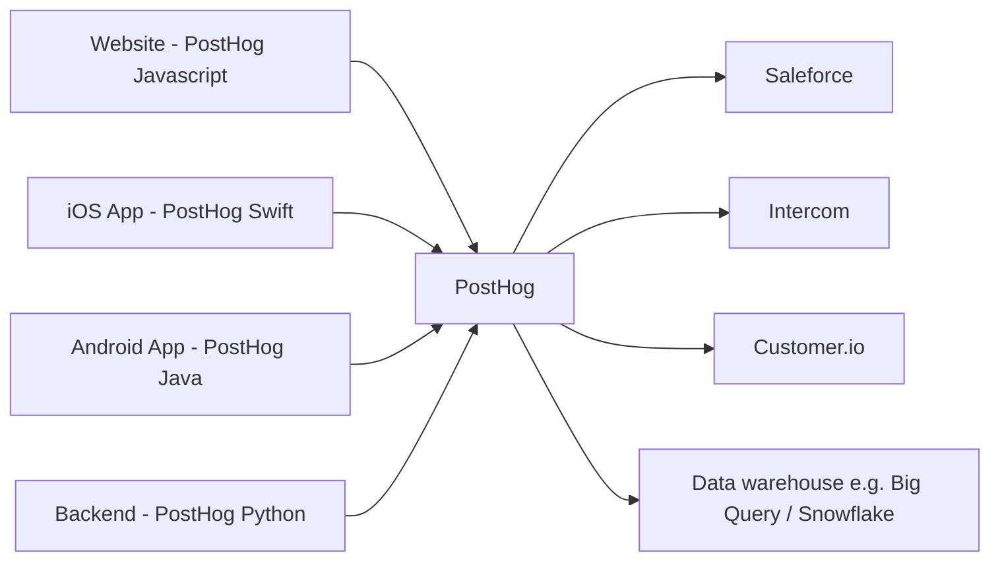
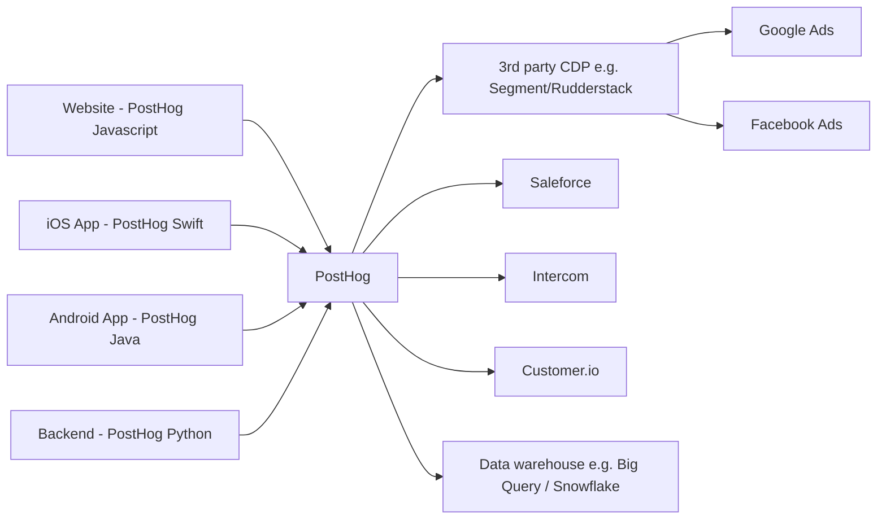
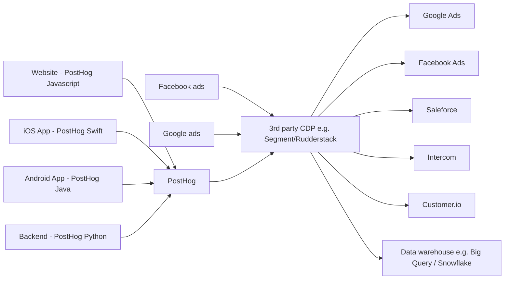
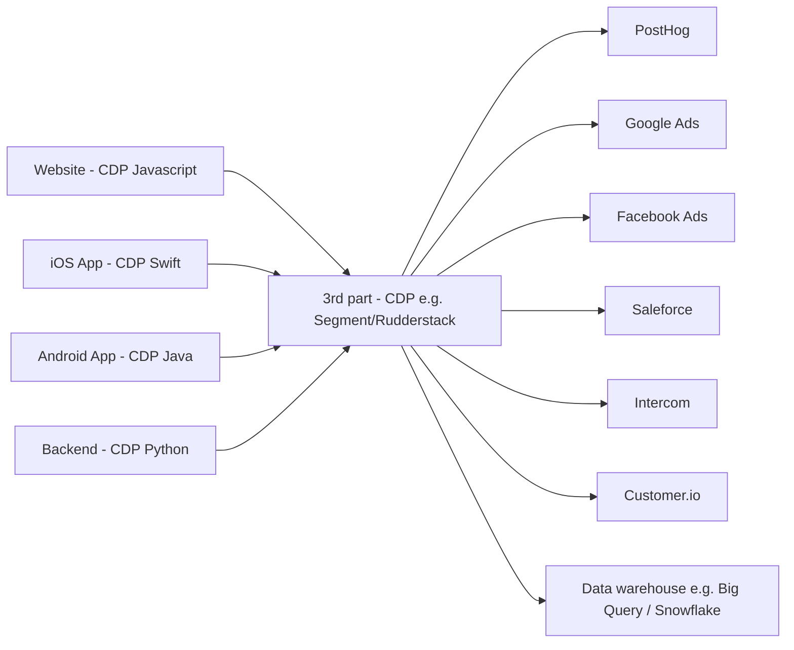
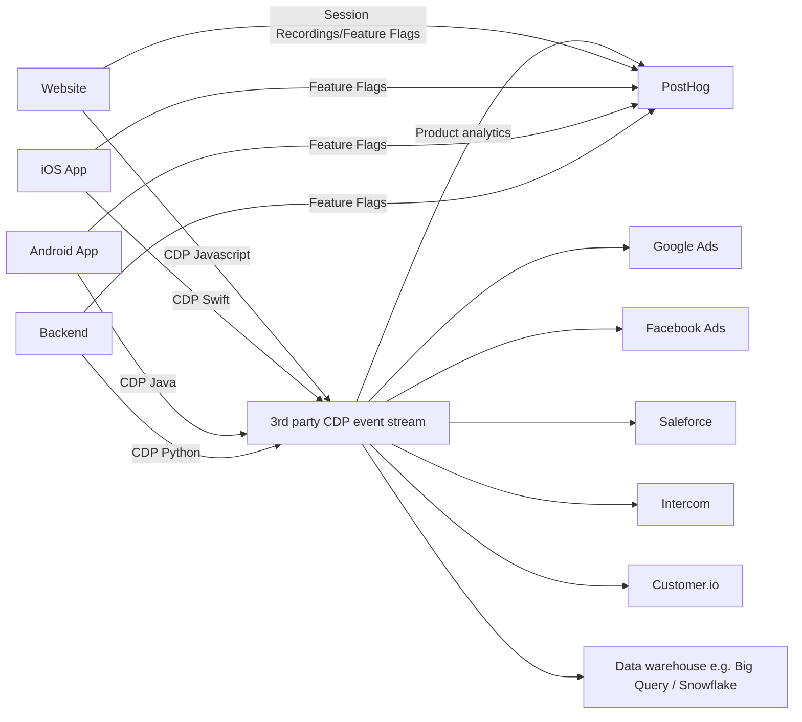

## What is a CDP?

A CDP is a Customer Data Platform. It is a platform that allows you to collect, and send customer data to other tools like product analytics (PostHog!), marketing automation tools, your CRM, data warehouses etc.

The most common CDPs are Segment and Rudderstack, both of which work with PostHog.

If you already have a Customer Data Platforms (CDP) setup or are thinking of using one this guide will help you decide how to integrate with PostHog.

## Which PostHog CDP setup should I use?

PostHog has many of the imports and exports of common (CDPs) built-in. This means there's a variety of options for how you could integrate PostHog with a 3rd party CDP:

1. Use PostHog as a CDP (recommend if you don't have a 3rd party CDP set up)
2. Use PostHog as the main CDP, and a 3rd party CDP for extra destinations
3. Use PostHog in front of a 3rd party CDP
4. Use a 3rd party CDP, with PostHog as a destination

Which method you choose will depend on what your goals are, what you have already set up, and how much time and money you are willing to invest.

Here's a decision tree that you might find handy:

## Option 1: Use PostHog as a CDP

If general, we'd highly recommend starting with PostHog as the CDP using the variety of imports and exports apps that we have. This is the easiest and least expensive way to get started.

If you later need some extra destinations that we don't yet have. You can either build your own export app or add a 3rd party CDP (Option 2 recommend, Option 3 also works) on top of PostHog. Every month we are adding more destinations.

Advantages:
- Least expensive as you don't need a 3rd party CDP.
- You don't have a 3rd party CDP before PostHog reducing risk of data being dropped.
- Works with all the features of PostHog (analytics, autocapture, feature flags, session recording, etc.)

Disadvantages:
- We don't yet have as many 3rd party integrations as existing 3rd party CDPs - particularly for marketing platforms (for Facebook Ads, Google Ads, TikTok Ads etc.). If you need the exports immediately we'd recommend adding a 3rd party CDP (Option 2 recommend, Option 3 also works) once you are setup.

## Option 2: Use PostHog as the main CDP, connected to a 3rd party CDP for extra destinations

If there's a large number of destinations you need to send data to, such as marketing platforms (Facebook Ads, Google Ads, TikTok Ads etc.), then you'll likely want to use a 3rd party CDP in addition to PostHog. We'd recommend Option 2, as this means you have the option to just use PostHog if we later add the destinations you need; however Option 3 also works.

To set this up, use the PostHog export app to send data to a 3rd party CDP and onto the destinations you need. It's also on our roadmap to add more destinations to PostHog directly and so you may be able to remove this 3rd party CDP in the future.

Pros:
- Many more destinations available than PostHog alone, including the marketing destinations.
- You don't have a 3rd party CDP before PostHog reducing risk of data being dropped.
- Works with all the features of PostHog (analytics, autocapture, feature flags, session recording, etc.).
- Can control within PostHog what data is sent onto the CDP and the extra destinations.

Cons:
- More expensive than Option 1 as you now need to pay for a 3rd party CDP.
- You need to manage two platforms, which adds some complexity.

### Option 3: Using PostHog in front of a 3rd party CDP

An alternative to Option 2 would be to have PostHog in front of a 3rd party CDP. Only one export app from PostHog is used (to send data to the CDP). And then the CDP is used to send data to the destinations you need.

Pros:
- Many more destinations available than PostHog alone, including the marketing destinations (the same number of destinations as Option 2)
- Works with all the features of PostHog (analytics, autocapture, feature flags, session recording, etc.)

Cons:
- More expensive than Option 1 as you now need to pay for a 3rd party CDP.
- You now have 2 destinations (PostHog and the CDP) in front of your destinations, which can adds more risk of data being dropped.
- More dependent on the 3rd party CDP, making it harder to transition to only PostHog as a CDP if in future we add the extra destinations that you need.

## Option 4: Use a 3rd party CDP with PostHog as a destination

If you already have a CDP being used extensively, the quickest way to get started is to to add PostHog as a destination to that CDP. For your frontend sources you'll want to configure PostHog as a device mode destination to ensure you get the full functionality.

Pros:
- You can quickly integrate PostHog with your existing CDP.
- Can manage all your sources and destinations in one place (the 3rd party CDP).
- Many more destinations available than PostHog alone (same as Option 2 and 3)

Cons:
- You'll need to pay for a 3rd party CDP.
- You won't be able to use PostHog autocapture of events and so you'll need to manually instrument each event you want to track.
- Enabling feature flags and session recordings requires some extra setup in addition to adding PostHog as a destination.
- Data into PostHog first passes through a CDP, adding risk that it's dropped.
- Variable support by the CDP libraries for PostHog.

If using feature flags and/or session recordings, it will end up looking more like this:

