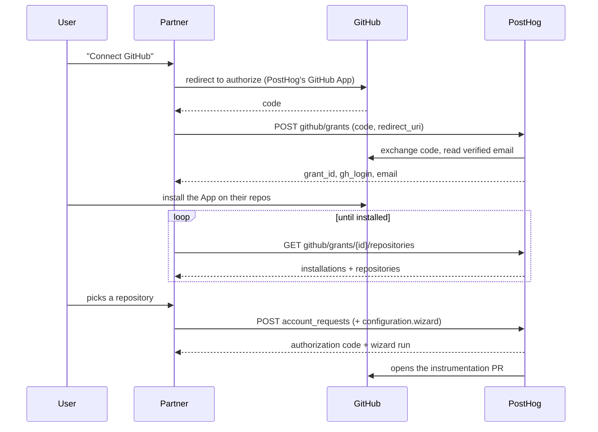

An optional extension to the [provisioning API](/docs/integrate/provisioning): hand PostHog a GitHub repository your user picked, and PostHog instruments it for them and opens a pull request.

Unlike the rest of the provisioning API, this one is not self-serve: it needs a confidential client and a capability PostHog enables by hand. Read the eligibility note below before building against it.

## What this is for

The [provisioning API](/docs/integrate/provisioning) creates an account and hands you a project token, which leaves your user with the actual work still to do: installing an SDK, wiring up config, opening a pull request. GitHub grants are how you skip that. Your user connects their GitHub account and picks a repository; PostHog runs its [setup wizard](/docs/getting-started/install) against that repository in the cloud and opens an instrumentation pull request on it. Your user reviews and merges. Nobody copies an API key anywhere.

The "grant" is the mechanism that makes this safe to broker. You hand PostHog a GitHub OAuth code and get back an opaque `grant_id`. The GitHub user tokens stay on PostHog's side and never pass through your app, so brokering the connection doesn't mean holding your user's GitHub credentials.

**This is how posthog.com's own `/wizard` page works.** A visitor clicks "Connect GitHub", picks a repo, and gets a PostHog account plus a PR against that repo, without ever seeing a signup form. posthog.com is a partner like any other here – it holds the same opaque grant id in a cookie and calls the same endpoints described below.

<CalloutBox icon="IconWarning" title="PostHog has to enable this for you" type="caution">

Two conditions, and the second is not self-serve:

1. You must be a **confidential client**. A public client is identified only by a `client_id` anyone can send, which proves nothing, so it gets a `403` no matter what it sends. See [becoming a confidential client](#becoming-a-confidential-client).
2. PostHog must grant your partner record `can_use_github_grants` (and `can_start_wizard_runs` for the run itself). Registering yourself does not set these – publishing a metadata document that declares `private_key_jwt` would otherwise clear a confidential-only gate with no PostHog involvement at all.

**We don't grant this by default.** These endpoints let you broker your users' GitHub access and open pull requests on their repositories, so it's a level of trust we extend deliberately rather than to anyone who registers. Open a [support request](https://us.posthog.com/#panel=support%3Asupport%3Alogin%3A%3Atrue) in the app, choosing **Authentication** as the topic, and tell us what you're building, who your users are, and what you want the wizard to do for them. If it's a fit we'll enable the capability and give you the client ID of the PostHog GitHub App your users authorize against, which you can't get any other way.

The rest of the [provisioning API](/docs/integrate/provisioning) is self-serve, and stays that way whether or not we say yes.

Check `capabilities.github_grants` and `capabilities.wizard_runs` in the [registration response](/docs/integrate/provisioning#register-your-client) to see where you stand. Both `false` on a confidential client means the capability is missing, not your auth.

</CalloutBox>

## The flow end to end



Four calls, of which two are the grant endpoints and one you already make. Taken one at a time:

## Step 1: Create a grant

You run the GitHub OAuth leg yourself, against PostHog's GitHub App, and land the resulting `code` on your own redirect URI. Then trade it for a grant:

```bash
curl -X POST https://us.posthog.com/api/agentic/provisioning/github/grants \
  -H "Content-Type: application/json" \
  -d '{
        "code": "github_oauth_code",
        "redirect_uri": "https://yourapp.com/callbacks/github",
        "client_id": "https://yourapp.com/.well-known/oauth-client.json",
        "client_assertion": "eyJhbGciOi...",
        "client_assertion_type": "urn:ietf:params:oauth:client-assertion-type:jwt-bearer"
      }'
```

`redirect_uri` must be byte-identical to the one you sent GitHub, as GitHub checks it on the exchange.

**Response** (HTTP 200):

```json
{
  "grant_id": "ghg_abc123...",
  "gh_login": "octocat",
  "email": "octocat@example.com",
  "expires_in": 3600
}
```

PostHog fetches the verified email server-side, so you never call GitHub for it. `email` is `null` when GitHub has no verified email to give – that's still a usable grant, so collect an address from the user inline rather than treating it as a failure. (A `502 email_unavailable` is a different thing: it means the GitHub App can't read emails at all, which is a PostHog-side misconfiguration.)

A grant lives for **one hour** and is single use – it's consumed the moment the installation is linked to a team. It's also region-local, because it lives in the cache of the region that minted it, so every follow-up call has to hit that same region.

## Step 2: Poll for the installation and list repositories

Authorizing the OAuth app is not the same as installing the GitHub App, and only the install grants repository access. Send your user to the App's install page, then poll:

```bash
curl "https://us.posthog.com/api/agentic/provisioning/github/grants/$GRANT_ID/repositories?client_id=$CLIENT_ID&client_assertion=$ASSERTION&client_assertion_type=urn:ietf:params:oauth:client-assertion-type:jwt-bearer"
```

This is a `GET`, so there's no body to carry your credentials and the assertion rides the query string instead. Each assertion is still single use, so mint a fresh one per poll.

**Response** (HTTP 200):

```json
{
  "gh_login": "octocat",
  "installations": [
    { "id": "12345678", "account_login": "octocat", "repository_selection": "selected" }
  ],
  "repositories": [
    { "installation_id": "12345678", "full_name": "octocat/hello-world", "default_branch": "main", "private": false }
  ]
}
```

There is no `installed` flag: the App is installed if and only if `installations` is non-empty, which is what you poll on. A user may have installed on several accounts, so each repository carries its own `installation_id` – keep it with the repository rather than assuming one per grant, and keep it as a string.

The listing is capped at 300 repositories per installation, so don't present it as exhaustive for a large org. Polling is budgeted at 120 requests per grant per hour; a 5-second interval over a 5-minute wait stays comfortably inside that. An unknown or foreign `grant_id` returns `404` – a grant belonging to another partner is deliberately indistinguishable from one that never existed.

## Step 3: Provision the account and start the run

The simplest path bundles the run into the [account request](/docs/integrate/provisioning#step-1-create-an-account) you were already making. Add a `configuration.wizard` block:

```json
{
  "id": "req_unique_request_id",
  "email": "octocat@example.com",
  "client_id": "https://yourapp.com/.well-known/oauth-client.json",
  "code_challenge": "...",
  "code_challenge_method": "S256",
  "client_assertion": "eyJhbGciOi...",
  "client_assertion_type": "urn:ietf:params:oauth:client-assertion-type:jwt-bearer",
  "configuration": {
    "region": "US",
    "wizard": {
      "grant_id": "ghg_abc123...",
      "installation_id": "12345678",
      "repository": "octocat/hello-world",
      "branch": "main"
    }
  }
}
```

Note the PKCE fields and the assertion in the same body. That is not redundant, and it is the shape every confidential request takes – see [both, always](#both-always).

The account and the run are created together, and the response carries both:

```json
{
  "id": "req_unique_request_id",
  "type": "oauth",
  "oauth": { "code": "abc123...authorization_code" },
  "wizard": { "task_id": "...", "run_id": "...", "status": "queued" }
}
```

**A failure inside the wizard block does not fail the account request.** You still get `200` and a usable `oauth.code`, with `wizard` replaced by an error:

```json
{
  "id": "req_unique_request_id",
  "type": "oauth",
  "oauth": { "code": "abc123...authorization_code" },
  "wizard": { "error": { "code": "run_creation_failed", "message": "..." } }
}
```

So branch on the presence of `wizard.error`, not on the status code. This matters for what you tell the user: the account exists either way, and offering them a fresh signup at that point would only bounce them into the existing-user consent flow.

Note also that `run_id` is an **empty string** when the run hasn't materialized yet. That's a success, not a failure – check for the presence of `run_id` rather than for a truthy value.

## Retrying the run on its own

If the bundled block failed but the account was created, you don't have to redo the account. Exchange the `oauth.code` for a token as usual, sending your `code_verifier` and a fresh assertion, then do the same two things the bundled block does against the team you provisioned:

```bash
# 1. Link the GitHub installation to the team. Idempotent: a repeat returns the existing
#    integration with "already_linked": true.
curl -X POST https://us.posthog.com/api/agentic/provisioning/resources/12345/github_integration \
  -H "Content-Type: application/json" \
  -H "Authorization: Bearer pha_abc123..." \
  -d '{"grant_id": "ghg_abc123...", "installation_id": "12345678"}'

# 2. Start the run.
curl -X POST https://us.posthog.com/api/agentic/provisioning/resources/12345/wizard_runs \
  -H "Content-Type: application/json" \
  -H "Authorization: Bearer pha_abc123..." \
  -d '{"repository": "octocat/hello-world", "branch": "main"}'
```

Both are Bearer-authenticated with the access token, not with your client assertion – by this point you're acting on a provisioned team rather than as an anonymous partner. The run is nested in the response:

```json
{
  "status": "complete",
  "id": "12345",
  "wizard_run": { "task_id": "...", "run_id": "...", "status": "queued" }
}
```

Order matters: `wizard_runs` returns `400 github_integration_required` if no integration exists for that team and repository, so link first.

Wizard runs are budgeted **2 per user per hour and 5 per day**, shared between the bundled path and this one. That's one retry, not a loop – if the retry fails too, tell the user their account is ready and point them at running the wizard locally instead.

## Becoming a confidential client

The grant endpoints are the only part of the provisioning API that will not talk to a public client, so this is the prerequisite. Your `token_endpoint_auth_method` decides which you are, and PostHog derives everything else from it. You do not declare `client_type` yourself.

| Your document says | You are | You authenticate with | GitHub grant endpoints |
| --- | --- | --- | --- |
| `"none"` (the default) | public | nothing, PKCE proves the code exchange | no, `403` |
| `"private_key_jwt"` plus a `jwks_uri` | confidential | a signed assertion per request | eligible, once PostHog enables it |

Pick `"private_key_jwt"` if you need the grant endpoints, or simply want the stronger guarantee. Nothing secret is ever transmitted, and you rotate keys yourself by publishing a new one. Being confidential is necessary but not sufficient for the grant endpoints – they also need a capability PostHog grants by hand.

One thing to be honest about: a credential shipped inside a distributed binary is not secret, and that is equally true of a private key. If your app runs on end users' machines, either make the confidential half a server you control, or stay public and rely on PKCE.

### Both, always

Becoming confidential does not replace PKCE. You keep sending `code_challenge` on the account request and `code_verifier` at the token exchange, and the assertion goes alongside them. The token endpoint checks PKCE before it checks your credentials, and a request without a `code_verifier` gets a `401` however well you authenticated.

That is deliberate, and it is what [OAuth 2.1](https://datatracker.ietf.org/doc/html/draft-ietf-oauth-v2-1) and the [OAuth Security BCP](https://datatracker.ietf.org/doc/html/rfc9700) both require of confidential clients. The two prove different things:

- **The assertion proves which app** is redeeming a code.
- **PKCE proves which session** asked for it.

The gap between those is authorization code injection. Suppose an attacker gets hold of one of your users' authorization codes, from a leaked referrer, an open redirector, or a mix-up between authorization servers. They inject it into their own session with your app. Your app authenticates flawlessly, because it really is your app, exchanges the code, and now the attacker's session holds your user's tokens. Nothing about the assertion is bound to the browser that started the flow, so it cannot catch this. The verifier can, because only the session that generated it can produce it.

So treat the verifier as session state worth protecting, not as boilerplate. If your flow has a detour in the middle, such as the [existing-user consent redirect](/docs/integrate/provisioning#step-1-create-an-account), park the verifier somewhere only that browser can retrieve it.

### Generating and publishing a key

Generate an RSA key pair. Keep the private half in your environment or secret manager, never in your repo:

```bash
node -e "
const c = require('crypto')
const { privateKey, publicKey } = c.generateKeyPairSync('rsa', {
  modulusLength: 2048,
  publicKeyEncoding: { type: 'spki', format: 'pem' },
  privateKeyEncoding: { type: 'pkcs8', format: 'pem' },
})
console.log(privateKey)
console.log(JSON.stringify({ keys: [{ ...c.createPublicKey(publicKey).export({ format: 'jwk' }), kid: 'sig-1', use: 'sig', alg: 'RS256' }] }, null, 2))
"
```

Publish the public half as a JWK Set at your `jwks_uri`:

```json
{
  "keys": [
    { "kty": "RSA", "n": "...", "e": "AQAB", "kid": "sig-1", "use": "sig", "alg": "RS256" }
  ]
}
```

`kid` is an opaque label you choose. It exists so a verifier can pick the right key when your set holds more than one, which is what makes rotation possible.

**Use it as a version number for the key.** PostHog treats it as an opaque string and never parses it, so the only thing that matters is that a new key gets a label you can tell apart from the old one at a glance – in a JWKS you're debugging, in a log line, in whichever secret store holds the private half. Dated labels (`sig-2026-07`) or plain counters (`sig-1`, `sig-2`) both work; what doesn't work is reusing a `kid` for a new key pair, which leaves you unable to tell which of two keys a cached JWK Set is serving.

Deriving the JWK Set from your private key at request time, rather than checking a copy into your repo, is worth the small effort: two copies that silently disagree is the most common reason a working setup stops working.

Then send a signed assertion (<a href="https://datatracker.ietf.org/doc/html/rfc7523">RFC 7523</a>) with each request:

| Claim | Value |
| --- | --- |
| `iss` | your `client_id` |
| `sub` | your `client_id`, the same value |
| `aud` | `https://us.posthog.com/api/agentic/oauth/token` |
| `jti` | a unique id per assertion |
| `iat` | issued-at, required |
| `exp` | expiry, at most 300 seconds after `iat` |

Sign with an asymmetric algorithm (`RS256`, `PS256`, `ES256` and their variants). HMAC algorithms are rejected: your public key is published, so accepting one would let anyone sign with it.

The header must carry a `kid` whenever your JWK Set holds more than one key, so a rotated-out key stops working rather than falling back to a scan.

```js
import crypto from 'crypto'

function clientAssertion() {
    const now = Math.floor(Date.now() / 1000)
    const b64 = (o) => Buffer.from(JSON.stringify(o)).toString('base64url')
    const input =
        b64({ alg: 'RS256', typ: 'JWT', kid: 'my-key-1' }) +
        '.' +
        b64({
            iss: CLIENT_ID,
            sub: CLIENT_ID,
            aud: 'https://us.posthog.com/api/agentic/oauth/token',
            jti: crypto.randomUUID(),
            iat: now,
            exp: now + 60,
        })
    const signature = crypto.sign('RSA-SHA256', Buffer.from(input), PRIVATE_KEY)
    return `${input}.${signature.toString('base64url')}`
}
```

Send it as `client_assertion`, alongside `client_assertion_type` set to `urn:ietf:params:oauth:client-assertion-type:jwt-bearer`, on `account_requests`, `oauth/token` (both grant types), and the GitHub grant endpoints. Both go in the JSON body, except on `GET` requests, which have no body and take them as query parameters instead.

<CalloutBox icon="IconInfo" title="Each assertion is single use" type="fyi">

PostHog remembers the `jti` until the assertion would have expired, so reusing one gets rejected as a replay. Mint a fresh assertion per request, including on retries.

</CalloutBox>

The `aud` must name the region you are calling. An assertion minted for `us.posthog.com` is not accepted by `eu.posthog.com`.

### Rotating keys

Rotation is yours to do, and needs an overlap window because PostHog caches your JWK Set for an hour:

1. Generate a new key pair with a new `kid`.
2. Publish **both** public keys in your JWK Set, and start signing with the new one. Anything holding a cached copy of the old set still verifies your old key, so nothing breaks mid-rotation.
3. After an hour, drop the old key from the set.

Skipping step 2 is not instantly fatal. An assertion naming a `kid` PostHog has not seen makes it re-fetch your JWK Set once and retry the lookup, so a rotation you forgot to overlap usually recovers by itself. That forced re-fetch is capped at one per minute per `jwks_uri`, though, so assertions arriving inside that window are still rejected. Treat it as a safety net rather than the plan.

Once your set holds more than one key, the `kid` header becomes mandatory: PostHog will not try each key in turn, so a rotated-out key stops working rather than lingering.

<CalloutBox icon="IconWarning" title="A confidential client cannot fall back to the public path" type="caution">

If your document declares `private_key_jwt` and you send only your `client_id`, the request is rejected rather than treated as a public client. Your `client_id` is published, so honouring it alone would let anyone act as you.

</CalloutBox>
