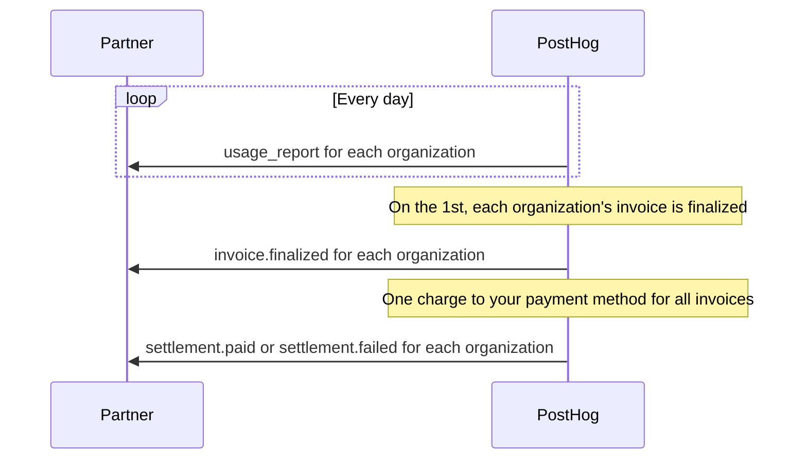

Partner billing lets a [provisioning partner](/docs/integrate/provisioning) pay for the PostHog organizations it creates for its customers. You pay for all of them from one payment method, and PostHog reports usage, invoices, and charges to you through webhooks and an API.

## How partner billing works

- Each of your customers gets their own PostHog organization, which your app creates with an [account request](/docs/integrate/provisioning#step-1-create-an-account).
- Each organization is billed on PostHog's standard paid plan, the same as an organization that pays for itself. That includes each product's monthly free allowance, which every organization gets separately.
- Each organization gets its own invoice every month. The invoice names you, with your billing name, address, and tax IDs.
- After each month ends, PostHog charges your payment method once for all of that month's organization invoices.
- Your customers keep their own PostHog logins. Their billing page shows their usage and billing limits, but no prices, spend, or invoices, and tells them that you manage their billing. They contact you to change their plan, payment details, or limits.

## Requirements

1. **Link your app to your own PostHog organization.** Add a [verification token](/docs/integrate/provisioning#link-your-partner-app-to-a-posthog-organization-optional) to your metadata document. The linked organization manages your bill. Its admins set up billing in PostHog, and the [partner billing API](#partner-billing-api) works only while your app stays linked to it.
2. **Sign requests with a key.** Your app must authenticate with [`private_key_jwt`](/docs/integrate/provisioning#sign-requests-with-a-key-optional). Whoever can act as your app can create organizations that you pay for. Anyone can send a public client's `client_id`, and a client secret is sent with every request, so PostHog accepts neither, and it checks this on every request. If your app stops using `private_key_jwt`, for example because you [switch back to a public client](/docs/integrate/provisioning#switch-back-to-a-public-client), every provisioning request fails with a 401, including requests with access tokens you already hold, until your app uses `private_key_jwt` again. The error message starts with `This client must authenticate with private_key_jwt`.
3. **Ask PostHog to turn it on.** Partner billing isn't self-serve. [Contact PostHog](https://app.posthog.com/#panel=support) to turn it on for your app, which must already sign its requests. When PostHog turns it on, it fixes which organization manages your bill, and that can't change later. If your app is linked to a different organization afterwards, the partner billing API returns 403 `forbidden`.

## Set up billing

Admins and owners of your linked organization set up billing on the [**Partner billing**](https://app.posthog.com/settings/organization-partner-billing) page in **Organization settings**. The page appears once PostHog has turned on partner billing for your app. If your organization manages billing for more than one app, choose one under **Partner application**.

1. Click **Set up payment**. PostHog opens a billing portal where you add your payment method, billing name, email, address, and tax IDs, then returns you to the page.
2. Under **Webhooks**, enter your **Webhook URL** and click **Save**. The URL must meet the [webhook URL requirements](#webhook-url-requirements).
3. Click **Generate signing secret** and copy the secret. PostHog shows it only once.
4. Click **Send test event**. Check that your endpoint receives a `test` event and [verifies its signature](#verify-the-signature).
5. Optionally, under **Spending**, set a **Spend alert**, a **Spend cap**, and **Default monthly limits per product**, then click **Save spending settings**. See [set spending limits](#set-spending-limits).

Add your billing details before your app creates organizations. PostHog copies them onto each organization's invoices, and an invoice that was finalized before you added them keeps the organization's own name. Changes you make in the portal later reach your organizations' invoices within a day.

The page also lists the organizations you pay for, their invoices, and your monthly settlements. Opening the billing portal, retrying a failed charge, and setting default limits are only available on this page. Everything else is also in the [partner billing API](#partner-billing-api).

## Monthly billing



### Invoices for each organization

- Every organization you pay for has a monthly billing period that renews on the 1st of the month at 00:00 UTC, so all your organizations' billing periods line up.
- On the 1st, each organization gets an invoice for the previous month. An organization that started partway through that month is billed for its usage since it started.
- The invoice carries your billing name, address, and tax IDs. PostHog doesn't send it to the organization.
- The invoice is due in 30 days and stays open until a settlement pays it.

### The monthly charge

After a month ends, PostHog charges your payment method once for the total of that month's organization invoices. This charge is the settlement, and it pays every organization invoice in it.

- PostHog checks every day at 03:00 UTC, and charges you once every organization's invoice for the month is final. The charge happens in the first days of the next month.
- When the charge succeeds, PostHog marks each organization's invoice as paid and sends you a `settlement.paid` event for each organization.
- If nothing is due, PostHog records the settlement as paid without charging you.
- Settlements are in US dollars.

### Failed charges

- When a charge fails, the settlement's status is `failed`, and you get a `settlement.failed` event for each organization. Its `failure_reason` says why, for example `card_declined`, or `no_payment_method` when you have no payment method on file. Each failed attempt sends new events with new IDs.
- PostHog retries the charge. To retry sooner, update your payment details in the billing portal, then click **Retry charge** next to the settlement on the partner billing page.
- When the retries run out, you're past due, and [`past_due`](#get-your-billing-status) is `true`. PostHog then blocks the organizations you pay for until you pay: it sets their billing limits to $0, so they stop collecting data beyond their free allowance.

## Receive billing events

PostHog sends billing events for the organizations you pay for to your webhook URL. Delivery follows the [Standard Webhooks](https://www.standardwebhooks.com/) spec, so you can verify events with the official `standardwebhooks` libraries.

### Webhook URL requirements

Your webhook URL must:

- Use `https`
- Have no username or password in it
- Write its host name in ASCII, with punycode for an internationalized domain name
- Resolve only to public IP addresses, not to private, loopback, link-local, multicast, or reserved ones
- Be 2,048 characters or fewer

PostHog checks the URL when you save it and again before every delivery, so a host that later resolves to a private address stops receiving events. In the API, a URL that fails these checks returns 400 `invalid_request`.

### Signing secret

Your signing secret is `whsec_` followed by a base64-encoded key. Create one on the partner billing page or with [create a signing secret](#create-a-signing-secret). PostHog shows each secret only once.

A new secret replaces the old one immediately, with no period where both work. Update your endpoint right after you rotate. A delivery your endpoint refuses in the meantime fails, and its retry is signed with the new secret.

### Request format

Each event is a `POST` to your webhook URL with a JSON body and these headers:

| Header | Value |
| --- | --- |
| `content-type` | `application/json` |
| `webhook-id` | The event's ID, the same value as `event_id` in the body |
| `webhook-timestamp` | When PostHog sent this attempt, in Unix seconds |
| `webhook-signature` | `v1,` followed by the base64-encoded signature |

The signature is an HMAC-SHA256 of `{webhook-id}.{webhook-timestamp}.{body}`, keyed with the base64-decoded part of your secret after `whsec_`. Verify it against the raw request body, before you parse the JSON.

### Verify the signature

Use the official Standard Webhooks library for your language. It checks the signature and rejects a `webhook-timestamp` more than 5 minutes away from your server's clock. PostHog sets a new timestamp on every attempt, so retries pass this check.

<MultiLanguage selector="tabs">

```python file=Python
# pip install flask standardwebhooks
import os

from flask import Flask, request
from standardwebhooks import Webhook, WebhookVerificationError

app = Flask(__name__)
webhook = Webhook(os.environ["POSTHOG_WEBHOOK_SECRET"])

@app.post("/webhooks/posthog")
def posthog_billing_event():
    try:
        event = webhook.verify(request.get_data(), dict(request.headers))
    except WebhookVerificationError:
        return "", 400

    # Deduplicate on event["event_id"], the same value as the webhook-id header.
    print(event["event_type"], event.get("organization_id"))
    return "", 204
```

```javascript file=Node.js
// npm install express standardwebhooks
import express from "express";
import { Webhook } from "standardwebhooks";

const app = express();
const webhook = new Webhook(process.env.POSTHOG_WEBHOOK_SECRET);

app.post("/webhooks/posthog", express.raw({ type: "application/json" }), (req, res) => {
  let event;
  try {
    event = webhook.verify(req.body, req.headers);
  } catch {
    return res.status(400).end();
  }

  // Deduplicate on event.event_id, the same value as the webhook-id header.
  console.log(event.event_type, event.organization_id);
  res.status(204).end();
});

app.listen(3000);
```

</MultiLanguage>

### Retries and duplicates

- Respond with any `2xx` status to accept an event. Any other status, a redirect, a timeout, or a network error fails the attempt. PostHog doesn't follow redirects.
- PostHog waits up to 5 seconds to connect and up to 10 seconds for your response, so respond first and process the event afterwards.
- PostHog tries each event up to 11 times. After the first failed attempt it waits 1 minute, and the wait doubles after each failure after that: 1, 2, 4, 8, 16, 32, 64, 128, 256, and 512 minutes. The last attempt comes about 17 hours after the first.
- After 5 attempts in a row fail, PostHog sends at most one delivery to your URL every 10 minutes until one succeeds. An attempt that PostHog holds back counts as failed.
- Delivery is at least once. Deduplicate on `webhook-id`, because a retry or a repeat of an event keeps its ID.
- Events can arrive in any order, and a retried event can arrive after a newer one.
- PostHog sends one event per organization. For example, a settlement that pays the invoices of 40 organizations sends 40 `settlement.paid` events.

Events that happen while you have no webhook URL or signing secret are never sent, and PostHog doesn't retry an event after its last attempt. Treat the API as the source of truth: [list invoices](#list-invoices) and [list settlements](#list-settlements) to catch up on anything you missed.

### Event types

| `event_type` | When PostHog sends it |
| --- | --- |
| `usage_report` | Once a day for each organization |
| `invoice.finalized` | When an organization's monthly invoice is finalized |
| `settlement.paid` | When a charge succeeds, once for each organization invoice it pays |
| `settlement.failed` | When a charge fails, once for each organization invoice it was for |
| `organization.detached` | When an organization's owner chooses to [pay for it themselves](#when-a-customer-pays-for-itself) |
| `test` | When you send a test event |

Every event body has `event_id`, the same value as the `webhook-id` header, and `event_type`. Amounts are integers in cents, and times are ISO 8601 in UTC.

#### `usage_report`

A daily snapshot of an organization's usage and spend so far this billing period. `amount_cents` is an estimate until the organization's invoice is finalized.

| Field | Description |
| --- | --- |
| `organization_id` | The organization the report is for |
| `period_start` | Start of the organization's current billing period |
| `period_end` | End of the last day the report covers, at midnight UTC |
| `amount_cents` | Spend so far this billing period, after discounts |
| `currency` | Currency of `amount_cents` |
| `metrics` | Billable usage so far this billing period, by usage key, such as `events` or `recordings`. The keys match `usage_key` in the [standard rates](#get-the-standard-rates). |

```json
{
  "event_id": "evt_6c1f0b8e2a4d4f7e9b3c1a2d4e6f8a0b",
  "event_type": "usage_report",
  "organization_id": "0192d7c4-5b6e-7000-8000-00000000c001",
  "period_start": "2026-10-01T00:00:00Z",
  "period_end": "2026-10-05T00:00:00Z",
  "amount_cents": 18250,
  "currency": "USD",
  "metrics": {
    "enhanced_persons_events": 1500000,
    "events": 2700000,
    "recordings": 12000
  }
}
```

#### `invoice.finalized`

Sent when an organization's monthly invoice is final. The invoice stays open until the month's settlement pays it. PostHog doesn't send this event for the opening invoice an organization gets when PostHog starts billing it.

| Field | Description |
| --- | --- |
| `organization_id` | The organization the invoice is for |
| `period_start` | Start of the billing period the invoice covers |
| `period_end` | End of the billing period the invoice covers |
| `amount_cents` | Invoice total |
| `currency` | Currency of `amount_cents` |
| `invoice.invoice_id` | The invoice's ID |
| `invoice.status` | The invoice's status when it was finalized, usually `open` |

```json
{
  "event_id": "evt_2b7e9d4c1a3f4e6b8c0d2e4f6a8b0c1d",
  "event_type": "invoice.finalized",
  "organization_id": "0192d7c4-5b6e-7000-8000-00000000c001",
  "period_start": "2026-10-01T00:00:00Z",
  "period_end": "2026-11-01T00:00:00Z",
  "amount_cents": 8430,
  "currency": "USD",
  "invoice": {
    "invoice_id": "in_1ExampleInvoice",
    "status": "open"
  }
}
```

#### `settlement.paid` and `settlement.failed`

PostHog sends one of these for each organization invoice in a settlement, after each charge attempt.

| Field | Description |
| --- | --- |
| `organization_id` | The organization the invoice is for |
| `settlement_id` | The settlement. Pass it to [get a settlement](#get-a-settlement). |
| `amount_cents` | The amount of this organization's invoice that the settlement pays |
| `currency` | Currency of `amount_cents` |
| `invoice.invoice_id` | The organization's invoice |
| `invoice.status` | `paid` in `settlement.paid`, `open` in `settlement.failed` |
| `failure_reason` | In `settlement.failed` only. Why the charge failed, for example `card_declined`, or `no_payment_method` when you have no payment method on file. |

```json
{
  "event_id": "evt_9a8b7c6d5e4f4a3b2c1d0e9f8a7b6c5d",
  "event_type": "settlement.failed",
  "organization_id": "0192d7c4-5b6e-7000-8000-00000000c001",
  "settlement_id": "3f9a2c4e-8b1d-4e6f-a7c2-5d9e0b1f4a68",
  "amount_cents": 8430,
  "currency": "USD",
  "invoice": {
    "invoice_id": "in_1ExampleInvoice",
    "status": "open"
  },
  "failure_reason": "card_declined"
}
```

#### `organization.detached`

| Field | Description |
| --- | --- |
| `organization_id` | The organization that now pays for itself |
| `detached_at` | When it started paying for itself. You pay for its usage before this time. |

```json
{
  "event_id": "evt_4d3c2b1a0f9e4d8c7b6a5f4e3d2c1b0a",
  "event_type": "organization.detached",
  "organization_id": "0192d7c4-5b6e-7000-8000-00000000c001",
  "detached_at": "2026-10-14T16:20:00Z"
}
```

#### `test`

A test event has only `event_id` and `event_type`. Every test event has a new ID.

```json
{
  "event_id": "evt_0d5c3a8f6b2e4f71a9c4e2b7d1f08a63",
  "event_type": "test"
}
```

## Partner billing API

Your app manages its billing through the provisioning API, authenticated as your app. The routes are under `/api/agentic/provisioning/payer`, in the region of the organization your app is linked to: `https://us.posthog.com` or `https://eu.posthog.com`. PostHog doesn't forward these requests to the other region.

Access tokens don't work here, because they're scoped to your customers' projects.

### Authenticate

Sign a new [client assertion](/docs/integrate/provisioning#build-the-assertion) for every request, the same way as for account requests. PostHog accepts each assertion once.

- On a `GET`, send `client_assertion_type` and `client_assertion` as query parameters.
- On a `PATCH` or `POST`, send them in the JSON body, next to the other fields.

`client_assertion_type` is always `urn:ietf:params:oauth:client-assertion-type:jwt-bearer`. `client_id` is optional, because PostHog reads it from the assertion's `sub`. Send the `API-Version: 0.1d` header on every request.

The examples below use these shell variables. Mint a new assertion for each request.

```bash
ASSERTION_TYPE="urn:ietf:params:oauth:client-assertion-type:jwt-bearer"
CLIENT_ASSERTION="eyJhbGci..."
```

### Get your billing status

`GET /api/agentic/provisioning/payer`

```bash
curl -G https://us.posthog.com/api/agentic/provisioning/payer \
  -H "API-Version: 0.1d" \
  --data-urlencode "client_assertion_type=$ASSERTION_TYPE" \
  --data-urlencode "client_assertion=$CLIENT_ASSERTION"
```

**Response** (HTTP 200):

```json
{
  "name": "Example Partner Inc.",
  "billing_enabled": true,
  "has_payment_method": true,
  "billing_details": {
    "address": {
      "line1": "1 Example Street",
      "line2": null,
      "city": "Springfield",
      "state": "CA",
      "postal_code": "00000",
      "country": "US"
    },
    "tax_ids": [{ "type": "us_ein", "value": "00-0000000" }]
  },
  "organization_count": 2,
  "webhook": {
    "url": "https://yourapp.com/webhooks/posthog",
    "secret_created_at": "2026-09-01T00:00:00Z"
  },
  "past_due": false,
  "spend": {
    "month_to_date_usd": "1200.50",
    "alert_usd": "2000.00",
    "cap_usd": "5000.00",
    "capped": false
  },
  "default_limits_usd": { "product_analytics": 500 }
}
```

| Field | Description |
| --- | --- |
| `name` | Name on your organizations' invoices |
| `billing_enabled` | Whether PostHog bills you for your organizations |
| `has_payment_method` | Whether you have a payment method on file |
| `billing_details.address` | Billing address on your organizations' invoices, or `null`. `country` is a two-letter ISO code. |
| `billing_details.tax_ids` | Tax IDs on your organizations' invoices, each with a `type`, such as `eu_vat`, and a `value` |
| `organization_count` | Number of organizations you pay for now |
| `webhook.url` | Your webhook URL, or `null` |
| `webhook.secret_created_at` | When your current signing secret was created, or `null`. The secret itself never appears here. |
| `past_due` | Whether you owe a settlement that PostHog couldn't charge |
| `spend.month_to_date_usd` | This month's spend across all your organizations, as a decimal string in US dollars |
| `spend.alert_usd` | Your spend alert, as a decimal string in US dollars, or `null` |
| `spend.cap_usd` | Your spend cap, as a decimal string in US dollars, or `null` |
| `spend.capped` | Whether this month's spend has reached your cap |
| `default_limits_usd` | Monthly limit per product that each new organization gets, in whole US dollars |

### Update webhook and spend settings

`PATCH /api/agentic/provisioning/payer`

Send only the fields you want to change.

```bash
curl -X PATCH https://us.posthog.com/api/agentic/provisioning/payer \
  -H "Content-Type: application/json" \
  -H "API-Version: 0.1d" \
  -d @- <<JSON
{
  "webhook_url": "https://yourapp.com/webhooks/posthog",
  "spend_alert_usd": "2000.00",
  "client_assertion_type": "$ASSERTION_TYPE",
  "client_assertion": "$CLIENT_ASSERTION"
}
JSON
```

**Request fields:**

| Field | Type | Description |
| --- | --- | --- |
| `webhook_url` | string or null | Where PostHog sends your billing events. See [webhook URL requirements](#webhook-url-requirements). `null` removes it and stops events. |
| `spend_alert_usd` | decimal string or null | Spend this month, across all your organizations, at which PostHog sends you a spend alert. Up to two decimal places. `null` turns the alert off. |
| `spend_cap_usd` | decimal string or null | Spend this month, across all your organizations, at which PostHog caps further usage. Up to two decimal places. `null` removes the cap. |

The response is your billing status, in the same shape as [get your billing status](#get-your-billing-status).

### Create a signing secret

`POST /api/agentic/provisioning/payer/webhook_secret`

Creates a new signing secret and replaces your current one immediately. This response is the only place the secret appears, and it carries `Cache-Control: no-store`.

```bash
curl -X POST https://us.posthog.com/api/agentic/provisioning/payer/webhook_secret \
  -H "Content-Type: application/json" \
  -H "API-Version: 0.1d" \
  -d @- <<JSON
{
  "client_assertion_type": "$ASSERTION_TYPE",
  "client_assertion": "$CLIENT_ASSERTION"
}
JSON
```

**Response** (HTTP 200):

```json
{
  "secret": "whsec_ZXhhbXBsZS1zZWNyZXQtZm9yLWRvY3Mtb25seQ==",
  "created_at": "2026-10-05T12:00:00Z"
}
```

### Send a test event

`POST /api/agentic/provisioning/payer/test_event`

Sends a `test` event to your webhook URL and returns its ID, the same value as its `webhook-id` header. You need a webhook URL and a signing secret first. Without them, the request fails with 400 `billing_rejected`. Send the assertion fields in the body, as in [create a signing secret](#create-a-signing-secret).

**Response** (HTTP 200):

```json
{
  "event_id": "evt_0d5c3a8f6b2e4f71a9c4e2b7d1f08a63"
}
```

### List organizations

`GET /api/agentic/provisioning/payer/organizations`

Lists the organizations you pay for, including ones that now pay for themselves. Send the query parameters next to the assertion fields, as in [list invoices](#list-invoices).

**Query parameters:**

| Parameter | Type | Required | Description |
| --- | --- | --- | --- |
| `limit` | integer | No | Number of results to return, from 1 to 100 |
| `offset` | integer | No | Number of results to skip |

**Response** (HTTP 200):

```json
{
  "count": 41,
  "results": [
    {
      "organization_id": "0192d7c4-5b6e-7000-8000-00000000c001",
      "name": "Acme Corp",
      "linked_at": "2026-08-01T00:00:00Z",
      "detached_at": null,
      "custom_limits_usd": { "session_replay": 100 }
    }
  ]
}
```

| Field | Description |
| --- | --- |
| `count` | Total number of organizations |
| `organization_id` | The organization's ID |
| `name` | The organization's name |
| `linked_at` | When you started paying for the organization |
| `detached_at` | When the organization started paying for itself, or `null` |
| `custom_limits_usd` | The organization's monthly limit per product, in whole US dollars |

### Set limits for an organization

`PATCH /api/agentic/provisioning/payer/organizations/{organization_id}/limits`

Sets an organization's monthly billing limits. Send only the products you want to change.

```bash
curl -X PATCH https://us.posthog.com/api/agentic/provisioning/payer/organizations/0192d7c4-5b6e-7000-8000-00000000c001/limits \
  -H "Content-Type: application/json" \
  -H "API-Version: 0.1d" \
  -d @- <<JSON
{
  "custom_limits_usd": { "session_replay": 100, "product_analytics": null },
  "client_assertion_type": "$ASSERTION_TYPE",
  "client_assertion": "$CLIENT_ASSERTION"
}
JSON
```

**Request fields:**

| Field | Type | Description |
| --- | --- | --- |
| `custom_limits_usd` | object | Maps a product key, such as `session_replay`, to a monthly limit in whole US dollars. `null` removes that product's limit. |

The response is the organization, in the same shape as an entry in [list organizations](#list-organizations).

### List invoices

`GET /api/agentic/provisioning/payer/invoices`

Lists the invoices of the organizations you pay for.

```bash
curl -G https://us.posthog.com/api/agentic/provisioning/payer/invoices \
  -H "API-Version: 0.1d" \
  --data-urlencode "organization_id=0192d7c4-5b6e-7000-8000-00000000c001" \
  --data-urlencode "status=paid" \
  --data-urlencode "client_assertion_type=$ASSERTION_TYPE" \
  --data-urlencode "client_assertion=$CLIENT_ASSERTION"
```

**Query parameters:**

| Parameter | Type | Required | Description |
| --- | --- | --- | --- |
| `organization_id` | UUID | No | Only this organization's invoices |
| `status` | string | No | Only invoices in this status, for example `open` or `paid` |
| `limit` | integer | No | Number of results to return, from 1 to 100 |
| `offset` | integer | No | Number of results to skip |

**Response** (HTTP 200):

```json
{
  "count": 1,
  "results": [
    {
      "invoice_id": "in_1ExampleInvoice",
      "organization_id": "0192d7c4-5b6e-7000-8000-00000000c001",
      "period_start": "2026-09-01T00:00:00Z",
      "period_end": "2026-10-01T00:00:00Z",
      "amount_cents": 125000,
      "currency": "USD",
      "status": "paid",
      "settlement_id": "3f9a2c4e-8b1d-4e6f-a7c2-5d9e0b1f4a68",
      "pdf_url": "https://files.example.com/in_1ExampleInvoice.pdf"
    }
  ]
}
```

| Field | Description |
| --- | --- |
| `count` | Total number of matching invoices |
| `invoice_id` | The invoice's ID |
| `organization_id` | The organization the invoice is for |
| `period_start` | Start of the billing period the invoice covers |
| `period_end` | End of the billing period the invoice covers |
| `amount_cents` | Invoice total, in cents |
| `currency` | Three-letter currency code |
| `status` | `draft`, `open`, `paid`, `uncollectible`, or `void` |
| `settlement_id` | The settlement that pays the invoice, or `null` |
| `pdf_url` | URL of the invoice PDF, or `null` |

### List settlements

`GET /api/agentic/provisioning/payer/settlements`

Lists your monthly settlements.

**Query parameters:**

| Parameter | Type | Required | Description |
| --- | --- | --- | --- |
| `limit` | integer | No | Number of results to return, from 1 to 100 |
| `offset` | integer | No | Number of results to skip |

**Response** (HTTP 200):

```json
{
  "count": 1,
  "results": [
    {
      "settlement_id": "3f9a2c4e-8b1d-4e6f-a7c2-5d9e0b1f4a68",
      "period_start": "2026-09-01T00:00:00Z",
      "period_end": "2026-10-01T00:00:00Z",
      "amount_cents": 125000,
      "currency": "USD",
      "status": "paid",
      "attempt_count": 1,
      "next_attempt_at": null,
      "paid_at": "2026-10-01T03:04:00Z"
    }
  ]
}
```

| Field | Description |
| --- | --- |
| `count` | Total number of settlements |
| `settlement_id` | The settlement's ID |
| `period_start` | Start of the month the settlement pays for |
| `period_end` | End of the month the settlement pays for |
| `amount_cents` | Total charged, in cents |
| `currency` | Three-letter currency code |
| `status` | `pending`, `processing`, `paid`, or `failed` |
| `attempt_count` | How many times PostHog has tried the charge |
| `next_attempt_at` | When PostHog tries the charge again, or `null` |
| `paid_at` | When the charge succeeded, or `null` |

### Get a settlement

`GET /api/agentic/provisioning/payer/settlements/{settlement_id}`

Returns a settlement with the organization invoices it pays. The response has the fields of an entry in [list settlements](#list-settlements), plus `invoices`, a list of invoices in the shape of [list invoices](#list-invoices).

### Actions only on the partner billing page

These actions aren't in the API. Admins of your linked organization use the [partner billing page](#set-up-billing) for them:

- Open the billing portal to change your payment method, billing address, or tax IDs
- Retry a failed charge
- Set default limits for new organizations

### Errors

Errors use the same envelope as account requests:

```json
{
  "type": "error",
  "error": {
    "code": "forbidden",
    "message": "Partner billing needs a verified PostHog organization for this partner"
  }
}
```

| Code | HTTP status | Description |
| --- | --- | --- |
| `invalid_request` | 400 | A parameter or field is invalid. The message names it. |
| `billing_rejected` | 400 | PostHog refused the request, for example a test event before you set a webhook URL and signing secret |
| `unauthorized` | 401 | The assertion is missing or invalid, or your app isn't registered. See [assertion errors](/docs/integrate/provisioning#troubleshoot-assertion-errors). |
| `forbidden` | 403 | Partner billing isn't on for your app, your app isn't linked to an organization, or it's linked to a different organization from the one that manages your bill |
| `not_found` | 404 | The record doesn't exist, or PostHog hasn't turned on partner billing for your app yet |
| `conflict` | 409 | PostHog can't make the change right now. Reload and try again. |
| `rate_limited` | 429 | Wait the number of seconds in the `Retry-After` header |
| `billing_unavailable` | 502 | PostHog couldn't answer. Try again in a moment. |

### Rate limits

Reads (`GET`) share one budget, and changes (`PATCH` and `POST`) share another. Your app signs its requests and is linked to an organization, so it's on the [10x tier](/docs/integrate/provisioning#your-tier): each budget allows a burst of 300 and refills at 1,200 per hour. Test events have their own budget, a burst of 5 that refills at 30 per hour, which doesn't scale with your tier. The [limits endpoint](/docs/integrate/provisioning#check-your-limits) reports them as `payer_reads`, `payer_writes`, and `payer_test_events`.

## Get the standard rates

To price your own plans, read PostHog's standard usage rates from the public pricing API. It needs no authentication.

```bash
curl https://billing.posthog.com/api/pricing
```

**Response** (HTTP 200), abbreviated. The amounts are examples, not current rates.

```json
{
  "version": 1,
  "currency": "USD",
  "products": [
    {
      "type": "product_analytics",
      "name": "Product analytics",
      "usage_key": "events",
      "unit": "event",
      "free_allocation": 1000000,
      "tiers": [
        { "up_to": 1000000, "unit_amount_usd": "0", "flat_amount_usd": "0" },
        { "up_to": 2000000, "unit_amount_usd": "0.00005", "flat_amount_usd": "0" },
        { "up_to": null, "unit_amount_usd": "0.000009", "flat_amount_usd": "0" }
      ]
    }
  ]
}
```

| Field | Description |
| --- | --- |
| `version` | The response format version. Within a version, PostHog adds fields but never renames or removes them, and a field keeps its meaning. |
| `currency` | `USD` |
| `products[].type` | Product key, such as `product_analytics`. Billing limits use these keys. |
| `products[].name` | Product name |
| `products[].usage_key` | Key the product's usage is reported under. It matches the `metrics` keys in `usage_report` events. |
| `products[].unit` | One unit of usage, as usage reports count it |
| `products[].free_allocation` | Units each month that cost nothing, or `0` when the first unit is charged. Each organization gets its own. |
| `products[].tiers[].up_to` | Last unit the tier covers, counted from the first unit of the month. `null` on the last tier. |
| `products[].tiers[].unit_amount_usd` | Price of each unit in the tier |
| `products[].tiers[].flat_amount_usd` | Fee charged once when usage reaches the tier, or `"0"` for none |

- Amounts are decimal strings in US dollars with no exponent, such as `"0.00000015"`. Parse them as decimals, not floats.
- Tiers are graduated: each unit costs the rate of the tier it falls in.
- Ignore fields you don't recognize, and find a product by `type` or `usage_key`, not by its position in the list.
- Responses carry `Cache-Control: public, max-age=300`, so you can cache them for 5 minutes.
- The list covers the products that the standard paid plan bills by usage. It leaves out flat-fee [platform packages](/platform-packages), such as Boost and Scale, add-ons that a customer opts into, such as group analytics, and products without a usage price. On the standard paid plan, usage under a key that isn't listed costs nothing.

## Set spending limits

Billing limits work per organization and per product, in whole US dollars a month, the same as [billing limits](/docs/billing/limits-alerts) on any organization. When an organization reaches a product's limit, PostHog stops ingesting that product's data until the next billing period. Limits use the product keys from the [standard rates](#get-the-standard-rates), such as `product_analytics` or `session_replay`.

- **Defaults for new organizations.** Admins of your linked organization set **Default monthly limits per product** on the partner billing page. Each organization gets these limits when PostHog starts billing it to you.
- **Limits for one organization.** Change an organization's limits with [set limits for an organization](#set-limits-for-an-organization), or with **Edit limits** on the partner billing page.
- **Your customers can't change them.** Members of the organization can see its limits and usage, but PostHog refuses their limit changes and tells them to contact you. The organization's owners still get PostHog's billing limit alert emails.
- **A spend alert and cap across all organizations.** `spend_alert_usd` and `spend_cap_usd` apply to this month's total spend across every organization you pay for. When spend reaches the alert, PostHog sends you a spend alert. When it reaches the cap, PostHog caps further usage across all your organizations until you raise or remove the cap. Set them on the partner billing page or with [update webhook and spend settings](#update-webhook-and-spend-settings), and check `spend.capped` in [your billing status](#get-your-billing-status).

## When a customer pays for itself

An owner of an organization you pay for can choose to pay for it themselves, with **Pay for this organization yourself** on the organization's billing page. When they confirm:

- You stop paying for the organization from that moment. You pay for its usage up to `detached_at`, including its usage earlier that month, and the organization pays from then on.
- You get an `organization.detached` event. In [list organizations](#list-organizations), the organization has `detached_at` set, and `organization_count` no longer includes it.
- The organization needs its own payment method, like any other organization.
- The change can't be undone.

Your app keeps its access to the organization's projects.

## Existing PostHog users

When an account request names an email that already has a PostHog account, the response is `requires_auth`, and the person approves your app on PostHog's consent screen. See [step 1: create an account](/docs/integrate/provisioning#step-1-create-an-account).

With partner billing, the consent screen has no organization or project picker. PostHog puts your project in a new organization that the person owns and you pay for, named after your app and their email address. If they already belong to an organization that your app set up for them, PostHog uses that one instead. Their own organizations never pay for your usage.

After they approve, PostHog redirects them to your `redirect_uris` with a `code`, the same as for any existing user.
