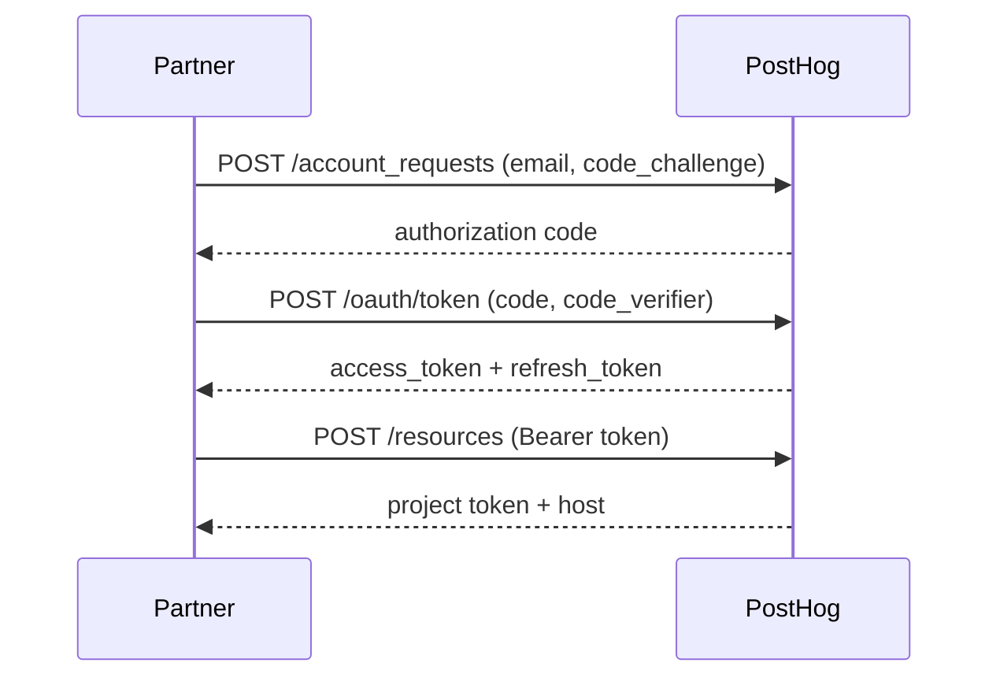
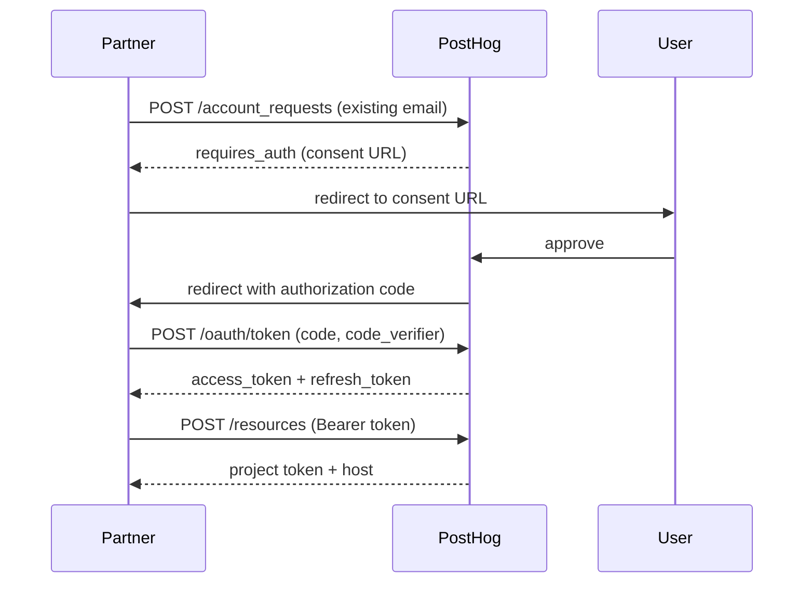

If you're onboarding users from your own product into PostHog, this API lets you skip the signup form. Call three endpoints and you get back a project token, a personal API key, and a host URL – everything you need to start sending events into the user's project. The user still gets a welcome email with a link to set their password and access their dashboard.

It's intended for partners and platform integrations. If you're integrating your own app with your own PostHog account, you probably want [OAuth](/docs/api/oauth) or a [personal API key](/docs/api#private-endpoint-authentication) instead.

Jump to the [full Node.js example](#full-example) to see the complete flow in code.

## How it works

The flow uses OAuth 2.0 with PKCE (Proof Key for Code Exchange), so there are no shared secrets to manage.
Your application is identified by a metadata document hosted on your domain.

```
1. POST /account_requests  →  authorization code
2. POST /oauth/token        →  access + refresh tokens
3. POST /resources          →  project token + host
```



## Set up as a partner

### Host a CIMD metadata document

PostHog uses [Client ID Metadata Documents](https://datatracker.ietf.org/doc/draft-ietf-oauth-client-id-metadata-document/) (CIMD) for partner registration. There's no signup form to fill out – you host a JSON document at an HTTPS URL on your domain, and that URL becomes your `client_id`.

Create a JSON file at a stable HTTPS URL, for example `https://yourapp.com/.well-known/posthog-client.json`:

```json
{
  "client_id": "https://yourapp.com/.well-known/posthog-client.json",
  "client_name": "Your App Name",
  "redirect_uris": ["https://yourapp.com/callbacks/posthog"],
  "logo_uri": "https://yourapp.com/logo.png",
  "token_endpoint_auth_method": "none",
  "grant_types": ["authorization_code"],
  "response_types": ["code"]
}
```

Requirements:
- **`client_id`** must exactly match the URL where this document is hosted.
- **`redirect_uris`** is required and must contain at least one HTTPS URI. This is where PostHog redirects existing users during the consent flow.
- **`logo_uri`** (optional) must be HTTPS if provided.
- **`token_endpoint_auth_method`** must be `"none"` (CIMD clients are public clients, no client secret).
- The document must be served with `Content-Type: application/json` and be under 5 KB.
- The URL must use HTTPS, include a path component, and must not contain query parameters or fragments.

PostHog fetches and caches this document automatically.
Subsequent requests reuse the cached version and refresh it in the background based on your `Cache-Control: max-age` header (clamped between 5 minutes and 24 hours, default 1 hour).

Once your metadata document is live, you can start calling the API. The first request auto-registers your app and returns HTTP 202; retry after a few seconds.

### Link your partner app to a PostHog organization (optional)

By default, a CIMD partner app is unverified and capped at 10 account requests per hour.
You can link the app to a PostHog organization with a verification token to raise that to 100/hour and surface the partner integration to that org's admins.

1. In PostHog, go to **Organization settings → CIMD verification tokens** and click **Create token**. Copy the `phvt_…` value – it's only shown once.
2. Add a `posthog_verification_token` field to your CIMD metadata document:

   ```json
   {
     "client_id": "https://yourapp.com/.well-known/posthog-client.json",
     "client_name": "Your App Name",
     "redirect_uris": ["https://yourapp.com/callbacks/posthog"],
     "logo_uri": "https://yourapp.com/logo.png",
     "token_endpoint_auth_method": "none",
     "grant_types": ["authorization_code"],
     "response_types": ["code"],
     "posthog_verification_token": "phvt_..."
   }
   ```

3. The next time PostHog refreshes the metadata document, the app is linked to the matching organization and the rate limit is bumped.

The token is only used to prove ownership of the partner app – it isn't sent on API requests.
You can rotate or revoke a token at any time from the same settings page.
Revocation clears the link on the next metadata refresh, so a leaked or stale token can't keep an app linked to your org.

## API reference

All endpoints are on `https://us.posthog.com` (US region) or `https://eu.posthog.com` (EU region).

Every request must include the `API-Version: 0.1d` header.

### Step 1: Create an account

Create a PostHog account for a user by email. If the user is new, PostHog creates the account and returns an authorization code immediately. If the user already exists, the response tells you to redirect them for consent.

Generate a PKCE code verifier and challenge before making this request:

```bash
# Generate PKCE values
CODE_VERIFIER=$(openssl rand -base64 32 | tr -d '=' | tr '+/' '-_')
CODE_CHALLENGE=$(echo -n "$CODE_VERIFIER" | openssl dgst -sha256 -binary | openssl base64 | tr -d '=' | tr '+/' '-_')
```

```bash
BODY=$(cat <<JSON
{
  "id": "req_unique_request_id",
  "email": "user@example.com",
  "name": "Jane Doe",
  "client_id": "https://yourapp.com/.well-known/posthog-client.json",
  "code_challenge": "$CODE_CHALLENGE",
  "code_challenge_method": "S256",
  "configuration": {
    "region": "US",
    "organization_name": "Acme Corp"
  }
}
JSON
)

curl -X POST https://us.posthog.com/api/agentic/provisioning/account_requests \
  -H "Content-Type: application/json" \
  -H "API-Version: 0.1d" \
  -d "$BODY"
```

**Request fields:**

| Field | Type | Required | Description |
|---|---|---|---|
| `id` | string | Yes | Your unique request ID (for idempotency) |
| `email` | string | Yes | User's email address |
| `name` | string | No | User's full name |
| `client_id` | string | Yes | Your CIMD metadata URL |
| `code_challenge` | string | Yes | Base64url-encoded SHA-256 hash of your code verifier (43-128 chars) |
| `code_challenge_method` | string | Yes | Must be `"S256"` |
| `scopes` | list | No | OAuth scopes to request for the access token. See [available scopes](#available-scopes). |
| `configuration.region` | string | No | `"US"` (default) or `"EU"` |
| `configuration.organization_name` | string | No | Organization name (defaults to `"Partner (email)"`) |

**New user response** (HTTP 200):

```json
{
  "id": "req_unique_request_id",
  "type": "oauth",
  "oauth": {
    "code": "abc123...authorization_code"
  }
}
```

The user receives a welcome email with a link to set their password and access their dashboard.

**Existing user response** (HTTP 200):

```json
{
  "id": "req_unique_request_id",
  "type": "requires_auth",
  "requires_auth": {
    "url": "https://us.posthog.com/api/agentic/authorize?state=xyz..."
  }
}
```

When `type` is `requires_auth`, redirect the user to the provided URL. After they approve, PostHog redirects them to your `redirect_uris` with a `code` query parameter that you use in step 2.



#### Deep linking

The `requires_auth` flow isn't only for first-time onboarding. Use the same handshake every time you want to deep-link a user from your own application into PostHog. A common case is an "Open in PostHog" button on the project a user has already connected: each click should run the handshake again, not point at a static PostHog URL.

For each click, your backend calls `/account_requests` with the user's email, then you redirect them to the returned `requires_auth.url`. When the logged-in PostHog session matches the email you sent, PostHog completes the OAuth handshake and lands the user in their project.

If the session is for a different PostHog account, PostHog shows an "Account mismatch" page with a one-click "Log out and continue as <expected email>" button that resumes the flow after re-login. To smooth this case even further – so users can self-diagnose before they click – consider also surfacing the expected PostHog email in your own UI, for example a button labeled _"Open in PostHog as user@example.com"_.

##### Avoid linking directly to project URLs

Pointing a button straight at `https://us.posthog.com/project/<id>` skips the handshake and removes PostHog's ability to route the user safely:

- If the user is logged into PostHog with a different email, they hit a permission error or 404 on a project their current account can't access.
- If they're logged out, they get the generic PostHog login page with no context about which email to use.

Going through `/account_requests` keeps routing scoped to the email you sent.

### Step 2: Exchange the code for tokens

Exchange the authorization code for an access token and refresh token. The token endpoint uses standard `application/x-www-form-urlencoded` encoding.

```bash
curl -X POST https://us.posthog.com/api/agentic/oauth/token \
  -H "Content-Type: application/x-www-form-urlencoded" \
  -H "API-Version: 0.1d" \
  -d "grant_type=authorization_code&code=abc123...authorization_code&code_verifier=$CODE_VERIFIER"
```

**Request fields:**

| Field | Type | Required | Description |
|---|---|---|---|
| `grant_type` | string | Yes | Must be `"authorization_code"` |
| `code` | string | Yes | The authorization code from step 1 |
| `code_verifier` | string | Yes | The original PKCE code verifier (must match the challenge from step 1) |

**Response** (HTTP 200):

```json
{
  "token_type": "bearer",
  "access_token": "phx_abc123...",
  "refresh_token": "phr_def456...",
  "expires_in": 3600,
  "account": {
    "id": "01234567-89ab-cdef-0123-456789abcdef",
    "payment_credentials": "orchestrator",
    "available_teams": [
      {
        "id": 12345,
        "name": "Default project",
        "organization_id": "01234567-89ab-cdef-0123-456789abcdef",
        "organization_name": "Acme Corp"
      }
    ]
  }
}
```

Authorization codes expire after 5 minutes and can only be used once.
Access tokens expire after 1 hour. Use the refresh token to get new tokens.

**Token endpoint errors** use the standard OAuth 2.0 format:

```json
{
  "error": "invalid_grant",
  "error_description": "Invalid or expired authorization code"
}
```

### Step 3: Provision a project

Use the access token to provision a PostHog project and get credentials.

```bash
curl -X POST https://us.posthog.com/api/agentic/provisioning/resources \
  -H "Content-Type: application/json" \
  -H "Authorization: Bearer phx_abc123..." \
  -H "API-Version: 0.1d" \
  -d '{
    "service_id": "analytics",
    "label_prefix": "Acme Co",
    "configuration": {
      "project_name": "My App - Production"
    }
  }'
```

**Request fields:**

| Field | Type | Required | Description |
|---|---|---|---|
| `service_id` | string | No | The plan to provision. `"analytics"` (default) provisions a standard project. `"free"` and `"pay_as_you_go"` set the billing plan explicitly. |
| `label_prefix` | string | No | Label prefix for the personal API key shown in PostHog, up to 25 characters. The key is labeled `{label_prefix} - {team_name}`. If omitted, empty, or whitespace-only, the key is labeled with just the team name. |
| `configuration.project_name` | string | No | Project name (defaults to `"Default project"`) |

**Response** (HTTP 200):

```json
{
  "status": "complete",
  "id": "12345",
  "service_id": "analytics",
  "complete": {
    "access_configuration": {
      "api_key": "phc_abc123...",
      "host": "https://us.posthog.com",
      "personal_api_key": "phx_def456..."
    }
  }
}
```

**Response fields:**

| Field | Description |
|---|---|
| `api_key` | The project token (starts with `phc_`) – use this to initialize PostHog SDKs |
| `host` | The API host (`https://us.posthog.com` or `https://eu.posthog.com`) |
| `personal_api_key` | A personal API key scoped to this project – use this for the PostHog API |

### Rotate project credentials

Rotate the project token and create a new personal API key for an existing provisioned project:

```bash
curl -X POST https://us.posthog.com/api/agentic/provisioning/resources/12345/rotate_credentials \
  -H "Content-Type: application/json" \
  -H "Authorization: Bearer phx_abc123..." \
  -H "API-Version: 0.1d" \
  -d '{
    "label_prefix": "Acme Co"
  }'
```

**Request fields:**

| Field | Type | Required | Description |
|---|---|---|---|
| `label_prefix` | string | No | Label prefix for the new personal API key shown in PostHog, up to 25 characters. The key is labeled `{label_prefix} - {team_name}`. If omitted, empty, or whitespace-only, the key is labeled with just the team name. |

The response has the same shape as the project provisioning response and includes the rotated `api_key`, `host`, and new `personal_api_key`.

### Refresh tokens

Access tokens expire after 1 hour. Use the refresh token to get new credentials:

```bash
curl -X POST https://us.posthog.com/api/agentic/oauth/token \
  -H "Content-Type: application/x-www-form-urlencoded" \
  -H "API-Version: 0.1d" \
  -d "grant_type=refresh_token&refresh_token=phr_def456..."
```

**Response** (HTTP 200):

```json
{
  "token_type": "bearer",
  "access_token": "phx_new_token...",
  "refresh_token": "phr_new_refresh...",
  "expires_in": 3600
}
```

Each refresh token is single-use. The response includes a new refresh token for subsequent refreshes.

### Available scopes

The `scopes` field in the account request controls what permissions the access token receives. If omitted, a default set of scopes is granted. Available scopes:

| Scope | Description |
|---|---|
| `customer_journey:read` | Read customer journey data |
| `query:read` | Execute read-only queries |
| `conversation:read` | Read PostHog AI conversations |
| `conversation:write` | Create and update PostHog AI conversations |
| `experiment:read` | Read experiments |
| `feature_flag:read` | Read feature flags |
| `insight:read` | Read insights |
| `organization:read` | Read organization details |
| `person:read` | Read person data |
| `project:read` | Read project settings |
| `ticket:read` | Read tickets |
| `ticket:write` | Create and update tickets |
| `user:read` | Read user information |
| `hog_flow:read` | Read Hog flows |
| `hog_flow:write` | Create and update Hog flows |

## What the user gets

When you provision a new account, the user receives:

- A welcome email with a link to set their password.
- Full dashboard access at [us.posthog.com](https://us.posthog.com) (or [eu.posthog.com](https://eu.posthog.com) for EU).
- The PostHog [free tier](/pricing) across all products – no credit card required.

Your integration gets back the project token and host, so you can start sending events the moment the API call returns.

## Error handling

Provisioning endpoints (account_requests, resources) return errors in this format:

```json
{
  "type": "error",
  "error": {
    "code": "error_code",
    "message": "Human-readable description"
  }
}
```

The token endpoint uses the standard OAuth 2.0 error format instead:

```json
{
  "error": "error_code",
  "error_description": "Human-readable description"
}
```

Common error codes:

| Code | HTTP Status | Description |
|---|---|---|
| `invalid_request` | 400 | Missing or invalid field |
| `unauthorized` | 401 | Authentication failed |
| `forbidden` | 403 | Partner not authorized for this action |
| `expired` | 400 | Account request has expired |
| `invalid_grant` | 400 | Authorization code is invalid or expired (token endpoint) |
| `invalid_label_prefix` | 400 | `label_prefix` is not a string, is longer than 25 characters after trimming, or contains control or Unicode format characters |
| `invalid_scope` | 400 | Unrecognized scope requested |
| `rate_limited` | 429 | Rate limit exceeded |
| `account_creation_failed` | 500 | Server error during account creation |

## Rate limits

All provisioning endpoints are rate limited.

**CIMD registration** (first request from a new `client_id`):
- 5 requests per minute per IP (burst)
- 10 requests per hour per IP (sustained)
- 100 new client registrations per hour globally
- 5 new client registrations per domain per hour

**Account requests** (per partner, per hour):
- 10/hour for unverified CIMD partners
- 100/hour for partners linked to a PostHog organization via a [verification token](#link-your-partner-app-to-a-posthog-organization-optional)

Email [team-growth@posthog.com](mailto:team-growth@posthog.com) if you need a higher limit for production use.

## Full example

Here's a complete example in Node.js:

```javascript
import crypto from 'node:crypto';

const CLIENT_ID = 'https://yourapp.com/.well-known/posthog-client.json';
const BASE_URL = 'https://us.posthog.com';

async function provisionPostHogAccount(email, name) {
  // Generate PKCE values
  const codeVerifier = crypto.randomBytes(32).toString('base64url');
  const codeChallenge = crypto
    .createHash('sha256')
    .update(codeVerifier)
    .digest('base64url');

  // Step 1: Create account
  const accountRes = await fetch(
    `${BASE_URL}/api/agentic/provisioning/account_requests`,
    {
      method: 'POST',
      headers: {
        'Content-Type': 'application/json',
        'API-Version': '0.1d',
      },
      body: JSON.stringify({
        id: crypto.randomUUID(),
        email,
        name,
        client_id: CLIENT_ID,
        code_challenge: codeChallenge,
        code_challenge_method: 'S256',
        configuration: { region: 'US' },
      }),
    }
  );

  if (!accountRes.ok) {
    const err = await accountRes.json();
    throw new Error(
      `Account request failed (${accountRes.status}): ${err.error?.message || JSON.stringify(err)}`
    );
  }

  const account = await accountRes.json();

  if (account.type === 'requires_auth') {
    // Existing user - redirect them to account.requires_auth.url
    return { type: 'requires_auth', url: account.requires_auth.url };
  }

  if (account.type !== 'oauth') {
    throw new Error(account.error?.message || 'Unexpected response type');
  }

  // Step 2: Exchange code for tokens
  const tokenRes = await fetch(`${BASE_URL}/api/agentic/oauth/token`, {
    method: 'POST',
    headers: {
      'Content-Type': 'application/x-www-form-urlencoded',
      'API-Version': '0.1d',
    },
    body: new URLSearchParams({
      grant_type: 'authorization_code',
      code: account.oauth.code,
      code_verifier: codeVerifier,
    }),
  });

  if (!tokenRes.ok) {
    const err = await tokenRes.json();
    throw new Error(
      `Token exchange failed (${tokenRes.status}): ${err.error_description || JSON.stringify(err)}`
    );
  }

  const tokens = await tokenRes.json();

  // Step 3: Provision a project
  const resourceRes = await fetch(
    `${BASE_URL}/api/agentic/provisioning/resources`,
    {
      method: 'POST',
      headers: {
        'Content-Type': 'application/json',
        Authorization: `Bearer ${tokens.access_token}`,
        'API-Version': '0.1d',
      },
      body: JSON.stringify({
        service_id: 'analytics',
        label_prefix: 'Acme Co',
        configuration: { project_name: 'Production' },
      }),
    }
  );

  if (!resourceRes.ok) {
    const err = await resourceRes.json();
    throw new Error(
      `Resource provisioning failed (${resourceRes.status}): ${err.error?.message || JSON.stringify(err)}`
    );
  }

  const resource = await resourceRes.json();

  return {
    type: 'provisioned',
    apiKey: resource.complete.access_configuration.api_key,
    host: resource.complete.access_configuration.host,
    personalApiKey: resource.complete.access_configuration.personal_api_key,
    projectId: resource.id,
  };
}
```
