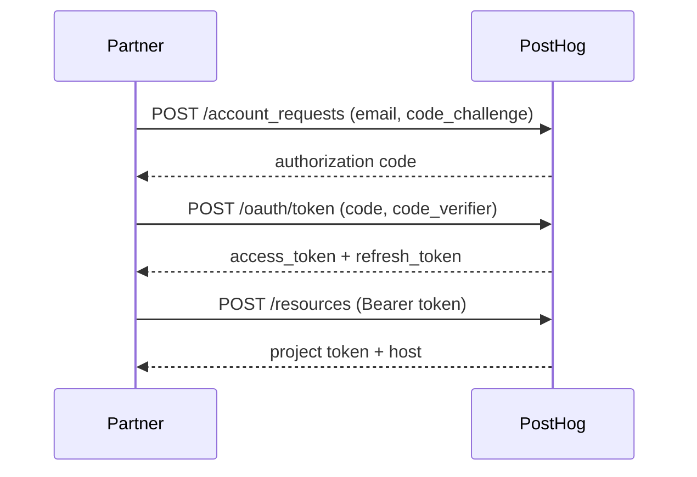
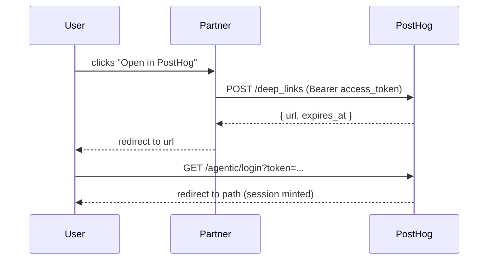
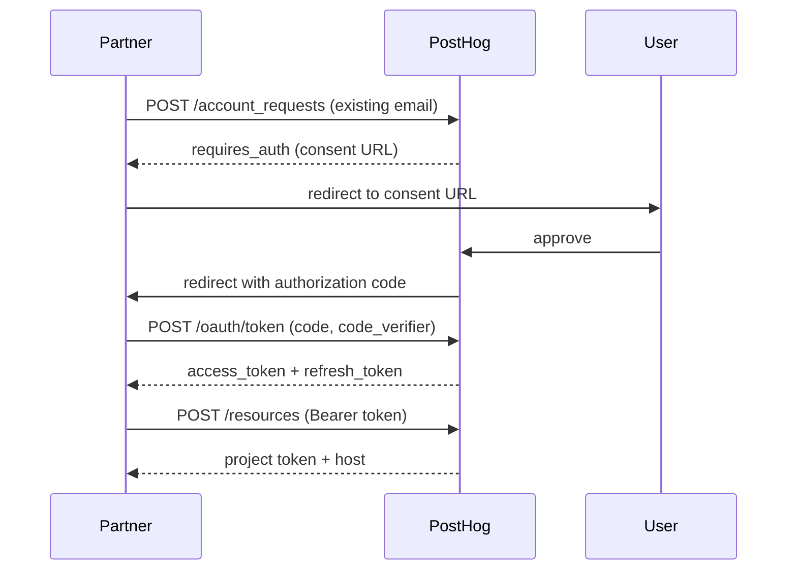

PostHog's provisioning API lets you create PostHog accounts for your users and deep link them into their PostHog project.

It's intended for partners and platform integrations. If you're integrating your own app with your own PostHog account, you probably want [OAuth](/docs/api/oauth) or a [personal API key](/docs/api/personal-api-keys) instead.

Jump to the [full Node.js example](#full-example) to see the complete flow in code.

## How it works

The flow uses OAuth 2.0 with PKCE (Proof Key for Code Exchange).
Your application is identified by a metadata document hosted on your domain, so there is no registration form to fill in and no client secret for us to issue.

Whether your app also has to *authenticate* depends on what it does.
A **public client** is identified by its `client_id` alone and relies on PKCE, which is enough to create accounts and exchange tokens.
A **confidential client** additionally proves it controls the app by signing a short-lived assertion with a private key it holds.
Some endpoints, including the [GitHub grant endpoints](#github-grants), accept only confidential clients.

See [choosing an authentication method](#choosing-an-authentication-method) to work out which you are.

### Onboarding (once per user)

```
1. POST /account_requests  →  authorization code
2. POST /oauth/token        →  access + refresh tokens
3. POST /resources          →  project token + host
```


```mermaid
sequenceDiagram
    participant P as Partner
    participant PH as PostHog

    P->>PH: POST /account_requests (email, code_challenge)
    PH-->>P: authorization code

    P->>PH: POST /oauth/token (code, code_verifier)
    PH-->>P: access_token + refresh_token

    P->>PH: POST /resources (Bearer token)
    PH-->>P: project token + host
```

### Deep linking (per click, after onboarding)

Reuses the access token from onboarding to mint a single-use URL that logs the user into their PostHog project.

```
4. POST /deep_links  →  single-use URL (10 min TTL)
```


```mermaid
sequenceDiagram
    participant U as User
    participant P as Partner
    participant PH as PostHog

    U->>P: clicks "Open in PostHog"
    P->>PH: POST /deep_links (Bearer access_token)
    PH-->>P: { url, expires_at }
    P-->>U: redirect to url
    U->>PH: GET /agentic/login?token=...
    PH-->>U: redirect to path (session minted)
```

## Set up as a partner

Setup is four steps, and you only do them once:

1. **[Decide whether you need to authenticate](#choosing-an-authentication-method).** If you need the GitHub grant endpoints, you do. If not, you can stay a public client and skip step 3.
2. **[Host a metadata document](#host-a-cimd-metadata-document)** at an HTTPS URL on your domain. That URL becomes your `client_id`. There is no signup form.
3. **Generate a key pair and publish the public half** at a `jwks_uri`, if you are a confidential client. See [authenticating with a private key](#authenticating-with-a-private-key).
4. **[Register your client](#register-your-client)** in every region you serve, and check the diagnostics it returns.

Optionally, [link the app to a PostHog organization](#link-your-partner-app-to-a-posthog-organization-optional) to raise your rate limit, and [declare a scope ceiling](#declare-oauth-scopes-for-your-app-optional).

After that, the per-user flow is the three API calls in [onboarding](#onboarding-once-per-user).

### Host a CIMD metadata document

PostHog uses [Client ID Metadata Documents](https://datatracker.ietf.org/doc/draft-ietf-oauth-client-id-metadata-document/) (CIMD) for partner registration. There's no signup form to fill out – you host a JSON document at an HTTPS URL on your domain, and that URL becomes your `client_id`.

Create a JSON file at a stable HTTPS URL, for example `https://yourapp.com/.well-known/posthog-client.json`:

```json
{
  "client_id": "https://yourapp.com/.well-known/posthog-client.json",
  "client_name": "Your App Name",
  "redirect_uris": ["https://yourapp.com/callbacks/posthog"],
  "logo_uri": "https://yourapp.com/logo.png",
  "token_endpoint_auth_method": "none",
  "grant_types": ["authorization_code"],
  "response_types": ["code"]
}
```

Requirements:

- **`client_id`** must exactly match the URL where this document is hosted.
- **`redirect_uris`** is required and must contain at least one HTTPS URI. This is where PostHog redirects existing users during the consent flow.
- **`logo_uri`** (optional) must be HTTPS if provided.
- **`token_endpoint_auth_method`** must be either `"none"` (a public client, relying on PKCE) or `"private_key_jwt"` (a confidential client, which also requires `jwks_uri`). A CIMD client can never hold a client secret, because there is no registration step in which we could deliver one.
- **`jwks_uri`** is required when `token_endpoint_auth_method` is `"private_key_jwt"`, and must be an HTTPS URL serving your public keys as a JWK Set.
- The document must be served with `Content-Type: application/json` and be under 5 KB.
- The URL must use HTTPS, include a path component, and must not contain query parameters or fragments. These rules apply to the `client_id` document only, since it is your stable identifier. Your `jwks_uri` is an ordinary document reference and may carry a query string.

PostHog fetches and caches this document automatically.
Subsequent requests reuse the cached version and refresh it in the background based on your `Cache-Control: max-age` header (clamped between 5 minutes and 24 hours, default 1 hour).

Because the document is re-read on every refresh, you can switch between `"none"` and `"private_key_jwt"` at any time by editing it. Your `client_id` does not change and there is nothing to re-register.

### Register your client

Once the document is live, register it. Paste the URL below: this reads the document back so you can see what you actually published, then registers it per region.

<CIMDRegistration />

Or do it yourself:

```bash
curl -X POST https://us.posthog.com/api/agentic/provisioning/client_registration \
  -H "Content-Type: application/json" \
  -d '{"client_id": "https://yourapp.com/.well-known/posthog-client.json"}'
```

This is the first call you make. Every other endpoint requires an already-registered client and returns `401` naming this one if it does not find yours.

> **Register in every region you serve.** US and EU are separate deployments with separate databases, so registering in one does **not** register you in the other, and we will not do it for you. A client registered only in the US gets a `401` from `eu.posthog.com`. Run the registration against `https://us.posthog.com` and `https://eu.posthog.com` separately, and re-run both whenever you change your metadata document or your keys. The [setup script](#registration-script) below does both.

The response reports each check separately, so a broken setup tells you which part is wrong rather than failing as a bare `401`:

```json
{
  "client_id": "https://yourapp.com/.well-known/posthog-client.json",
  "registered": true,
  "client_type": "confidential",
  "token_endpoint_auth_method": "private_key_jwt",
  "jwks_uri": "https://yourapp.com/.well-known/jwks.json",
  "scopes": ["organization:read", "project:read"],
  "provisioning": { "active": true, "can_create_accounts": true, "can_provision_resources": true },
  "capabilities": { "account_requests": true, "github_grants": true },
  "checks": [
    { "name": "metadata_document", "ok": true, "detail": "Fetched and validated" },
    { "name": "provisioning_enabled", "ok": true, "detail": "Active" },
    { "name": "jwks", "ok": true, "detail": "1 key(s) served: my-key-1" }
  ]
}
```

`capabilities` tells you which endpoints you qualify for. If `github_grants` is `false`, you are a public client. It is safe to call this endpoint again at any time; it re-fetches your document and re-runs every check, which makes it the fastest way to confirm a change took effect.

You can also verify your signing setup end to end by including an assertion. It is checked and reported as a `client_assertion` entry in `checks`:

```bash
curl -X POST https://us.posthog.com/api/agentic/provisioning/client_registration \
  -H "Content-Type: application/json" \
  -d '{
        "client_id": "https://yourapp.com/.well-known/posthog-client.json",
        "client_assertion": "eyJhbGciOi...",
        "client_assertion_type": "urn:ietf:params:oauth:client-assertion-type:jwt-bearer"
      }'
```

Verifying consumes the assertion's `jti`, so mint a fresh one for the check rather than reusing it on a real call.

### Registration script

Save this as `register-posthog-client.mjs` and run it with `node register-posthog-client.mjs`. It registers in both regions, prints every check, and exits non-zero if anything failed, so you can run it from CI or a deploy step.

```js
#!/usr/bin/env node
import crypto from 'crypto'

const CLIENT_ID = process.env.POSTHOG_CLIENT_ID // your CIMD document URL
const PRIVATE_KEY = process.env.POSTHOG_CLIENT_PRIVATE_KEY // omit if you are a public client
const KEY_ID = process.env.POSTHOG_CLIENT_KEY_ID || 'key-1'

const REGIONS = { us: 'https://us.posthog.com', eu: 'https://eu.posthog.com' }
const ASSERTION_TYPE = 'urn:ietf:params:oauth:client-assertion-type:jwt-bearer'

function assertion(host) {
  const now = Math.floor(Date.now() / 1000)
  const b64 = (o) => Buffer.from(JSON.stringify(o)).toString('base64url')
  const input =
    b64({ alg: 'RS256', typ: 'JWT', kid: KEY_ID }) +
    '.' +
    b64({
      iss: CLIENT_ID,
      sub: CLIENT_ID,
      // Per region: an assertion minted for one region is not valid at the other.
      aud: `${host}/api/agentic/oauth/token`,
      jti: crypto.randomUUID(),
      iat: now,
      exp: now + 60,
    })
  const sig = crypto.sign('RSA-SHA256', Buffer.from(input), crypto.createPrivateKey(PRIVATE_KEY))
  return `${input}.${sig.toString('base64url')}`
}

let ok = true
for (const [region, host] of Object.entries(REGIONS)) {
  const body = { client_id: CLIENT_ID }
  if (PRIVATE_KEY) {
    body.client_assertion = assertion(host)
    body.client_assertion_type = ASSERTION_TYPE
  }

  const res = await fetch(`${host}/api/agentic/provisioning/client_registration`, {
    method: 'POST',
    headers: { 'Content-Type': 'application/json' },
    body: JSON.stringify(body),
  })
  const json = await res.json().catch(() => null)

  console.log(`\n${region.toUpperCase()} ${host}`)
  for (const check of json?.checks || []) {
    console.log(`  ${check.ok ? 'ok  ' : 'FAIL'} ${check.name}: ${check.detail}`)
  }
  if (!json?.registered) {
    console.log(`  not registered: ${json?.error?.message || `HTTP ${res.status}`}`)
    ok = false
    continue
  }
  console.log(`  ${json.client_type} (${json.token_endpoint_auth_method})`)
  console.log(`  github grants: ${json.capabilities?.github_grants ? 'allowed' : 'not allowed'}`)
  ok = ok && (json.checks || []).every((c) => c.ok)
}

process.exit(ok ? 0 : 1)
```

Re-run it after any change to your metadata document or your keys. It re-fetches everything and re-runs every check, so it is the fastest way to confirm a change took effect.

### Link your partner app to a PostHog organization (optional)

By default, a CIMD partner app is unverified and capped at 10 account requests per hour.
You can link the app to a PostHog organization with a verification token to raise that to 100/hour and surface the partner integration to that org's admins.

1. In PostHog, go to **Organization settings → CIMD verification tokens** and click **Create token**. Copy the `phvt_…` value – it's only shown once.
2. Add the token inside a `com.posthog` namespace in your CIMD metadata document:

   ```json
   {
     "client_id": "https://yourapp.com/.well-known/posthog-client.json",
     "client_name": "Your App Name",
     "redirect_uris": ["https://yourapp.com/callbacks/posthog"],
     "logo_uri": "https://yourapp.com/logo.png",
     "token_endpoint_auth_method": "none",
     "grant_types": ["authorization_code"],
     "response_types": ["code"],
     "com.posthog": {
       "verification_token": "phvt_..."
     }
   }
   ```

3. The next time PostHog refreshes the metadata document, the app is linked to the matching organization and the rate limit is bumped.

The token is only used to prove ownership of the partner app – it isn't sent on API requests.
You can rotate or revoke a token at any time from the same settings page.
Revocation clears the link on the next metadata refresh, so a leaked or stale token can't keep an app linked to your org.

> **Note:** The legacy top-level `posthog_verification_token` field is still supported as a fallback. PostHog reads `com.posthog.verification_token` first and falls back to the top-level field if the nested one is absent or unrecognized. New integrations should use the `com.posthog` namespace.

### Declare OAuth scopes for your app (optional)

You can declare which OAuth scopes your partner app needs by adding a `scopes` field inside the `com.posthog` namespace. This sets a scope ceiling – tokens issued to your app are limited to these scopes.

```json
{
  "client_id": "https://yourapp.com/.well-known/posthog-client.json",
  "client_name": "Your App Name",
  "redirect_uris": ["https://yourapp.com/callbacks/posthog"],
  "token_endpoint_auth_method": "none",
  "grant_types": ["authorization_code"],
  "response_types": ["code"],
  "com.posthog": {
    "verification_token": "phvt_...",
    "scopes": ["insight:read", "project:read", "person:read"]
  }
}
```

Only scopes a user can grant on the consent screen are accepted – see [available scopes](#available-scopes) for the full list. Any scope PostHog reserves for internal use, or doesn't recognize, is dropped. If every scope you declare is dropped (none are grantable), registration is rejected rather than falling back to an empty ceiling, so make sure at least one declared scope is on the available list.

If `com.posthog.scopes` is omitted, your app can request any scope a user can grant. When present, the declared scopes are applied on both initial registration and every subsequent metadata refresh. A scope ceiling is a cap, not a grant – each scope still requires user consent at the authorization step.

CIMD app scopes are managed via the metadata document and are read-only in the PostHog admin UI.

## Choosing an authentication method

Your `token_endpoint_auth_method` decides this, and PostHog derives everything else from it. You do not declare `client_type` yourself.

| Your document says | You are | You authenticate with | GitHub grant endpoints |
| --- | --- | --- | --- |
| `"none"` | public | nothing, PKCE proves the code exchange | no, `403` |
| `"private_key_jwt"` plus a `jwks_uri` | confidential | a signed assertion per request | yes |

Pick `"none"` if your client cannot keep a credential secret, such as a CLI, a mobile app, or anything running on a user's machine. PKCE is what protects a public client's code exchange and it is required for every client regardless.

Pick `"private_key_jwt"` if you need the GitHub grant endpoints, or simply want the stronger guarantee. Nothing secret is ever transmitted, and you rotate keys yourself by publishing a new one.

One thing to be honest about: a credential shipped inside a distributed binary is not secret, and that is equally true of a private key. If your app runs on end users' machines, either make the confidential half a server you control, or stay public and rely on PKCE.

### Authenticating with a private key

Generate an RSA keypair. Keep the private half in your environment or secret manager, never in your repo:

```bash
node -e "
const c = require('crypto')
const { privateKey, publicKey } = c.generateKeyPairSync('rsa', {
  modulusLength: 2048,
  publicKeyEncoding: { type: 'spki', format: 'pem' },
  privateKeyEncoding: { type: 'pkcs8', format: 'pem' },
})
console.log(privateKey)
console.log(JSON.stringify({ keys: [{ ...c.createPublicKey(publicKey).export({ format: 'jwk' }), kid: 'sig-1', use: 'sig', alg: 'RS256' }] }, null, 2))
"
```

Publish the public half as a JWK Set at your `jwks_uri`:

```json
{
  "keys": [
    { "kty": "RSA", "n": "...", "e": "AQAB", "kid": "sig-1", "use": "sig", "alg": "RS256" }
  ]
}
```

`kid` is an opaque label you choose. It exists so a verifier can pick the right key when your set holds more than one, which is what makes rotation possible. Deriving the JWK Set from your private key at request time, rather than checking a copy into your repo, is worth the small effort: two copies that silently disagree is the most common reason a working setup stops working.

Then send a signed assertion (<a href="https://datatracker.ietf.org/doc/html/rfc7523">RFC 7523</a>) with each request:

| Claim | Value |
| --- | --- |
| `iss` | your `client_id` |
| `sub` | your `client_id`, the same value |
| `aud` | `https://us.posthog.com/api/agentic/oauth/token` |
| `jti` | a unique id per assertion |
| `iat` | issued-at, required |
| `exp` | expiry, at most 300 seconds after `iat` |

Sign with an asymmetric algorithm (`RS256`, `PS256`, `ES256` and their variants). HMAC algorithms are rejected: your public key is published, so accepting one would let anyone sign with it.

The header must carry a `kid` whenever your JWK Set holds more than one key, so a rotated-out key stops working rather than falling back to a scan.

```js
import crypto from 'crypto'

function clientAssertion() {
    const now = Math.floor(Date.now() / 1000)
    const b64 = (o) => Buffer.from(JSON.stringify(o)).toString('base64url')
    const input =
        b64({ alg: 'RS256', typ: 'JWT', kid: 'my-key-1' }) +
        '.' +
        b64({
            iss: CLIENT_ID,
            sub: CLIENT_ID,
            aud: 'https://us.posthog.com/api/agentic/oauth/token',
            jti: crypto.randomUUID(),
            iat: now,
            exp: now + 60,
        })
    const signature = crypto.sign('RSA-SHA256', Buffer.from(input), PRIVATE_KEY)
    return `${input}.${signature.toString('base64url')}`
}
```

Send it as `client_assertion`, alongside `client_assertion_type` set to `urn:ietf:params:oauth:client-assertion-type:jwt-bearer`, on `account_requests`, `oauth/token` (both grant types), and the GitHub grant endpoints. Both go in the JSON body, except on `GET` requests, which have no body and take them as query parameters instead.

> **Each assertion is single use.** PostHog remembers the `jti` until the assertion would have expired, so reusing one gets rejected as a replay. Mint a fresh assertion per request, including on retries.

The `aud` must name the region you are calling. An assertion minted for `us.posthog.com` is not accepted by `eu.posthog.com`.

#### Rotating keys

Rotation is yours to do, and needs an overlap window because PostHog caches your JWK Set for an hour:

1. Generate a new key pair with a new `kid`.
2. Publish **both** public keys in your JWK Set, and start signing with the new one. Anything holding a cached copy of the old set still verifies your old key, so nothing breaks mid-rotation.
3. After an hour, drop the old key from the set.

Skipping step 2 means assertions signed with the new key fail against every cached copy of the old set until it expires.

Once your set holds more than one key, the `kid` header becomes mandatory: PostHog will not try each key in turn, so a rotated-out key stops working rather than lingering.

### Authenticating with a client secret

If PostHog issued you a `client_id` and `client_secret` directly rather than through CIMD, send them either as HTTP Basic credentials:

```
Authorization: Basic base64(urlencode(client_id) + ":" + urlencode(client_secret))
```

or as `client_id` and `client_secret` in the request body. Basic is the only option on `GET` requests.

> **A confidential client cannot fall back to the public path.** If your app is registered as confidential and you send only your `client_id`, the request is rejected rather than treated as a public client. Your `client_id` is published, so honouring it alone would let anyone act as you.

## API reference

All endpoints are on `https://us.posthog.com` (US region) or `https://eu.posthog.com` (EU region).

The two regions are separate deployments with separate databases. Your client must be [registered in each region you serve](#register-your-client), tokens issued by one are not valid at the other, and a `client_assertion` must name the region it is sent to in its `aud`.

### Step 1: Create an account

Create a PostHog account for a user by email. If the user is new, PostHog creates the account and returns an authorization code immediately. If the user already exists, the response tells you to redirect them for consent.

Generate a PKCE code verifier and challenge before making this request:

```bash
# Generate PKCE values
CODE_VERIFIER=$(openssl rand -base64 32 | tr -d '=' | tr '+/' '-_')
CODE_CHALLENGE=$(echo -n "$CODE_VERIFIER" | openssl dgst -sha256 -binary | openssl base64 | tr -d '=' | tr '+/' '-_')
```

```bash
BODY=$(cat <<JSON
{
  "id": "req_unique_request_id",
  "email": "user@example.com",
  "name": "Jane Doe",
  "client_id": "https://yourapp.com/.well-known/posthog-client.json",
  "code_challenge": "$CODE_CHALLENGE",
  "code_challenge_method": "S256",
  "configuration": {
    "region": "US",
    "organization_name": "Acme Corp"
  }
}
JSON
)

curl -X POST https://us.posthog.com/api/agentic/provisioning/account_requests \
  -H "Content-Type: application/json" \
  -d "$BODY"
```

**Request fields:**

| Field                             | Type   | Required | Description                                                                              |
| --------------------------------- | ------ | -------- | ---------------------------------------------------------------------------------------- |
| `id`                              | string | Yes      | Your unique request ID (for idempotency)                                                 |
| `email`                           | string | Yes      | User's email address                                                                     |
| `name`                            | string | No       | User's full name                                                                         |
| `client_id`                       | string | Yes      | Your CIMD metadata URL                                                                   |
| `code_challenge`                  | string | Yes      | Base64url-encoded SHA-256 hash of your code verifier (43-128 chars)                      |
| `code_challenge_method`           | string | Yes      | Must be `"S256"`                                                                         |
| `scopes`                          | list   | No       | OAuth scopes to request for the access token. See [available scopes](#available-scopes). |
| `configuration.region`            | string | No       | `"US"` (default) or `"EU"`                                                               |
| `configuration.organization_name` | string | No       | Organization name (defaults to `"Partner (email)"`)                                      |
| `client_assertion`                | string | Confidential clients | Signed assertion. See [authenticating with a private key](#authenticating-with-a-private-key). |
| `client_assertion_type`           | string | Confidential clients | `urn:ietf:params:oauth:client-assertion-type:jwt-bearer` |
| `client_secret`                   | string | Confidential clients | Only if PostHog issued you a secret. Can also ride the Basic header. |

**New user response** (HTTP 200):

```json
{
  "id": "req_unique_request_id",
  "type": "oauth",
  "oauth": {
    "code": "abc123...authorization_code"
  }
}
```

The user receives a welcome email with a link to set their password and access their dashboard.

**Existing user response** (HTTP 200):

```json
{
  "id": "req_unique_request_id",
  "type": "requires_auth",
  "requires_auth": {
    "url": "https://us.posthog.com/api/agentic/authorize?state=xyz..."
  }
}
```

When `type` is `requires_auth`, redirect the user to the provided URL. After they approve, PostHog redirects them to your `redirect_uris` with a `code` query parameter that you use in step 2.

An email that already has a PostHog account **always** takes this path. No partner setting skips it, and authenticating as a confidential client does not skip it either. Proving you control your app is not the same as proving you control somebody's email address, and silently linking an existing account to a partner would be an account takeover. Plan for the consent redirect as a normal branch rather than an edge case.


```mermaid
sequenceDiagram
    participant P as Partner
    participant PH as PostHog
    participant U as User

    P->>PH: POST /account_requests (existing email)
    PH-->>P: requires_auth (consent URL)

    P->>U: redirect to consent URL
    U->>PH: approve
    PH->>P: redirect with authorization code

    P->>PH: POST /oauth/token (code, code_verifier)
    PH-->>P: access_token + refresh_token

    P->>PH: POST /resources (Bearer token)
    PH-->>P: project token + host
```

### Step 2: Exchange the code for tokens

Exchange the authorization code for an access token and refresh token. The token endpoint uses standard `application/x-www-form-urlencoded` encoding.

```bash
curl -X POST https://us.posthog.com/api/agentic/oauth/token \
  -H "Content-Type: application/x-www-form-urlencoded" \
  -d "grant_type=authorization_code&code=abc123...authorization_code&code_verifier=$CODE_VERIFIER&client_id=$CLIENT_ID"
```

**Request fields:**

| Field           | Type   | Required | Description                                                            |
| --------------- | ------ | -------- | ---------------------------------------------------------------------- |
| `grant_type`    | string | Yes      | Must be `"authorization_code"`                                         |
| `code`          | string | Yes      | The authorization code from step 1                                     |
| `code_verifier` | string | Yes      | The original PKCE code verifier (must match the challenge from step 1) |
| `client_id`     | string | Yes      | Your CIMD metadata URL                                                 |
| `client_assertion` | string | Confidential clients | Signed assertion. See [authenticating with a private key](#authenticating-with-a-private-key). |
| `client_assertion_type` | string | Confidential clients | `urn:ietf:params:oauth:client-assertion-type:jwt-bearer` |
| `client_secret` | string | Confidential clients | Only if PostHog issued you a secret. Can also ride the Basic header. |

A public client exchanges on `code_verifier` alone. A confidential client must also authenticate, and gets `invalid_client` with a `401` if it does not.

Client authentication is checked before the code is consumed, so an attempt that fails on credentials leaves the code usable and you can retry with the same one.

**Response** (HTTP 200):

```json
{
  "token_type": "bearer",
  "access_token": "pha_abc123...",
  "refresh_token": "phr_def456...",
  "expires_in": 3600,
  "account": {
    "id": "01234567-89ab-cdef-0123-456789abcdef",
    "payment_credentials": "orchestrator",
    "available_teams": [
      {
        "id": 12345,
        "name": "Default project",
        "organization_id": "01234567-89ab-cdef-0123-456789abcdef",
        "organization_name": "Acme Corp"
      }
    ]
  }
}
```

Authorization codes expire after 5 minutes and can only be used once.
Access tokens expire after 1 hour. Use the refresh token to get new tokens.

**Token endpoint errors** use the standard OAuth 2.0 format:

```json
{
  "error": "invalid_grant",
  "error_description": "Invalid or expired authorization code"
}
```

### Step 3: Provision a project

Use the access token to provision a PostHog project and get credentials.

```bash
curl -X POST https://us.posthog.com/api/agentic/provisioning/resources \
  -H "Content-Type: application/json" \
  -H "Authorization: Bearer pha_abc123..." \
  -d '{
    "label_prefix": "Acme Co",
    "configuration": {
      "project_name": "My App - Production"
    }
  }'
```

**Request fields:**

| Field | Type | Required | Description |
|---|---|---|---|
| `label_prefix` | string | No | Label prefix for the provisioned personal API key, up to 25 characters, used only when a personal API key is issued (off by default). When issued, the key is labeled `{label_prefix} - {team_name}`; if omitted, empty, or whitespace-only, just the team name. |
| `configuration.project_name` | string | No | Project name (defaults to `"Default project"`) |

**Response** (HTTP 200):

```json
{
  "status": "complete",
  "id": "12345",
  "complete": {
    "access_configuration": {
      "api_key": "phc_abc123...",
      "host": "https://us.posthog.com"
    }
  }
}
```

**Response fields:**

| Field | Description |
|---|---|
| `api_key` | The project token (starts with `phc_`) – use this to initialize PostHog SDKs |
| `host` | The API host (`https://us.posthog.com` or `https://eu.posthog.com`) |

For authenticated REST API calls, use the OAuth `access_token` from [Step 2](#step-2-exchange-the-code-for-tokens) as a `Bearer` token. It carries the [scopes](#available-scopes) you requested in the account request. Provisioning does not return a `personal_api_key` in this response.

### Deep linking

For recurring deep links from your application into PostHog – the most common case is an "Open in PostHog" button on a user's connected project – use the deep-link endpoint. Each call returns a short-lived, single-use URL that logs the user into their PostHog project on click. There's no consent screen and no email-mismatch friction: the URL mints a fresh PostHog session for the right user, overriding any other session the browser happens to have.

```bash
curl -X POST https://us.posthog.com/api/agentic/provisioning/deep_links \
  -H "Content-Type: application/json" \
  -H "Authorization: Bearer pha_abc123..." \
  -d '{
    "path": "/project/12345/replay/019e6d10-c3b0-7000-8000-000000000000"
  }'
```

Authenticate with the `access_token` you got from [Step 2](#step-2-exchange-the-code-for-tokens) – the same Bearer credential you use for `/resources`. The token is scoped to a single team, so the resulting deep link lands the user in the correct project.

**Request fields:**

| Field | Type | Required | Description |
|---|---|---|---|
| `path` | string | No | The in-app path to land the user on after login, for example `/project/12345/replay/<recording_id>`. Must be a relative, same-origin path beginning with a single `/`. If omitted, the link lands on the project home (`/project/<team_id>`). |
| `purpose` | string | No | Free-form label recorded for your own analytics. Defaults to `dashboard`. It does not affect where the link lands – use `path` for that. |

The `path` is validated when the link is minted and again when it's opened. PostHog rejects open-redirect forms (absolute URLs, protocol-relative `//`, backslashes, and `javascript:`) as well as control characters and whitespace. To find the path for a destination, open it in PostHog and copy everything after the host, including the leading `/`.

**Response:**

```json
{
  "purpose": "dashboard",
  "url": "https://us.posthog.com/agentic/login?token=...&team_id=12345",
  "expires_at": "2026-05-20T21:00:00Z"
}
```

The returned `url` is valid for 10 minutes and can only be opened once, so don't pre-render it as the button's `href`. Wire the button click to your backend, call `/deep_links` there, then redirect the user to the returned URL.

#### Requires a trusted partner record

This endpoint is gated on the `provisioning_can_issue_deep_links` flag on your partner record, which is only enabled for partners admin-onboarded by PostHog. If you get a `deep_links_not_enabled` 403, ask PostHog to enable it for your CIMD app.

### Rotate project credentials

Rotate the project token for an existing provisioned project:

```bash
curl -X POST https://us.posthog.com/api/agentic/provisioning/resources/12345/rotate_credentials \
  -H "Content-Type: application/json" \
  -H "Authorization: Bearer pha_abc123..." \
  -d '{
    "label_prefix": "Acme Co"
  }'
```

**Request fields:**

| Field | Type | Required | Description |
|---|---|---|---|
| `label_prefix` | string | No | Label prefix for the personal API key, up to 25 characters, used only when a personal API key is issued (off by default). When issued, the key is labeled `{label_prefix} - {team_name}`; if omitted, empty, or whitespace-only, just the team name. |

The response has the same shape as the project provisioning response and includes the rotated `api_key` and `host`.

### Refresh tokens

Access tokens expire after 1 hour. Use the refresh token to get new credentials:

```bash
curl -X POST https://us.posthog.com/api/agentic/oauth/token \
  -H "Content-Type: application/x-www-form-urlencoded" \
  -d "grant_type=refresh_token&refresh_token=phr_def456..."
```

**Response** (HTTP 200):

```json
{
  "token_type": "bearer",
  "access_token": "pha_new_token...",
  "refresh_token": "phr_new_refresh...",
  "expires_in": 3600
}
```

Confidential clients must authenticate on this grant too, with the same `client_assertion` or `client_secret` parameters as the authorization code exchange.

Each refresh token is single-use. The response includes a new refresh token for subsequent refreshes. Refreshing can only keep or narrow a token's scopes, never add them. To grant additional scopes, request them in a new account request; they apply to connections provisioned afterward.

### GitHub grants

These endpoints let you hand PostHog a GitHub OAuth code and get back an opaque `grant_id`, so the GitHub user tokens stay server-side and never pass through your app.

> **Confidential clients only.** These endpoints exchange GitHub OAuth codes and read back GitHub account metadata, so they need a real partner trust boundary. A public client gets `403`. Either a signed assertion or a client secret qualifies, since both prove you control the app. Check `capabilities.github_grants` in the [registration response](#register-your-client) to confirm you are eligible.

Grants are region-local: call the same region that minted the grant.

**Create a grant:**

```bash
curl -X POST https://us.posthog.com/api/agentic/provisioning/github/grants \
  -H "Content-Type: application/json" \
  -d '{
        "code": "github_oauth_code",
        "redirect_uri": "https://yourapp.com/callbacks/github",
        "client_id": "https://yourapp.com/.well-known/posthog-client.json",
        "client_assertion": "eyJhbGciOi...",
        "client_assertion_type": "urn:ietf:params:oauth:client-assertion-type:jwt-bearer"
      }'
```

The response carries `grant_id`, `gh_login`, `email`, and `expires_in`. PostHog fetches the verified email server-side, so you never call GitHub for it. `email` is `null` when GitHub has no verified email, which is still a usable grant; collect an address inline instead.

**List repositories for a grant:**

```bash
curl "https://us.posthog.com/api/agentic/provisioning/github/grants/$GRANT_ID/repositories?client_id=$CLIENT_ID&client_assertion=$ASSERTION&client_assertion_type=urn:ietf:params:oauth:client-assertion-type:jwt-bearer" \
```

This is a `GET`, so there is no body to carry your credentials. Send the assertion as query parameters, or use the Basic header if you authenticate with a client secret. Each assertion is still single use, so mint a fresh one per poll.

The response carries `gh_login`, `installations`, and `repositories`. The GitHub App is installed if and only if `installations` is non-empty, so poll this while the user completes the install.

### Available scopes

The `scopes` field in the account request controls what permissions the access token receives. If omitted, a default set of scopes is granted. The default set does not include every scope below, so explicitly request the scopes your integration needs. Available scopes:

| Scope | Description |
|---|---|
| `customer_journey:read` | Read customer journey data |
| `query:read` | Execute read-only queries |
| `session_recording:read` | Read session recordings |
| `conversation:read` | Read PostHog AI conversations |
| `conversation:write` | Create and update PostHog AI conversations |
| `experiment:read` | Read experiments |
| `feature_flag:read` | Read feature flags |
| `insight:read` | Read insights |
| `organization:read` | Read organization details |
| `person:read` | Read person data |
| `project:read` | Read project settings |
| `ticket:read` | Read tickets |
| `ticket:write` | Create and update tickets |
| `user:read` | Read user information |
| `hog_flow:read` | Read Hog flows |
| `hog_flow:write` | Create and update Hog flows |

## What the user gets

When you provision a new account, the user receives:

- A welcome email with a link to set their password.
- Full dashboard access at [us.posthog.com](https://us.posthog.com) (or [eu.posthog.com](https://eu.posthog.com) for EU).
- The PostHog [free tier](/pricing) across all products – no credit card required.

Your integration gets back the project token and host, so you can start sending events the moment the API call returns.

## Error handling

Provisioning endpoints (account_requests, resources) return errors in this format:

```json
{
  "type": "error",
  "error": {
    "code": "error_code",
    "message": "Human-readable description"
  }
}
```

The token endpoint uses the standard OAuth 2.0 error format instead:

```json
{
  "error": "error_code",
  "error_description": "Human-readable description"
}
```

Common error codes:

| Code | HTTP Status | Description |
|---|---|---|
| `invalid_request` | 400 | Missing or invalid field |
| `unauthorized` | 401 | Authentication failed. If the message names `client_registration`, your client is not registered yet, so [register it](#register-your-client). |
| `invalid_client` | 401 | Client authentication failed at the token endpoint: missing, wrong, or replayed credentials |
| `forbidden` | 403 | Partner not authorized for this action. On the GitHub grant endpoints this means you are a public client, which those endpoints do not accept. |
| `registration_failed` | 400 | `client_registration` could not register your client. The `checks` array says which part failed. |
| `expired` | 400 | Account request has expired |
| `invalid_grant` | 400 | Authorization code is invalid or expired (token endpoint) |
| `invalid_label_prefix` | 400 | `label_prefix` is not a string, is longer than 25 characters after trimming, or contains control or Unicode format characters |
| `invalid_path` | 400 | Deep-link `path` is not a relative, same-origin in-app path beginning with a single `/` |
| `invalid_scope` | 400 | Unrecognized scope requested |
| `rate_limited` | 429 | Rate limit exceeded |
| `account_creation_failed` | 500 | Server error during account creation |

## Rate limits

All provisioning endpoints are rate limited.

**CIMD registration** (first request from a new `client_id`):

- 5 requests per minute per IP (burst)
- 10 requests per hour per IP (sustained)
- 100 new client registrations per hour globally
- 5 new client registrations per domain per hour

**Account requests** (per partner, per hour):

- 10/hour for unverified CIMD partners
- 100/hour for partners linked to a PostHog organization via a [verification token](#link-your-partner-app-to-a-posthog-organization-optional)

Open a [support request](https://us.posthog.com/#panel=support%3Asupport%3Alogin%3A%3Atrue) in the app, choosing **Authentication** as the topic, if you need a higher limit for production use.

## Full example

Here's a complete example in Node.js:

```javascript
import crypto from "node:crypto";

const CLIENT_ID = "https://yourapp.com/.well-known/posthog-client.json";
const BASE_URL = "https://us.posthog.com";

async function provisionPostHogAccount(email, name) {
  // Generate PKCE values
  const codeVerifier = crypto.randomBytes(32).toString("base64url");
  const codeChallenge = crypto.createHash("sha256").update(codeVerifier).digest("base64url");

  // Step 1: Create account
  const accountRes = await fetch(`${BASE_URL}/api/agentic/provisioning/account_requests`, {
    method: "POST",
    headers: {
      "Content-Type": "application/json",
      },
    body: JSON.stringify({
      id: crypto.randomUUID(),
      email,
      name,
      client_id: CLIENT_ID,
      code_challenge: codeChallenge,
      code_challenge_method: "S256",
      configuration: { region: "US" },
    }),
  });

  if (!accountRes.ok) {
    const err = await accountRes.json();
    throw new Error(
      `Account request failed (${accountRes.status}): ${err.error?.message || JSON.stringify(err)}`,
    );
  }

  const account = await accountRes.json();

  if (account.type === "requires_auth") {
    // Existing user - redirect them to account.requires_auth.url
    return { type: "requires_auth", url: account.requires_auth.url };
  }

  if (account.type !== "oauth") {
    throw new Error(account.error?.message || "Unexpected response type");
  }

  // Step 2: Exchange code for tokens
  const tokenRes = await fetch(`${BASE_URL}/api/agentic/oauth/token`, {
    method: "POST",
    headers: {
      "Content-Type": "application/x-www-form-urlencoded",
      },
    body: new URLSearchParams({
      grant_type: "authorization_code",
      code: account.oauth.code,
      code_verifier: codeVerifier,
      client_id: CLIENT_ID,
      // A confidential client also sends client_assertion and client_assertion_type here.
    }),
  });

  if (!tokenRes.ok) {
    const err = await tokenRes.json();
    throw new Error(
      `Token exchange failed (${tokenRes.status}): ${err.error_description || JSON.stringify(err)}`,
    );
  }

  const tokens = await tokenRes.json();

  // Step 3: Provision a project
  const resourceRes = await fetch(`${BASE_URL}/api/agentic/provisioning/resources`, {
    method: "POST",
    headers: {
      "Content-Type": "application/json",
      Authorization: `Bearer ${tokens.access_token}`,
      },
    body: JSON.stringify({
      label_prefix: "Acme Co",
      configuration: { project_name: "Production" },
    }),
  });

  if (!resourceRes.ok) {
    const err = await resourceRes.json();
    throw new Error(
      `Resource provisioning failed (${resourceRes.status}): ${err.error?.message || JSON.stringify(err)}`,
    );
  }

  const resource = await resourceRes.json();

  return {
    type: "provisioned",
    apiKey: resource.complete.access_configuration.api_key,
    host: resource.complete.access_configuration.host,
    projectId: resource.id,
    accessToken: tokens.access_token,
    refreshToken: tokens.refresh_token,
  };
}
```

For the "Open in PostHog" button, call this from your click handler with the user's stored `access_token`, then redirect the browser to the returned URL. Pass a `path` to land the user on a specific page, or omit it to land on the project home:

```javascript
async function getDeepLinkUrl(accessToken, path) {
  const res = await fetch(
    `${BASE_URL}/api/agentic/provisioning/deep_links`,
    {
      method: 'POST',
      headers: {
        'Content-Type': 'application/json',
        Authorization: `Bearer ${accessToken}`,
      },
      body: JSON.stringify(path ? { path } : {}),
    }
  );

  if (!res.ok) {
    const err = await res.json();
    throw new Error(
      `Deep link request failed (${res.status}): ${err.error?.message || JSON.stringify(err)}`,
    );
  }

  const { url } = await res.json();
  return url;
}
```
